# Visual Grammar

## 1. What This File Is

This is the shared alphabet that every pattern in the library is projected from. It is an author time document. It does not ship with the plugin, and it is never loaded when someone is actually drawing a diagram. The shipped pattern files under `explainer-diagrams/ref/patterns/` are self contained copies of the parts they use, and they reference nothing, including this file.

The reason for that split is worth stating once. Consistency across patterns is settled the moment a pattern file is written, not the moment it is read. Once `step-flow.md` contains the literal string `fill:#D1F0DB`, the green is already correct, and an agent reading that file to draw one diagram gains nothing from knowing the value came from a shared table. What it would lose is real: handing it this document means handing it five shapes, four arrow forms, and two directions the pattern forbids, immediately before the pattern tells it not to use them.

So this file has two jobs and neither is runtime. It fixes the vocabulary so ten pattern files agree with each other. And section 10 records where each pattern deliberately departs from that vocabulary, which is the only place the whole picture exists once the pattern files stop pointing at anything.

The vocabulary is closed. Eight shapes, six emoji, three directions, four arrow forms, four color classes, and that is all of it. The point of a closed alphabet is that a reader who has seen a dozen of these diagrams can decode the thirteenth without a legend. Every shape added for the sake of one diagram costs the reader that ability across all the others.

A pattern narrows this vocabulary by using only part of it, which needs no announcement. A pattern deviates when it binds a piece of the vocabulary to a different meaning or loosens a limit set here, and every deviation gets a row in section 10. The rule that has no exception is that a pattern never invents vocabulary. A ninth shape or a fifth color is a change to this file, applied across every pattern file, or it does not happen.

---

## 2. Shape Semantics

Shape carries meaning, never decoration. Eight shapes, each locked to one role.

| Role | Shape | Syntax | Notes |
| :--- | :--- | :--- | :--- |
| Goal, final outcome | Double circle | `@{ shape: dbl-circ }` | At most one per diagram, always paired with 🎯 |
| Start, entry point | Stadium | `@{ shape: stadium }` | The place the reader begins |
| Action, step | Rounded rectangle | `@{ shape: rounded }` | The default shape, and the most used |
| Input, prerequisite | Lean right | `@{ shape: lean-r }` | Knowledge or data that enters from outside |
| Artifact, evidence | Document | `@{ shape: doc }` | A document, report, or deliverable |
| Branch point | Diamond | `@{ shape: diam }` | Only when a real branch follows |
| Milestone, gate | Hexagon | `@{ shape: hex }` | A checkpoint in a long flow, usually `accent` |
| Concept, static entity | Rectangle | `@{ shape: rect }` | Org charts, roles, value chain positions |

Here is the full alphabet rendered once, so you can see what each name actually looks like.

And here is the same alphabet doing its job in a real diagram, where each shape is chosen by what the node means rather than by what looks balanced.

The rule that gets broken most often is the diamond. A diamond is a promise to the reader that two or more arrows leave the node, and when only one does, the reader spends attention confirming that nothing was missed. If a step does not branch, it is a `rounded`, however procedural it feels.

The second most broken rule is the double circle. One goal per diagram. A diagram with three goals has no goal, and the content is really two or three diagrams that were merged to save space.

---

## 3. Emoji Semantics

Six emoji, and the list does not grow. Each one marks a node whose role the reader should register instantly, and each is placed at the front of the label.

| Emoji | Meaning |
| :--- | :--- |
| 🎯 | Goal, the final target |
| 📄 | Artifact, a deliverable |
| 💡 | Insight, the thing worth remembering |
| ⚠️ | Risk, a trap |
| 🔑 | Prerequisite, what must already be true |
| ✅ | Done, a passed checkpoint |

The cap of six exists to keep these diagrams from drifting into the emoji soup that decorated documents fall into. Unicode emoji are used rather than Mermaid's Iconify icon packs because icon packs must be registered by the renderer, and the same diagram then breaks when it moves from GitHub to Sphinx to Obsidian. An emoji renders everywhere.

All six in one diagram, each attached to a node whose shape already agrees with it.

Emoji reinforce shape, they never replace it. `📄 Metrics Spec` written inside a `rounded` node is wrong, because the shape says step and the emoji says artifact, and the reader has to guess which signal to trust. Use one emoji per node at most, and leave ordinary steps bare. If every node carries an emoji, none of them is a marker any more.

---

## 4. Direction Semantics

Direction is a meaning, not a layout preference. Three directions, three meanings.

| Direction | Meaning |
| :--- | :--- |
| `RL` | Backwards reasoning. Start at the goal and ask what it requires |
| `LR` | Forward execution or time order. This is the default form published to readers |
| `TD` | Hierarchy or containment. Org charts, taxonomies, layered systems |

Backwards reasoning runs right to left, and every arrow means `requires`.

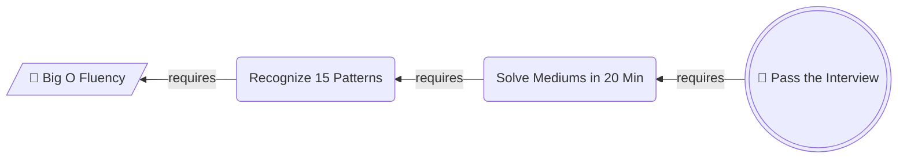

The same content, reversed into execution order, is what the reader actually follows. Note that the entry point becomes a stadium once the chain is read forwards, because it is now a starting place rather than a dependency.

Top down means one thing only, which is that the node above owns or contains the node below.

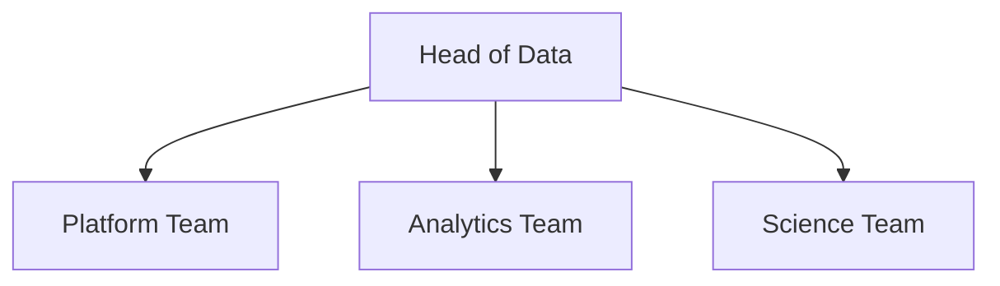

Never mix two of these meanings inside one diagram. The classic failure is a graph where some arrows mean "then" and others mean "requires", which leaves the reader with no way to interpret any arrow.

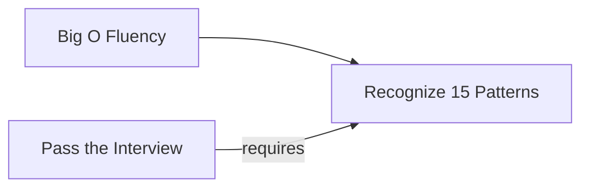

Two arrows point at `B` and they mean opposite things. One says work flows into it, the other says it is a precondition of something else. The fix is never to relabel the arrows. It is to split this into a backwards diagram and a forwards diagram, which is exactly what the Working Backwards Chain pattern does.

`BT` is not in the vocabulary. Anything that wants to grow upward is a `TD` diagram drawn the other way round.

---

## 5. Arrow Semantics

Four arrow forms, and each says something different about the connection.

| Form | Meaning |
| :--- | :--- |
| `-->` | Main line. Strong causality, strong ordering, strong ownership |
| `-.->` | Side line. A service relationship, a weak dependency, an optional path |
| `==>` | Emphasized trunk. Only on the happy path of a decision tree |
| `-->\|label\|` | Labeled. The label names the relationship, never the node |

All three arrow weights in one small diagram, each carrying its own meaning.

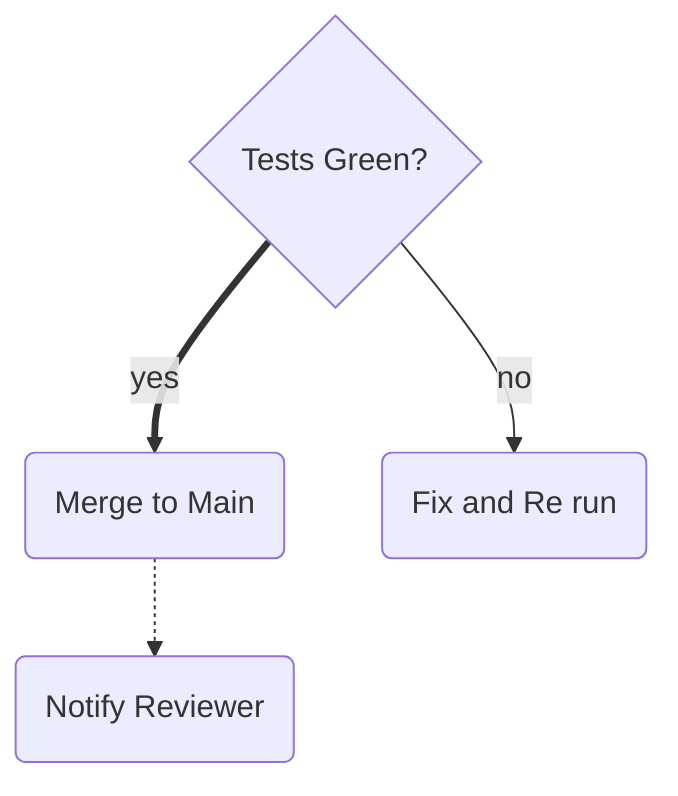

The thick arrow tells the reader where the story goes when nothing goes wrong. The thin arrow is the exception path. The dotted arrow is a courtesy notification that is not part of the flow at all, and drawing it solid would have implied the merge is not finished until the reviewer is told.

Arrow labels are where discipline slips. A label must add information the arrow does not already carry, which in practice means it names a relationship (`requires`, `feeds`, `escalates to`) or states a condition (`yes`, `no`, `over 5 MB`). A label that repeats the node it points at is noise.

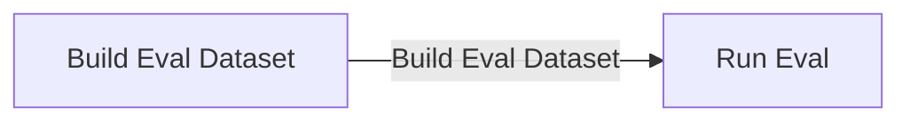

The label says what the target node already says, so it doubles the words on screen and adds nothing. Either write `-->|feeds|` or write nothing. In an unbranching chain the correct number of labels is usually zero, because sequence is already carried by the direction of the arrows.

---

## 6. Color Semantics

Four classes, four meanings. Color is the last signal applied, after shape and position have already done their work, and a diagram that only makes sense in color is a broken diagram.

| Class | Use for | classDef |
| :--- | :--- | :--- |
| `goal` | The goal node | `fill:#D1F0DB,stroke:#1B7F4B,color:#0B3D24` |
| `accent` | Milestones and the one link worth staring at | `fill:#FFF3CD,stroke:#B8860B,color:#3D2E00` |
| `risk` | Risks, traps, headwinds | `fill:#FDE2E1,stroke:#C0392B,color:#5A1710` |
| `muted` | Background context that is not the point | `fill:#EEF1F5,stroke:#8A94A6,color:#2C3440` |

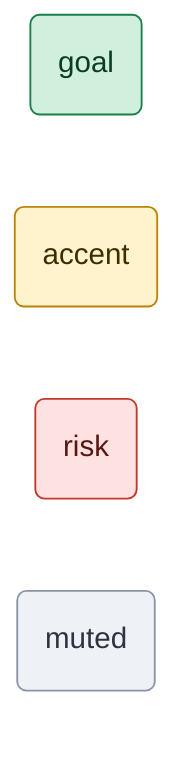

Every `classDef` must set `fill`, `stroke`, and `color` together. Setting only `fill` leaves the text color to the theme, and dark text on a pale fill turns into pale text on a pale fill the moment someone reads the page in GitHub dark mode. The three properties travel as a unit.

Unclassed nodes keep the theme default, and most nodes should stay unclassed. The budget for the three emphasis classes (`goal`, `accent`, `risk`) is three nodes per diagram. Past that, emphasis stops pointing anywhere.

`muted` is not counted against that budget, because it removes attention rather than adding it. Pushing the surrounding context into grey is often the cleanest way to make one node stand out, and it costs no highlight budget at all.

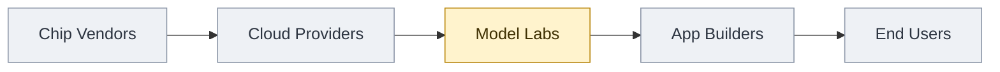

One amber node against four grey ones says "we are here, and the rest is context" without a single word of explanation. Compare that to the version where enthusiasm won.

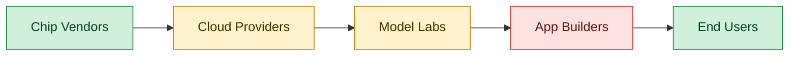

Five colored nodes, three classes, and no hierarchy at all. The reader's eye has nowhere to land, and the green now means "endpoint" here while it means "goal" everywhere else in the library, which quietly breaks the color vocabulary across the whole document set.

---

## 7. Complexity Limits

These are hard numbers, not guidelines. They exist because the most common failure in explainer diagrams is not an ugly diagram, it is a correct diagram nobody can read.

| Limit | Value |
| :--- | :--- |
| Nodes in one horizontal chain | 3 to 6, never more than 7 |
| Total nodes in one diagram | 12 |
| Meanings per node | 1 |
| Words per node label | 4 |

The horizontal chain limit is about page width. Beyond roughly seven nodes the renderer shrinks the labels to fit, and on a phone the reader scrolls sideways looking for the end. A pattern may loosen this cap for a vertical layout, where height is cheap, and Step Flow does exactly that. The ceiling of 12 nodes per diagram binds everywhere and is never raised.

Here is what breaking the limit looks like.

```mermaid
flowchart LR
    A["Collect Requirements"] --> B["Draft the Spec"] --> C["Review the Spec"] --> D["Approve the Spec"] --> E["Design the Schema"] --> F["Review the Schema"] --> G["Build Ingest"] --> H["Build Transform"] --> I["Build Serving"] --> J["Write Tests"] --> K["Run the Backfill"] --> L["Validate Output"] --> M["Deploy"] --> N["Monitor"]
```

Fourteen nodes on one line. Every label is technically present and functionally invisible. The fix is never a smaller font. Group the steps into named phases and draw one diagram per phase, ending each phase on the milestone that opens the next.

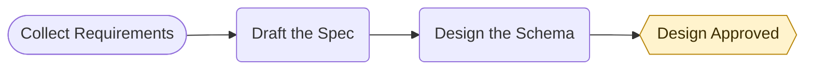

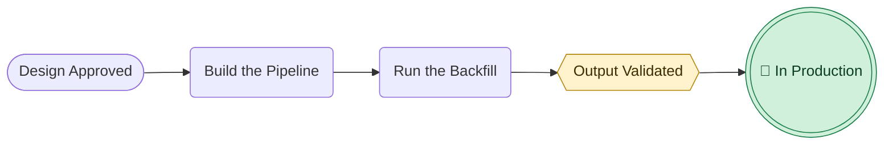

The shared node is what makes this work. `Design Approved` is a milestone at the end of the first diagram and the start of the second, so the two read as one story rather than as two unrelated pictures.

The one meaning per node rule is the other half of this. A node holds a noun phrase or a short imperative, not a sentence and never a clause with "and" in it. `Build the pipeline and backfill history` is two nodes wearing one box. Detail that will not fit belongs in the prose beneath the diagram, which is unlimited in length and much easier to read.

---

## 8. Legacy Renderer Fallback

The `@{ shape: ... }` syntax needs Mermaid v11.3 or newer. GitHub supports it. Some Sphinx and Obsidian builds lag behind. When targeting an older renderer, swap the syntax and keep every semantic rule unchanged.

| Role | Modern | Classic |
| :--- | :--- | :--- |
| Goal | `G@{ shape: dbl-circ, label: "Ship" }` | `G((("Ship")))` |
| Start | `S@{ shape: stadium, label: "Kickoff" }` | `S(["Kickoff"])` |
| Action | `A@{ shape: rounded, label: "Build" }` | `A("Build")` |
| Input | `I@{ shape: lean-r, label: "Raw Logs" }` | `I[/"Raw Logs"/]` |
| Branch | `Q@{ shape: diam, label: "Green?" }` | `Q{"Green?"}` |
| Milestone | `M@{ shape: hex, label: "Sign Off" }` | `M{{"Sign Off"}}` |
| Concept | `C@{ shape: rect, label: "Model Labs" }` | `C["Model Labs"]` |

The document shape has no classic equivalent. Fall back to a plain rectangle and let the 📄 emoji carry the meaning, which is the one case where an emoji is doing a shape's job.

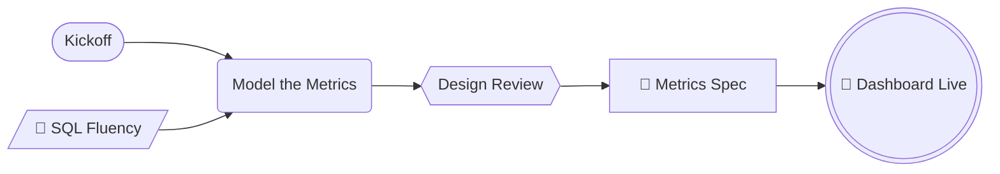

That is the same diagram as the one in section 2, rendered entirely in classic syntax. Keep quotes around every label. They are what let emoji and punctuation survive the parser.

---

## 9. Grammar Checklist

Run this against any diagram drafted straight from the grammar, and against every example embedded in a pattern file.

- Every shape is one of the eight, and it was chosen by meaning rather than by looks.
- At most one `dbl-circ`, and it carries 🎯.
- No diamond without a real branch leaving it.
- Every emoji is one of the six, at most one per node, and it agrees with the node's shape.
- The direction matches the meaning, and only one meaning appears in the diagram.
- Every arrow form is intentional, and no label restates the node it points at.
- Each `classDef` sets `fill`, `stroke`, and `color`.
- At most three nodes carry `goal`, `accent`, or `risk` combined.
- No horizontal chain exceeds 7 nodes, and no diagram exceeds 12.
- Every label is 4 words or fewer and holds exactly one idea.
- The diagram still parses. Run it through a renderer before it ships.

Two of these bend per pattern. The three node color budget and the seven node chain limit are both loosened by Step Flow, and section 10 says why. Check the pattern file's own rules before failing a diagram on either one.

---

## 10. Deviation Register

Every place a shipped pattern departs from the vocabulary above, and the reason. This table exists because the pattern files are self contained and reference nothing, so nothing else in the library records that a color has already been spoken for somewhere. Read it before binding a color or loosening a limit in a new pattern.

Narrowing is not a deviation and is not listed here. A pattern that uses three of the eight shapes is doing what patterns are for.

| Pattern | Deviates on | What it does instead | Why |
| :--- | :--- | :--- | :--- |
| Step Flow | `goal` green, `risk` red | Green marks the start terminal, red marks the end terminal | A procedure has a beginning and an end rather than a goal, and a chain containing a hazard is not a Step Flow, so no red is competing for the meaning |
| Step Flow | `TD` means hierarchy | `TD` is a layout choice, taken when a row would be too wide to read | The pattern is unbranching, so forward order is the only meaning available and direction is free to carry something else. Paid for by requiring the chain to be strictly linear, since a fan out under `TD` reads as containment |
| Step Flow | 3 colored nodes per diagram | 4 allowed, being 2 terminals plus at most 2 key steps | The terminals appear in every diagram of the pattern and point at nothing, so they are structure rather than emphasis. The emphasis budget is the 2 key steps |
| Step Flow | 7 node horizontal chain limit | No fixed count. Total label width decides `LR` against `TD` | The 7 is a proxy for a row running out of page width, and a vertical chain never hits it |

Two things to watch when adding a row. If a new pattern wants to re-bind green or red, check what Step Flow already did with them, because two patterns binding the same color to two different meanings is exactly the drift a closed palette is supposed to prevent. And if a deviation cannot be written as a single row here, it is usually not a deviation but a new pattern.
