# Visual Grammar

## 1. What This File Is

This is the shared alphabet that every pattern in the library is projected from. It is an author time document. It does not ship with the plugin, and it is never loaded when someone is actually drawing a diagram. The shipped pattern files under `explainer-diagrams/ref/patterns/` are self contained copies of the parts they use, and they reference nothing, including this file.

The reason for that split is worth stating once. Consistency across patterns is settled the moment a pattern file is written, not the moment it is read. Once `step-flow.md` contains the literal string `fill:#D1F0DB`, the green is already correct, and an agent reading that file to draw one diagram gains nothing from knowing the value came from a shared table. What it would lose is real: handing it this document means handing it five shapes, four arrow forms, and two directions the pattern forbids, immediately before the pattern tells it not to use them.

So this file has two jobs and neither is runtime. It fixes the vocabulary so ten pattern files agree with each other. And section 10 records where each pattern deliberately departs from that vocabulary, which is the only place the whole picture exists once the pattern files stop pointing at anything.

The vocabulary is closed. Eight shapes, six emoji, three directions, four arrow forms, four color classes, and that is all of it. The point of a closed alphabet is that a reader who has seen a dozen of these diagrams can decode the thirteenth without a legend. Every shape added for the sake of one diagram costs the reader that ability across all the others.

A pattern narrows this vocabulary by using only part of it, which needs no announcement. A pattern deviates when it binds a piece of the vocabulary to a different meaning or loosens a limit set here, and every deviation gets a row in section 10. The rule that has no exception is that a pattern never invents vocabulary. A ninth shape or a fifth color is a change to this file, applied across every pattern file, or it does not happen.

---

## 2. Shape Semantics

Shape carries meaning, never decoration. Eight shapes, each locked to one role.

| Role | Shape | Syntax | Notes |
| :--- | :--- | :--- | :--- |
| Goal, final outcome | Double circle | `@{ shape: dbl-circ }` | At most one per diagram, always paired with 🎯 |
| Start, entry point | Stadium | `@{ shape: stadium }` | The place the reader begins |
| Action, step | Rounded rectangle | `@{ shape: rounded }` | The default shape, and the most used |
| Input, prerequisite | Lean right | `@{ shape: lean-r }` | Knowledge or data that enters from outside |
| Artifact, evidence | Document | `@{ shape: doc }` | A document, report, or deliverable |
| Branch point | Diamond | `@{ shape: diam }` | Only when a real branch follows |
| Milestone, gate | Hexagon | `@{ shape: hex }` | A checkpoint in a long flow, usually `accent` |
| Concept, static entity | Rectangle | `@{ shape: rect }` | Roles in a role map, positions in a niche map |

Here is the full alphabet rendered once, so you can see what each name actually looks like.

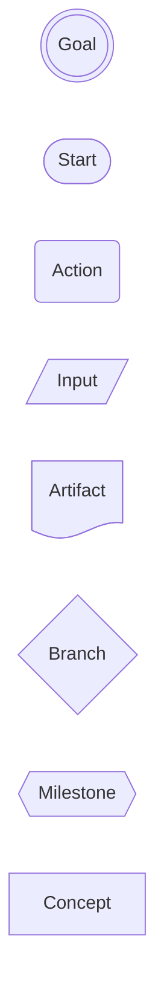

And here is the same alphabet doing its job in a real diagram, where each shape is chosen by what the node means rather than by what looks balanced.

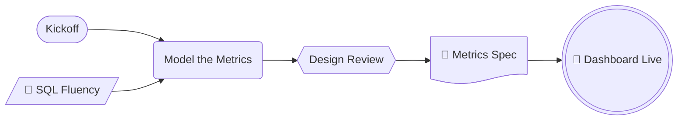

The rule that gets broken most often is the diamond. A diamond is a promise to the reader that two or more arrows leave the node, and when only one does, the reader spends attention confirming that nothing was missed. If a step does not branch, it is a `rounded`, however procedural it feels.

The second most broken rule is the double circle. One goal per diagram. A diagram with three goals has no goal, and the content is really two or three diagrams that were merged to save space.

---

## 3. Emoji Semantics

Six emoji, and the list does not grow. Each one marks a node whose role the reader should register instantly, and each is placed at the front of the label.

| Emoji | Meaning |
| :--- | :--- |
| 🎯 | Goal, the final target |
| 📄 | Artifact, a deliverable |
| 💡 | Insight, the thing worth remembering |
| ⚠️ | Risk, a trap |
| 🔑 | Prerequisite, what must already be true |
| ✅ | Done, a passed checkpoint |

The cap of six exists to keep these diagrams from drifting into the emoji soup that decorated documents fall into. Unicode emoji are used rather than Mermaid's Iconify icon packs because icon packs must be registered by the renderer, and the same diagram then breaks when it moves from GitHub to Sphinx to Obsidian. An emoji renders everywhere.

All six in one diagram, each attached to a node whose shape already agrees with it.

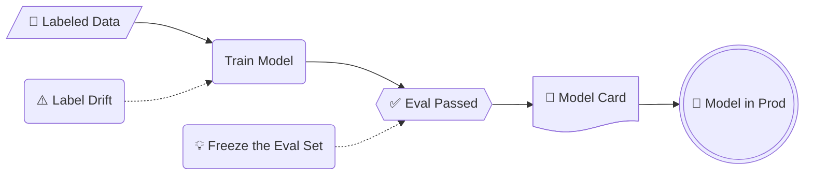

Emoji reinforce shape, they never replace it. `📄 Metrics Spec` written inside a `rounded` node is wrong, because the shape says step and the emoji says artifact, and the reader has to guess which signal to trust. Use one emoji per node at most, and leave ordinary steps bare. If every node carries an emoji, none of them is a marker any more.

---

## 4. Direction Semantics

Direction is a meaning, not a layout preference. Three directions, three meanings.

| Direction | Meaning |
| :--- | :--- |
| `RL` | Backwards reasoning. Start at the goal and ask what it requires |
| `LR` | Forward execution or time order. This is the default form published to readers |
| `TD` | Hierarchy or containment. Org charts, taxonomies, layered systems |

Backwards reasoning runs right to left, and every arrow means `requires`.

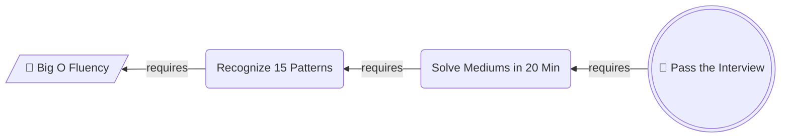

The same content, reversed into execution order, is what the reader actually follows. Note that the entry point becomes a stadium once the chain is read forwards, because it is now a starting place rather than a dependency.

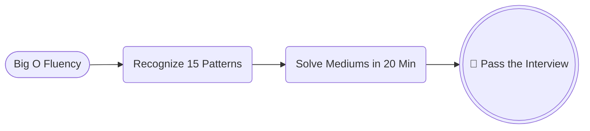

Top down means one thing only, which is that the node above owns or contains the node below.

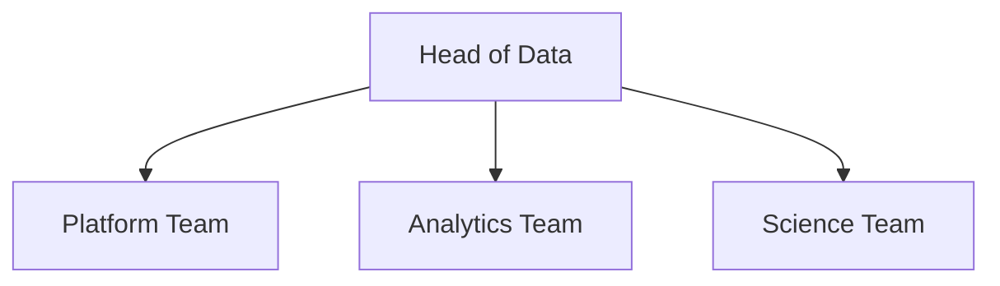

Never mix two of these meanings inside one diagram. The classic failure is a graph where some arrows mean "then" and others mean "requires", which leaves the reader with no way to interpret any arrow.

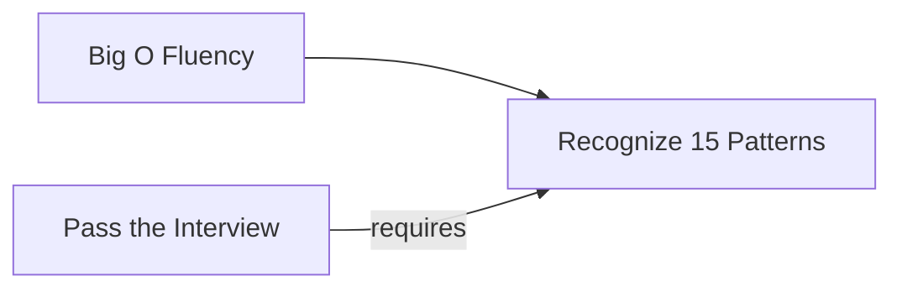

Two arrows point at `B` and they mean opposite things. One says work flows into it, the other says it is a precondition of something else. The fix is never to relabel the arrows. It is to split this into a backwards diagram and a forwards diagram, which is exactly what the Working Backwards Chain pattern does.

`BT` is not in the vocabulary. Anything that wants to grow upward is a `TD` diagram drawn the other way round.

---

## 5. Arrow Semantics

Four arrow forms, and each says something different about the connection.

| Form | Meaning |
| :--- | :--- |
| `-->` | Main line. Strong causality, strong ordering, strong ownership |
| `-.->` | Side line. A service relationship, a weak dependency, an optional path |
| `==>` | Emphasized trunk. Only on the happy path of a decision tree |
| `-->\|label\|` | Labeled. The label names the relationship, never the node |

All three arrow weights in one small diagram, each carrying its own meaning.

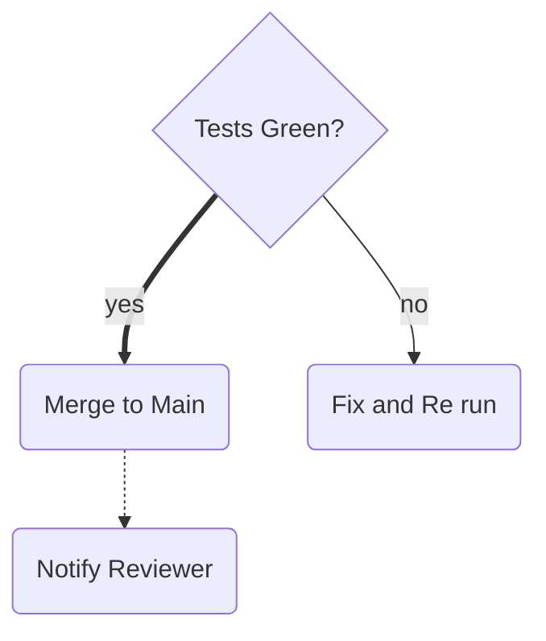

The thick arrow tells the reader where the story goes when nothing goes wrong. The thin arrow is the exception path. The dotted arrow is a courtesy notification that is not part of the flow at all, and drawing it solid would have implied the merge is not finished until the reviewer is told.

Arrow labels are where discipline slips. A label must add information the arrow does not already carry, which in practice means it names a relationship (`requires`, `feeds`, `escalates to`) or states a condition (`yes`, `no`, `over 5 MB`). A label that repeats the node it points at is noise.

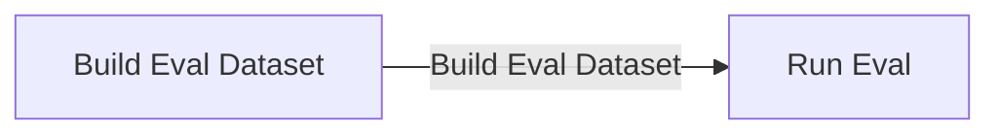

The label says what the target node already says, so it doubles the words on screen and adds nothing. Either write `-->|feeds|` or write nothing. In an unbranching chain the correct number of labels is usually zero, because sequence is already carried by the direction of the arrows.

---

## 6. Color Semantics

Four classes, four meanings. Color is the last signal applied, after shape and position have already done their work, and a diagram that only makes sense in color is a broken diagram.

| Class | Use for | classDef |
| :--- | :--- | :--- |
| `goal` | The goal node | `fill:#D1F0DB,stroke:#1B7F4B,color:#0B3D24` |
| `accent` | Milestones and the one link worth staring at | `fill:#FFF3CD,stroke:#B8860B,color:#3D2E00` |
| `risk` | Risks, traps, headwinds | `fill:#FDE2E1,stroke:#C0392B,color:#5A1710` |
| `muted` | Background context that is not the point | `fill:#EEF1F5,stroke:#8A94A6,color:#2C3440` |

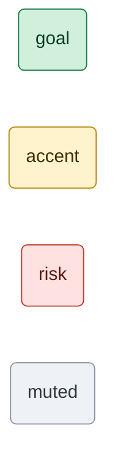

Every `classDef` must set `fill`, `stroke`, and `color` together. Setting only `fill` leaves the text color to the theme, and dark text on a pale fill turns into pale text on a pale fill the moment someone reads the page in GitHub dark mode. The three properties travel as a unit.

Unclassed nodes keep the theme default, and most nodes should stay unclassed. The budget for the three emphasis classes (`goal`, `accent`, `risk`) is three nodes per diagram. Past that, emphasis stops pointing anywhere.

`muted` is not counted against that budget, because it removes attention rather than adding it. Pushing the surrounding context into grey is often the cleanest way to make one node stand out, and it costs no highlight budget at all.

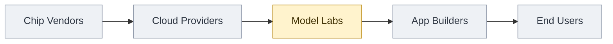

One amber node against four grey ones says "we are here, and the rest is context" without a single word of explanation. Compare that to the version where enthusiasm won.

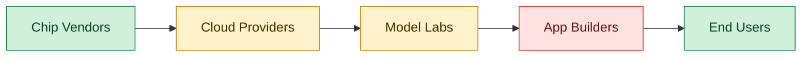

Five colored nodes, three classes, and no hierarchy at all. The reader's eye has nowhere to land, and the green now means "endpoint" here while it means "goal" everywhere else in the library, which quietly breaks the color vocabulary across the whole document set.

---

## 7. Complexity Limits

These are hard numbers, not guidelines. They exist because the most common failure in explainer diagrams is not an ugly diagram, it is a correct diagram nobody can read.

| Limit | Value |
| :--- | :--- |
| Nodes in one horizontal chain | 3 to 6, never more than 7 |
| Total nodes in one diagram | 12 |
| Meanings per node | 1 |
| Words per node label | 4 |

The horizontal chain limit is about page width. Beyond roughly seven nodes the renderer shrinks the labels to fit, and on a phone the reader scrolls sideways looking for the end. A pattern may loosen this cap for a vertical layout, where height is cheap, and Step Flow does exactly that. The ceiling of 12 nodes per diagram binds everywhere and is never raised.

Here is what breaking the limit looks like.

```mermaid
flowchart LR
    A["Collect Requirements"] --> B["Draft the Spec"] --> C["Review the Spec"] --> D["Approve the Spec"] --> E["Design the Schema"] --> F["Review the Schema"] --> G["Build Ingest"] --> H["Build Transform"] --> I["Build Serving"] --> J["Write Tests"] --> K["Run the Backfill"] --> L["Validate Output"] --> M["Deploy"] --> N["Monitor"]
```

Fourteen nodes on one line. Every label is technically present and functionally invisible. The fix is never a smaller font. Group the steps into named phases and draw one diagram per phase, ending each phase on the milestone that opens the next.

The shared node is what makes this work. `Design Approved` is a milestone at the end of the first diagram and the start of the second, so the two read as one story rather than as two unrelated pictures.

The one meaning per node rule is the other half of this. A node holds a noun phrase or a short imperative, not a sentence and never a clause with "and" in it. `Build the pipeline and backfill history` is two nodes wearing one box. Detail that will not fit belongs in the prose beneath the diagram, which is unlimited in length and much easier to read.

---

## 8. Legacy Renderer Fallback

The `@{ shape: ... }` syntax needs Mermaid v11.3 or newer. GitHub supports it. Some Sphinx and Obsidian builds lag behind. When targeting an older renderer, swap the syntax and keep every semantic rule unchanged.

| Role | Modern | Classic |
| :--- | :--- | :--- |
| Goal | `G@{ shape: dbl-circ, label: "Ship" }` | `G((("Ship")))` |
| Start | `S@{ shape: stadium, label: "Kickoff" }` | `S(["Kickoff"])` |
| Action | `A@{ shape: rounded, label: "Build" }` | `A("Build")` |
| Input | `I@{ shape: lean-r, label: "Raw Logs" }` | `I[/"Raw Logs"/]` |
| Branch | `Q@{ shape: diam, label: "Green?" }` | `Q{"Green?"}` |
| Milestone | `M@{ shape: hex, label: "Sign Off" }` | `M{{"Sign Off"}}` |
| Concept | `C@{ shape: rect, label: "Model Labs" }` | `C["Model Labs"]` |

The document shape has no classic equivalent. Fall back to a plain rectangle and let the 📄 emoji carry the meaning, which is the one case where an emoji is doing a shape's job.

That is the same diagram as the one in section 2, rendered entirely in classic syntax. Keep quotes around every label. They are what let emoji and punctuation survive the parser.

---

## 9. Grammar Checklist

Run this against any diagram drafted straight from the grammar, and against every example embedded in a pattern file.

- Every shape is one of the eight, and it was chosen by meaning rather than by looks.
- At most one `dbl-circ`, and it carries 🎯.
- No diamond without a real branch leaving it.
- Every emoji is one of the six, at most one per node, and it agrees with the node's shape.
- The direction matches the meaning, and only one meaning appears in the diagram.
- Every arrow form is intentional, and no label restates the node it points at.
- Each `classDef` sets `fill`, `stroke`, and `color`.
- At most three nodes carry `goal`, `accent`, or `risk` combined.
- No horizontal chain exceeds 7 nodes, and no diagram exceeds 12.
- Every label is 4 words or fewer and holds exactly one idea.
- The diagram still parses. Run it through a renderer before it ships.

Two of these bend per pattern. The three node color budget and the seven node chain limit are both loosened by Step Flow, and section 10 says why. Check the pattern file's own rules before failing a diagram on either one.

---

## 10. Deviation Register

Every place a shipped pattern departs from the vocabulary above, and the reason. This table exists because the pattern files are self contained and reference nothing, so nothing else in the library records that a color has already been spoken for somewhere. Read it before binding a color or loosening a limit in a new pattern.

Narrowing is not a deviation and is not listed here. A pattern that uses three of the eight shapes is doing what patterns are for.

| Pattern | Deviates on | What it does instead | Why |
| :--- | :--- | :--- | :--- |
| Step Flow | `goal` green, `risk` red | Green marks the start terminal, red marks the end terminal | A procedure has a beginning and an end rather than a goal, and a chain containing a hazard is not a Step Flow, so no red is competing for the meaning |
| Step Flow | `TD` means hierarchy | `TD` is a layout choice, taken when a row would be too wide to read | The pattern is unbranching, so forward order is the only meaning available and direction is free to carry something else. Paid for by requiring the chain to be strictly linear, since a fan out under `TD` reads as containment |
| Step Flow | 3 colored nodes per diagram | 4 allowed, being 2 terminals plus at most 2 key steps | The terminals appear in every diagram of the pattern and point at nothing, so they are structure rather than emphasis. The emphasis budget is the 2 key steps |
| Step Flow | 7 node horizontal chain limit | No fixed count. Total label width decides `LR` against `TD` | The 7 is a proxy for a row running out of page width, and a vertical chain never hits it |
| Working Backwards Chain | `RL` means backwards reasoning | The derivation is `LR` with the goal as the leftmost node, and backwards reasoning is carried by that position plus the `requires` label on every arrow | `RL` puts the derivation's conclusion under the reader's eye before its premise, so the argument has to be read against scan order, one arrow at a time. Drawing both diagrams `LR` also makes the pair a mirror, and watching the goal move from the left end to the right end is a clearer statement of working backwards than the layout direction ever was. Paid for by requiring the `requires` label on every derivation arrow, since direction no longer distinguishes the two diagrams |
| Working Backwards Chain | Zero labels in an unbranching chain | Every arrow in the derivation is labeled `requires` | Direction no longer separates the derivation from the plan, so the label is the only thing that does. Without it the pair reads as two diagrams contradicting each other |
| Working Backwards Chain | `accent` amber marks milestones | Amber marks the ground node, the place the derivation bottoms out | The ground is the one node worth staring at, since it is the only one the reader can act on today. It is also the hinge, appearing as the last node of the derivation and the first of the plan, and the repeated color is what binds the two diagrams into one story |
| Timeline | The whole flowchart vocabulary | Uses Mermaid's `timeline` diagram type, which has no shapes, no arrows, no direction, and no `classDef` | The content is dated events on an axis, and a flowchart drawn to look like an axis would offer arrows the content must not use. Only the emoji and the complexity limits survive the jump, and sections 2, 4, 5, 6 above simply do not apply |
| Timeline | 4 color classes | No color at all | `classDef` does not exist in a `timeline`, which auto colors by section. `%%{init}%%` theme variables parse but render inconsistently across GitHub, Sphinx, and Obsidian, and a color that silently fails is worse than none. The emphasis budget is spent on emoji instead |
| Timeline | ⚠️ is a risk, ✅ is a passed checkpoint | ⚠️ is a setback that already happened, ✅ is a stated goal actually reached | Every event in a history is in the past, so a forward looking risk cannot appear and an unqualified "done" would be true of every tick. Capped at two marked events, since emoji is the only typographic signal the diagram type has |
| Timeline | 4 words per label | 8 words per event | A dated fact does not fit in 4 words, and a timeline event is a line of text rather than a box that has to stay square. Raised nowhere else |
| Timeline | 12 nodes per diagram | 4 to 8 ticks, 1 to 3 events each | Ticks and events are a different unit from nodes. The binding constraint is axis width, which runs out around 8 ticks |
| Timeline | No pattern uses a diagram title | `title` is required | The window a timeline covers is its main argument and is otherwise invisible, since a reader cannot see that the axis starts in 2025 rather than at the company's founding |
| Niche Map | `LR` means forward execution or time order | `LR` means position in a one-way flow, which is a static structure rather than a sequence. The leftmost node is the furthest upstream, not the earliest | The positions are all there at once and none happens first, so ordering them in time would be a claim the content does not support. Paid for by requiring a sentence above every diagram naming what flows and which way, since direction alone no longer says it. Also paid for by forbidding `TD` outright, because with `LR` re-bound there is no direction left to carry hierarchy |
| Niche Map | `goal` green marks the goal node | Green marks the subject, the one position the surrounding writing is about | A map of positions has no goal: nothing in it is reached, and every box is simply there. The subject needs the library's strongest single color because the entire diagram exists to answer "which box is this about", and amber is already the second rank here. Safe because the pattern has no `dbl-circ` and no 🎯, so nothing else in the diagram could be mistaken for a goal |
| Niche Map | `accent` amber marks milestones or the one link worth staring at | Amber marks 1 to 3 neighbors that matter to the subject, chosen by what would force it to change rather than by adjacency | Importance and distance disagree often enough that a map coloring by distance says nothing the arrows had not already said. Raised from one node to three because the ranking is the argument: an amber second hop next to a grey first hop is the whole finding |
| Niche Map | 3 colored nodes per diagram | 5, being 1 green subject, 1 to 3 amber neighbors, and 0 or 1 red rival | Grey is mandatory on every remaining box, so the diagram reads as three tiers of brightness rather than five competing highlights. The green appears in every diagram of the pattern and points at nothing, so it is structure rather than emphasis, and the emphasis budget is the amber |
| Niche Map | Most nodes stay unclassed | Every node is classed, `muted` grey by default | Green against grey reads far louder than green against theme default, and the grey is what states that the rest is context rather than competition. Grey costs no emphasis budget, so this buys the contrast for free |
| Niche Map | 4 words per label, one meaning per node | At most 2 labels carry a second line holding one quantitative anchor, as `"Card Network 0.24 per 100 dollars"` | Where the value or the volume concentrates is a question the boxes cannot answer when they all look the same size. Capped at 2 because an anchor is a comparison and three comparisons is a table. Raised nowhere else, and the anchor must be a single citable figure, since a range on a box reads as precision the source never had |
| Triage Map | `accent` amber marks milestones or the one link worth staring at | Amber marks the fallback response, the node the escalation edges converge on | The fallback is the one exit the reader must hold onto when no case matches or a handler fails. Safe because the pattern has no hexagons and no milestones, so amber is otherwise idle, and capped at one node so it never crowds the three node budget |
| IO Pipeline | 4 words per label | Labels carry an `s<n>:` ID prefix on top of the 4 words: steps as `s2: Draft`, artifacts prefixed with their producing step as `s1: Outline`, external inputs bare | The pattern's unit is one overview plus one block per step, and the prefix is what replaces the cross-diagram arrows: an artifact repeats its exact label in every block that consumes it, so provenance is read off the name instead of traced along a wire. A bare label on a lean-r means "from outside", so the prefix's absence is also a signal, which is why it must never be added decoratively |
| Role Map | `goal` green marks the goal node | Green marks the subject, the one role the writing is about | The identical re-binding Niche Map made, kept identical on purpose: across the two map patterns, one green box always answers "which box is this about", and giving the two subjects two colors would be exactly the drift a closed palette exists to prevent. Safe for the same reason as there, since the pattern has no `dbl-circ` and no 🎯. This overrides the original design note that put the protagonist in amber |
| Role Map | `accent` amber marks milestones or the one link worth staring at | Amber marks 1 to 3 people or teams chosen by dependency rather than rank | Rank is already drawn by the solid tree, so amber repeating it would say nothing the layout had not. The pattern earns its place where the two maps disagree, and a grey manager above an amber peer is the disagreement made visible |
| Role Map | 3 colored nodes per diagram | Up to 4, being 1 green subject plus 1 to 3 amber | Same structure-versus-emphasis argument as Niche Map: the green appears in every diagram of the pattern and points at nothing, so it is structure, and the emphasis budget is the amber |
| Role Map | Most nodes stay unclassed | Every node is classed, `muted` grey by default | Matches Niche Map: green against grey reads far louder than green against theme default, and grey costs no emphasis budget |
| Role Map | 4 words per label, one meaning per node | A named person's box carries two lines, name then role, each line 4 words or fewer | A person in a seat is one meaning that does not fit on one line. Bounded by the rule that a person is named only when the surrounding prose names them, so bare seats and teams stay one line |
| Quadrant | The whole flowchart vocabulary | Uses Mermaid's `quadrantChart`, which has no node shapes, no arrows, and no direction; position on two judgment axes carries all the structure, and emoji are dropped since point color is available | The content is items judged on two continuous dimensions, and a flowchart has no way to state a coordinate. The color palette, the emphasis budget, and the label limits survive the jump; sections 2, 3, 4, 5 above do not apply |
| Quadrant | Every `classDef` sets `fill`, `stroke`, and `color` | `classDef` sets `color` only, reusing the palette's four stroke hexes as point colors: `#1B7F4B`, `#B8860B`, `#C0392B`, `#8A94A6` | A quadrant point is a dot, not a box: its `classDef` takes `color`, `radius`, and `stroke-*`, and there is no label fill to protect because point labels stay theme colored in both GitHub modes. `radius` is banned outright, since a bigger dot reads as a third measured dimension the chart does not have |
| Quadrant | `goal` green marks the goal node | Green marks the subject point, the one item the surrounding writing is about, or a mover's current position | The identical re-binding Niche Map and Role Map made, kept identical on purpose: across the map patterns one green mark always answers "which one is this about". Safe because the chart has no goal to reach and no 🎯. Unlike the other two maps, zero green is allowed, because a portfolio chart argues about the set rather than a member |
| Quadrant | `muted` grey marks background context that is not the point | Grey also marks the earlier position of a mover in the movement form | The past is context by another name: it removes attention from where an item was so the eye lands on where it is now. Costs no emphasis budget, same as everywhere else, and the pairing is carried by the shared name plus time suffix rather than by the color |
| Quadrant | No pattern uses a diagram title | `title` is required, naming the set of points and, in the movement form, the two dates | Same forcing as Timeline: the axes name the dimensions and the corners name the verdicts, but nothing else names the population that was judged, and an unnamed set reads as a claim about everything |
| Quadrant | No pattern ships an `%%{init}%%` directive, and Timeline's row above calls them unsafe | Every quadrant diagram opens with `%%{init: {"quadrantChart": {"xAxisPosition": "bottom"}}}%%`, moving the x axis poles below the plane | This is a layout key, not the theme variables Timeline rejected: a renderer that honors it puts axis text where axes live instead of stacked under the title, and one that ignores it falls back to the top position, a cosmetic regression rather than a silently wrong color |
| Quadrant | Every diagram is self-contained Mermaid, with no required companion apparatus beyond the caption sentences | The `quadrant-1` through `quadrant-4` labels are never written; the four verdicts live in a mandatory markdown table directly under the chart, rows fixed as both high, high y alone, high x alone, neither, poles named verbatim, verdicts imperative and ALL CAPS | With points present the renderer pins each on-chart verdict to the top edge of its quadrant, which for the lower quadrants is directly under the midline, exactly where the pattern's sanctioned midline-band points sit, and no configuration centers the labels. A verdict printed across a data point is worse than none, so the verdicts left the chart, and the caps keep them reading as stamps in the table |
| Proportion Pie | The whole flowchart vocabulary | Uses Mermaid's `pie` diagram type, which has no shapes, no arrows, no direction, and no `classDef` | The content is shares of one whole, and a flowchart drawn as a circle would offer arrows and shapes the content cannot use. Same jump Timeline made, and sections 2, 4, 5 above simply do not apply |
| Proportion Pie | 4 color classes | No color at all | Mermaid auto colors slices and offers no portable per-slice styling. `%%{init}%%` pie theme variables parse but render inconsistently across GitHub, Sphinx, and Obsidian, the same failure that stripped color from Timeline. Emphasis is carried by largest-first slice order and the takeaway sentence instead |
| Proportion Pie | Six emoji | None at all | Timeline kept two because a history contains setbacks and reached goals. A share is not an event: none of the six roles describes a slice, and with `showData` every label already carries a number, so a mark would be pure decoration |
| Proportion Pie | 12 nodes per diagram | 3 to 6 slices, with every slice under 5 percent merged into `Other` | Slices are a different unit from nodes. The binding constraint is that a sliver slice cannot hold its label, and past 6 named slices the content is a distribution that belongs in a table |
| Proportion Pie | No pattern uses a diagram title | `title` is required | Every slice is a share of one denominator, and the title is the only place the diagram can say what that denominator is. Same argument that made Timeline's window a required title |
| Decision Tree | `TD` means hierarchy or containment | `TD` carries the order of evaluation: the first question at the top, later questions lower, the trunk falling straight to the favored exit | Direction is the uniform that separates the two boundary patterns at a glance: an `LR` fan out of labeled cases is a Triage Map, a `TD` chain of diamonds is a Decision Tree, and drawing both the same way would erase the one visual cue that routes between them. Paid for by requiring a condition label on every edge and by banning `rect` outright, since containment edges in this library are unlabeled and nothing in the tree may look like an org box |
| Decision Tree | `goal` green marks the goal node, paired with `dbl-circ` and 🎯 | Green marks the exit the tree is built to reach, a `rounded` leaf at the end of the trunk, with no 🎯 | A decision tree is a standing rule walked again next week, not a goal reached once, so no `dbl-circ` belongs in it, but "where should I end up" still deserves the library's strongest color. Safe because the pattern has no `dbl-circ` and no 🎯, so nothing else could be mistaken for a goal |
| Decision Tree | `risk` red marks risks, traps, headwinds | Red marks at most one exit, the outcome the tree exists to route around | The closest re-binding in the register: the avoided exit is the trap, but it is an outcome node rather than a hazard node, and a tree whose exits are all acceptable carries no red. Capped at one so red keeps pointing at the single worst place a path can end |
| Exchange | The whole flowchart vocabulary | Uses Mermaid's `sequenceDiagram`: one lane per party, numbered messages, no node shapes, no flowchart arrows, no direction keyword, no `classDef` | The content is parties taking turns, and a flowchart cannot say "B answered A" without drawing a cycle. The four word label limit and the complexity discipline survive the jump; sections 2, 4, and 6 above do not apply, and section 5 is re-bound as below |
| Exchange | `-->` is the strong main line, `-.->` is a weak or optional side line | `->>` solid opens a request or hands something over; `-->>` dotted closes one by returning what was asked | The sequence syntax has only line weight to spend, and the open-close pairing is the content. The re-binding is total: grammar dotted means optional, but here the dotted reply is often the most load bearing line in the picture. Paid for by the pairing rule that every dotted arrow must answer an earlier solid one between the same two lanes |
| Exchange | 4 color classes | No color at all | Sequence theming is `%%{init}%%` only and renders inconsistently across GitHub, Sphinx, and Obsidian, the same failure that stripped color from Timeline and Proportion Pie. Emphasis is carried by the single `Note over` stating the diagram's invariant, by `autonumber` giving the prose message numbers to point at, and by the takeaway sentence |
| Exchange | Six emoji | None at all | None of the six roles names a message, and the lane plus the number already give the prose a handle on any line worth discussing. Same argument as Proportion Pie |
| Exchange | 12 nodes per diagram | 2 to 4 lanes and 4 to 10 numbered messages | Lanes and messages are a different unit from nodes. The binding constraints are vertical scan length and messages spanning lanes they do not concern |
| Exchange | `TD` means hierarchy or containment | Time runs down the page, fixed by the diagram type; the only layout choice is lane order, with the initiator leftmost | A sequence diagram has no direction keyword, vertical is time by construction, and no hierarchy claim is available to collide with it |
| Cycle | `rounded` means action, step | Rounded holds a condition written as a comparative, as `More Users`, rising or falling with each turn of the ring | A cycle's nodes are levels in motion rather than acts performed, and the static shape (`rect`) is both locked to the map patterns and a claim of stasis the content contradicts. Safe because the pattern contains no plain steps for the reading to collide with |
| Cycle | `LR` means forward execution or time order | Time on the ring is cyclic, so the leftmost node is where the telling enters rather than the earliest event | A closed ring has no earliest node, and treating the left end as one would claim a start the content denies. Paid for by a convention fixing the entry: the node the starter feeds, else the intervention, else the condition the reader already knows |
| Cycle | `accent` amber marks milestones and the one link worth staring at | Amber marks the intervention, the one condition the reader can move directly: where to push a building ring or cut a decaying one | The intervention is the only actionable thing on a ring, the node-shaped version of the one link worth staring at. Safe because the pattern has no hexagons and no milestones, so amber is otherwise idle, and capped at one |
| Cycle | `risk` red marks risks, traps, headwinds | Red marks at most one condition on a decaying ring, the one that ends the story if the ring keeps turning | The same closeness Decision Tree recorded: an outcome-condition rather than a hazard node. A building ring carries no red at all, so the color's presence also announces the ring's valence at a glance |
| State Lifecycle | `goal` green marks the goal node, paired with `dbl-circ` and 🎯 | Green marks the target state, the one the lifecycle exists to move instances into and keep them in, terminal or not, with no 🎯 | The next member of the green-answers-the-headline family: Decision Tree's green exit answers "where should I end up", and this answers "where should it end up". A lifecycle has no goal reached once, since the target can be left and re-entered and holding it is the point. Safe because the pattern has no `dbl-circ` and no 🎯 |
| State Lifecycle | `risk` red marks risks, traps, headwinds | Red marks at most one failure state, the one the lifecycle is built to keep instances out of | The same re-binding Decision Tree made for its avoided exit, kept identical on purpose. Capped at one so red keeps pointing at the single worst place an instance can land, and a lifecycle whose endings are all acceptable carries no red |
| State Lifecycle | `accent` amber marks milestones and the one link worth staring at | Amber marks at most one stall state, the state where instances wait longest and where the outcome is usually decided | The pattern has no hexagons and no milestones, so amber is otherwise idle, the same argument Triage Map used for its fallback. Capped at one, and the three classes together stay inside the grammar's three node budget, so no budget row is needed |
| State Lifecycle | `==>` only on the happy path of a decision tree | The thick path marks the happy path here too: the one route a typical instance takes from the entry state to the green target when nothing goes wrong | The meaning is identical and kept identical on purpose. The grammar sentence names Decision Tree only because it was the only pattern with a happy path to mark, and this row is where that stops being true |
| State Lifecycle | `LR` means forward execution or time order | `LR` means progress toward the target state. A leftward back edge is the instance losing ground, and at least one back edge is required for the pattern to apply at all | Time cannot run backwards but progress can, and the back edge is the finding the pattern exists to draw. Paid for by requiring every edge to carry its triggering event, so a backwards arrow reads as a caused regression rather than a layout accident |

Two things to watch when adding a row. If a new pattern wants to re-bind green or red, check what Step Flow already did with them, because two patterns binding the same color to two different meanings is exactly the drift a closed palette is supposed to prevent. And if a deviation cannot be written as a single row here, it is usually not a deviation but a new pattern.
