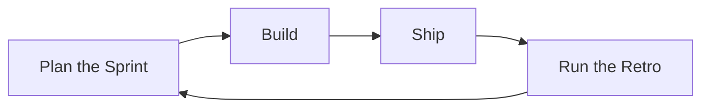
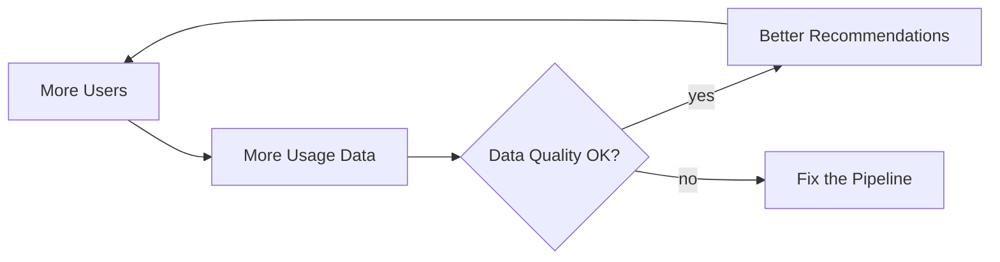
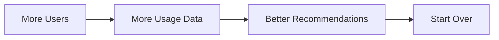

# Cycle

## 1. What It Is

A closed ring of conditions, each driving the next and the last driving the first, so one trip around ends where it began with every level pushed further in its stated direction. The diagram makes one claim: this set feeds itself, and left alone it will keep turning.

One drawing, two stories. When the comparatives point the way the owner wants, the ring is a flywheel and the argument is why growth compounds. When they point the other way, it is a spiral and the argument is why things keep getting worse on their own. Nothing in the rules changes between them except where red is allowed.

---

## 2. When To Use

The content is a set of conditions that cause each other in a circle, and two tests both have to pass.

Every edge survives being said out loud as "the more X, the more Y", with less, worse, or fewer allowed in either slot. And the ring closes: the last condition drives the first, with no "unless" on the closing edge.

The tell that fails the test is reaching for "then". A procedure that merely repeats — a sprint, an on-call rotation — has order but no compounding, and it is a Step Flow whose repetition costs one sentence of prose.

---

## 3. When Not To Use

| The content actually has | Use instead |
| :--- | :--- |
| Steps that run once from start to end | `step-flow.md` |
| A repeating procedure with nothing compounding | `step-flow.md`, with the repetition stated in prose |
| Two conditions reinforcing each other | No diagram. Write the sentence |
| Stages handing over named artifacts | `io-pipeline.md`, with the loop stated in prose |
| A next step that depends on an answer | `decision-tree.md` |
| The ring's history as dated events | `timeline.md` |

The second row is the boundary that gets crossed. Plan, build, ship, learn is a loop on a slide and a procedure in practice: no condition accumulates around it, so it draws as a chain.

---

## 4. Direction

Always `LR`. The ring has no earliest node, so the leftmost box is not a time claim: it is where the telling enters. Put leftmost the node the starter feeds; with no starter, the intervention; with neither, the condition the reader already knows. The closing edge arcs back across the row, and that arc is the signature — a reader who sees it knows the diagram is a ring before reading a single label.

Never `TD`, which claims the top of the ring owns the bottom. Never `RL`.

---

## 5. Shapes

| Role | Shape | Syntax | Count |
| :--- | :--- | :--- | :--- |
| Condition | Rounded rectangle | `@{ shape: rounded }` | 3 to 6, forming the ring |
| Starter | Lean right | `@{ shape: lean-r }` | 0 or 1, outside the ring |

Every ring label is a comparative noun phrase: More, Fewer, Better, Worse, Faster, Less, Higher, or Lower, plus a noun, four words at most. The comparative is the compounding claim, and it is what makes every edge testable. A label without one, `Ship Features`, is a step, and a ring of steps is a repeating procedure that belongs in a Step Flow.

The starter is the one-time outside push or shock that set the ring moving: `Launch Publicity`, `Slipped Deadline`. It names a thing that happened, not a condition, and a ring that has always been turning has none.

No diamonds: a question in the ring gives it an exit, and a ring with an exit is not self-sustaining. No stadiums and no double circles, because a ring has no start, no end, and no goal to reach. No hexagons, no documents, no emoji.

Below Mermaid v11.3 the `@{ shape: ... }` form is unavailable. Substitute `A("More Users")` and `X[/"Slipped Deadline"/]`, keeping the quotes so punctuation survives the parser.

---

## 6. Color

| Class | Color | Marks | Count |
| :--- | :--- | :--- | :--- |
| `accent` | Amber | The intervention, the one condition the reader can move directly | 0 or 1 |
| `risk` | Red | On a decaying ring only, the condition that ends the story if the ring keeps turning | 0 or 1 |
| `muted` | Grey | The starter | The starter only |

```text
classDef accent fill:#FFF3CD,stroke:#B8860B,color:#3D2E00
classDef risk fill:#FDE2E1,stroke:#C0392B,color:#5A1710
classDef muted fill:#EEF1F5,stroke:#8A94A6,color:#2C3440
```

Copy all three properties or none. Dropping `color` leaves the text to the theme, and a diagram that reads in GitHub light mode turns pale on pale in dark mode.

Pick the intervention by directness, not by pain. The question is not which level you want changed, it is which one can be moved by a decision — a spend, a mandate, a hire — without going around the ring to reach it. Every other ring node stays unclassed.

Red never appears on a building ring, so its presence alone tells the reader which story this is. Green appears nowhere: a loop that runs forever has no goal to reach.

---

## 7. Arrows

Every ring edge is a bare solid `-->`, read as drives. No labels: the comparatives on the nodes already state what each edge passes, and a label could only repeat them.

The starter's edge is dotted `-.->`. Once the ring turns, the starter is dispensable, and dispensable is exactly what the dots say.

No thick arrows, since a ring has no happy path — every edge is the argument. Strictly one ring: every condition has exactly one ring edge in and one ring edge out. A node with two ring edges leaving it is two loops sharing a picture, and each loop gets its own diagram.

---

## 8. Length

3 to 6 conditions plus at most one starter, seven nodes at the ceiling.

A two-node ring is a sentence: "more buyers attract more sellers, and the reverse". Write the sentence.

Past six, the ring is holding a detour or a second loop. Merge adjacent conditions that always move together, or split into one diagram per loop, repeating the label of the shared condition so the two rings read as one system.

---

## 9. Canonical Example, The Spiral

> What compounds here is a delivery team's debt: the ring is eating, one turn per sprint, and it was set moving by a single slipped deadline.
>
> ```mermaid
> flowchart LR
>     X@{ shape: lean-r, label: "Slipped Deadline" }
>     A@{ shape: rounded, label: "More Rushed Work" }
>     B@{ shape: rounded, label: "More Defects" }
>     C@{ shape: rounded, label: "More Firefighting" }
>     D@{ shape: rounded, label: "Less Slack Time" }
>
>     X -.-> A
>     A --> B --> C --> D --> A
>
>     classDef accent fill:#FFF3CD,stroke:#B8860B,color:#3D2E00
>     classDef risk fill:#FDE2E1,stroke:#C0392B,color:#5A1710
>     classDef muted fill:#EEF1F5,stroke:#8A94A6,color:#2C3440
>
>     class D accent
>     class B risk
>     class X muted
> ```
>
> - **Less Slack Time drives More Rushed Work.** With nothing unscheduled, every new task starts late, so every estimate is optimistic by construction. This is the ring's weakest-looking edge and its load-bearing one: a team that disputes it disputes the whole spiral.
>
> The takeaway from this diagram is that the ring is cut at its cheapest node rather than its most painful one: fixing defects fights the last turn's damage, while protected slack starves the next turn before it starts.

Red and amber land on different nodes, and the gap between them is the finding. The defects are where the damage becomes visible to customers, but nobody can decree fewer defects; slack is the one level a manager can move by writing it into the calendar, which is what makes it the intervention.

---

## 10. Canonical Example, The Flywheel

> What compounds here is a recommendation product's usage: the ring is building, and it was set moving by a one-time launch push.
>
> ```mermaid
> flowchart LR
>     P@{ shape: lean-r, label: "Launch Publicity" }
>     U@{ shape: rounded, label: "More Users" }
>     D@{ shape: rounded, label: "More Usage Data" }
>     R@{ shape: rounded, label: "Better Recommendations" }
>     W@{ shape: rounded, label: "More Word of Mouth" }
>
>     P -.-> U
>     U --> D --> R --> W --> U
>
>     classDef accent fill:#FFF3CD,stroke:#B8860B,color:#3D2E00
>     classDef muted fill:#EEF1F5,stroke:#8A94A6,color:#2C3440
>
>     class U accent
>     class P muted
> ```
>
> - **Better Recommendations drive More Word of Mouth.** Nobody praises a ranking algorithm, but recommendations are the product's visible behavior, and what users show each other is the product behaving well. This is the ring's weakest edge, so it gets the bullet.
>
> The takeaway from this diagram is that publicity is the starter motor rather than the engine: the spend that seeded the first users can stop the day word of mouth outdraws it, and from then on the wheel owns its motion.

The amber and the grey sit at the same doorstep, and that is common rather than coincidence: the crank you turn while the ring is cold and the node you push once it is warm are usually the same place.

---

## 11. Bad Examples

A procedure wearing a ring.



The ring closes but nothing compounds: "the more shipping, the more retros" is not a sentence anyone means. This is a repeating procedure, which is a Step Flow plus one line of prose saying it repeats.

An exit in the ring.



The diamond hands the ring an exit, so the picture no longer claims the set feeds itself — it claims it feeds itself as long as an inspection keeps passing, which is a different and weaker statement. Keep the ring unconditional and put the failure mode in prose, or draw the check as its own Decision Tree.

The closing edge drawn as a box.



`Start Over` is an instruction, not a condition, and with the ring never closed the reader gets a chain that trails off. The loop is an edge, not a node: delete the box and draw the arrow back to the first condition.

---

## 12. Prose Convention

**Above the diagram, one sentence naming what compounds and which way the ring is running.** Required rather than optional: the drawing itself is valence-blind, and a reader who cannot tell a flywheel from a spiral before reading the labels has to read the diagram twice.

**Below, one to three bullets, each defending one edge a skeptic would attack.** Assert the edge as "more X drives more Y", then give the reason it holds. The weakest edge always gets one, because a ring argument fails at its weakest edge, and a ring without that bullet has not been checked.

**Below, last, a takeaway sentence** beginning "The takeaway from this diagram is". It names the intervention or the pace — where to push or cut, what one turn earns or costs — rather than walking the ring again.

---

## 13. Checklist

- 3 to 6 ring conditions, every one `rounded`, plus at most one `lean-r` starter.
- Every ring label is a comparative noun phrase of four words or fewer.
- Every edge survives "the more X, the more Y" said out loud, and the ring closes with no "unless".
- Exactly one ring: each condition has one ring edge in and one out, and no node branches.
- Every ring edge is a bare `-->`, the starter's edge is the only `-.->`, nothing carries a label, and nothing is thick.
- Direction is `LR`, with the entry node leftmost: the starter's target, else the intervention.
- 0 or 1 amber intervention, movable by a decision rather than through the ring.
- Red only on a decaying ring, 0 or 1, on the condition that ends the story.
- The starter is grey, and every other ring node stays unclassed.
- Every `classDef` carries `fill`, `stroke`, and `color`.
- No diamonds, stadiums, double circles, hexagons, documents, or emoji.
- The valence sentence above, the weakest-edge bullet below, and the takeaway are all written.
- The diagram parses.
