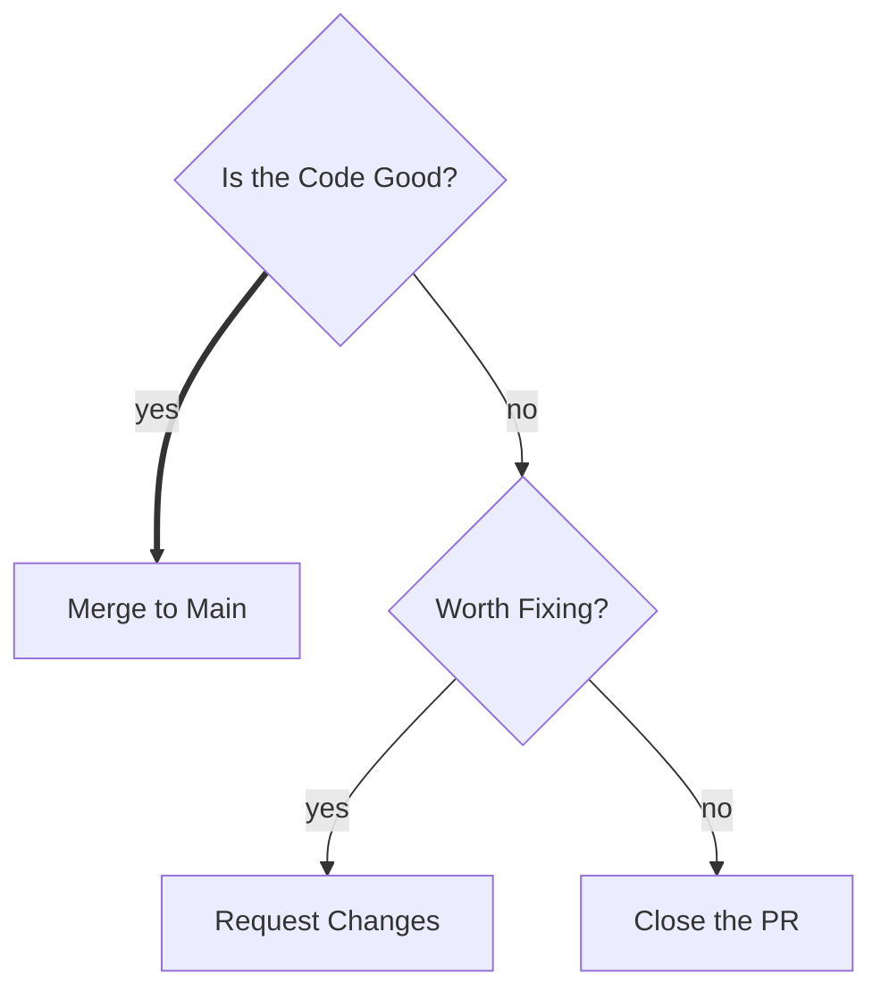
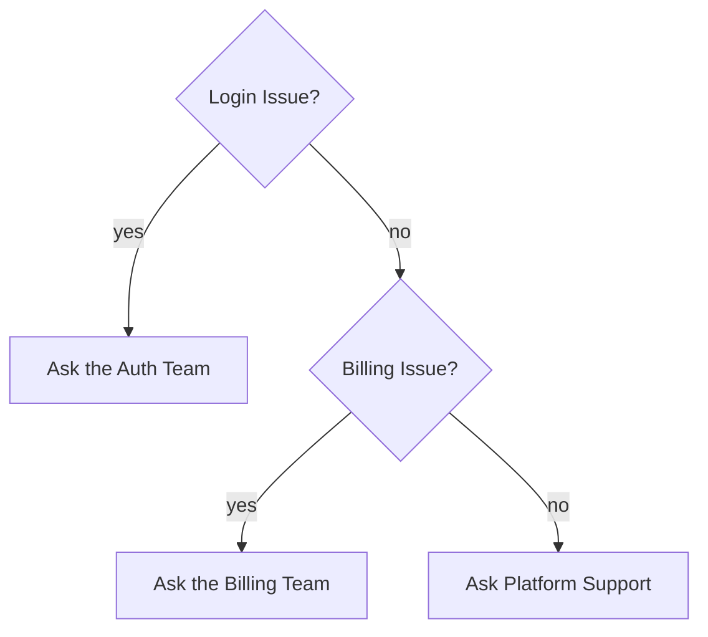
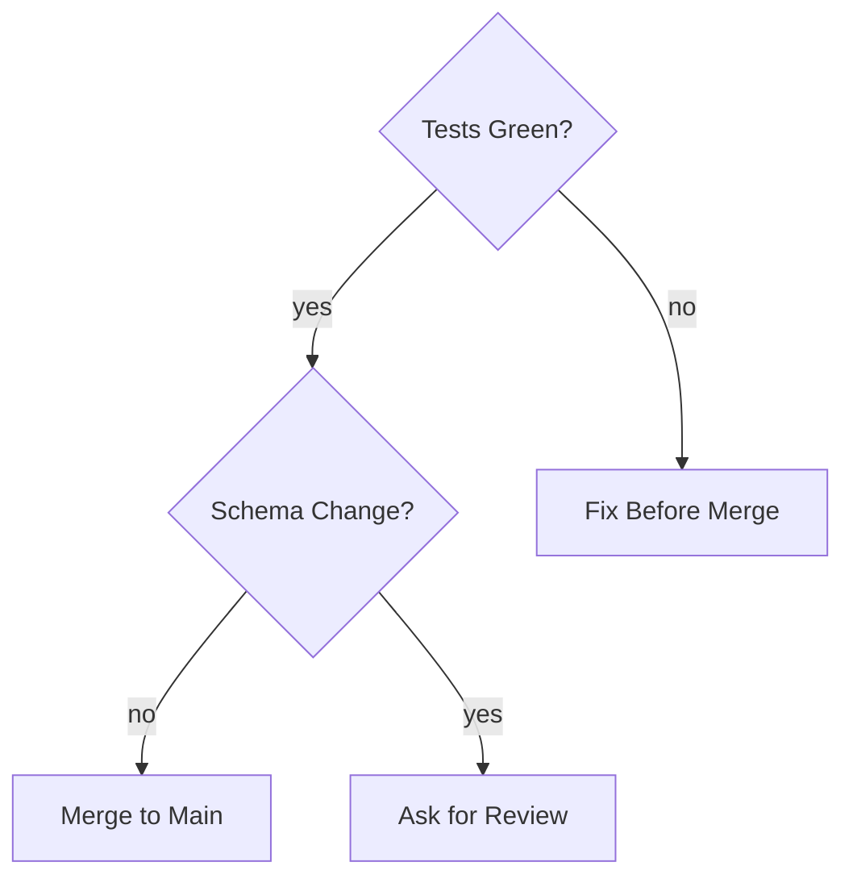

# Decision Tree

## 1. What It Is

A chain of checkable questions asked in a fixed order, where each answer either ends the matter or earns the next question. The reader arrives not knowing where they will end up, and the tree walks them there one verifiable fact at a time. One thick trunk runs from the first question to the exit the tree is built to reach, so the normal route is visible before a single label is read.

---

## 2. When To Use

The content is a rule that decides something in stages, and two tests both have to pass.

First, the order is real: a later question only makes sense after an earlier answer, so reordering the questions breaks the procedure. Second, every question is decidable: two people holding the same facts give the same answer. "Is the diff under 200 lines?" is decidable. "Is the code good?" is not.

Typical fits are merge and release rules, alerting thresholds, eligibility checks, and any policy that keeps getting re-litigated because it lives in someone's head instead of on a page.

---

## 3. When Not To Use

| The content actually has | Use instead |
| :--- | :--- |
| One question, peer cases, each straight to a response | `triage-map.md` |
| Depth that is only escalation, as in handler fails, go up | `triage-map.md` |
| No questions at all, just steps in order | `step-flow.md` |
| A role, who it answers to, and who it works with | `role-map.md` |
| Questions no checkable fact can settle | No diagram. Write the prose |

The first two rows are one boundary, and the reorder test above decides it. Questions that could be shuffled are a classification wearing a costume, however many diamonds it drew, and depth that is only "handler failed, go up" is a fallback edge, not a second question.

---

## 4. Direction

Always `TD`. The vertical axis is the order of evaluation: the first question sits at the top, each answer either exits or falls to the next question, and the trunk drops straight down to the exit it favors. Never `LR`: a fan out of labeled cases read left to right is a Triage Map (`triage-map.md`), and the two must not look alike. Never `RL`.

---

## 5. Shapes

| Role | Shape | Syntax | Count |
| :--- | :--- | :--- | :--- |
| Question | Diamond | `@{ shape: diam }` | 2 to 4 |
| Exit | Rounded rectangle | `@{ shape: rounded }` | 2 to 6 |

Two shapes and no others. The root is a diamond with nothing above it, every diamond has two or three arrows leaving it, and every path ends in a rounded exit.

At least two diamonds. A tree with one question is a Triage Map, whatever it calls itself.

The fix for an undecidable question is never better wording, it is the checkable facts behind the judgment: "Is this change risky?" becomes "Does it touch the schema?" and "Is it under 200 lines?".

Question labels end in a question mark. Exit labels are imperatives: `Merge to Main`, `Page the On Call`. Four words at most, either way.

No rectangles, no stadiums, no double circles, no hexagons, no documents, no emoji.

Below Mermaid v11.3 the `@{ shape: ... }` form is unavailable. Substitute `Q{"Tests Green?"}` and `A("Merge to Main")`, keeping the quotes so punctuation survives the parser.

---

## 6. Color

| Class | Color | Marks | Count |
| :--- | :--- | :--- | :--- |
| `goal` | Green | The exit the tree is built to reach | Exactly 1 |
| `risk` | Red | The exit the tree is built to avoid | 0 or 1 |

```text
classDef goal fill:#D1F0DB,stroke:#1B7F4B,color:#0B3D24
classDef risk fill:#FDE2E1,stroke:#C0392B,color:#5A1710
```

The trunk ends at the green exit, always. Red is not for every unpleasant outcome, only for the one the tree exists to route around, and a tree whose exits are all acceptable carries no red at all. Every other node stays unclassed. Copy all three properties or none: dropping `color` leaves the text to the theme, and a diagram that reads in GitHub light mode turns pale on pale in dark mode.

---

## 7. Arrows

| Form | Meaning |
| :--- | :--- |
| `==>\|label\|` | The trunk, the normal route |
| `-->\|label\|` | Every other branch |

Every edge carries a label stating the answer that selects it. An edge with no label is not a decision: strip the labels from a fan out and the picture claims the question owns three outcomes rather than choosing between them.

The labels leaving one diamond must be exhaustive and mutually exclusive. `yes` and `no` do this for free. Ranges must be written to meet: `under 200 lines` and `200 or more`, never `under 200` and `over 200` with the boundary lost between them.

The trunk is one unbroken thick path from the root to the green exit. Exactly one: a trunk that forks is two trunks, which is none. Pick it by asking which route the reader takes when every answer comes back normal.

Two paths may share an exit, so a leaf can have several arrows in. No dotted arrows anywhere: every edge in a decision tree is a decided answer, and nothing about it is optional.

---

## 8. Length

Two to four questions, two to six exits, and no path more than three questions deep. A tree at those limits holds ten nodes and still reads on a phone.

Past three questions deep, one of two things is true. Either adjacent questions are really one, `Over 5 MB?` followed by `Over 10 MB?` being one threshold asked twice, and merging them fixes it. Or the content is two decisions, and it splits into two trees where an exit of the first names the second: `Enter the Rollback Decision` is a fine leaf. The fix is never a smaller font.

---

## 9. Canonical Example, Team Scale

A merge rule with three questions, four exits, and a trunk two answers long.

> Whether a pull request merges is decided in order: correctness first, blast radius second.
>
> ```mermaid
> flowchart TD
>     Q1@{ shape: diam, label: "Tests Green?" }
>     Q2@{ shape: diam, label: "Schema Change?" }
>     Q3@{ shape: diam, label: "Migration Reviewed?" }
>     F@{ shape: rounded, label: "Fix Before Merge" }
>     M@{ shape: rounded, label: "Merge to Main" }
>     P@{ shape: rounded, label: "Merge with Migration Plan" }
>     B@{ shape: rounded, label: "Block the Release" }
>
>     Q1 ==>|yes| Q2
>     Q1 -->|no| F
>     Q2 ==>|no| M
>     Q2 -->|yes| Q3
>     Q3 -->|yes| P
>     Q3 -->|no| B
>
>     classDef goal fill:#D1F0DB,stroke:#1B7F4B,color:#0B3D24
>     classDef risk fill:#FDE2E1,stroke:#C0392B,color:#5A1710
>
>     class M goal
>     class B risk
> ```
>
> The takeaway from this diagram is that an ordinary change is two answers away from merging, and only schema changes ever need a third pair of eyes.

The order is load bearing: asking about the schema before the tests pass spends review on code that does not work yet, and `Migration Reviewed?` is meaningless until `Schema Change?` answers yes.

---

## 10. Canonical Example, Personal Scale

Three questions standing between a recurring chore and the decision to automate it.

> Whether a task deserves automation is decided by frequency, cost, and stability, in that order.
>
> ```mermaid
> flowchart TD
>     Q1@{ shape: diam, label: "Recurring Task?" }
>     Q2@{ shape: diam, label: "Over 5 Minutes?" }
>     Q3@{ shape: diam, label: "Stable Requirements?" }
>     H@{ shape: rounded, label: "Just Do It" }
>     W@{ shape: rounded, label: "Wait and Revisit" }
>     A@{ shape: rounded, label: "Automate It" }
>
>     Q1 ==>|yes| Q2
>     Q1 -->|no| H
>     Q2 ==>|yes| Q3
>     Q2 -->|no| H
>     Q3 ==>|yes| A
>     Q3 -->|no| W
>
>     classDef goal fill:#D1F0DB,stroke:#1B7F4B,color:#0B3D24
>     class A goal
> ```
>
> The takeaway from this diagram is that automation has to clear three bars in a row, and failing any early bar sends you back to just doing the work.

`Just Do It` takes arrows from two different questions, which is the shared exit rule working. There is no red, because doing a task by hand is not a failure, only the answer.

---

## 11. Bad Examples

Questions that are judgments.



Neither question is decidable: two reviewers holding the same diff answer them differently, so the tree settles nothing and the argument it was built to end continues at each diamond. Replace each judgment with the checkable facts behind it.

Questions with no real order.



Swap the two questions and every answer still means the same thing, so the sequence is fake: this is one classification stretched into a ladder. Collapse it into a single diamond with three labeled edges, which is a Triage Map and belongs in `triage-map.md`.

A tree with no trunk.



Every edge carries the same weight, so the reader cannot see which route is the normal one and walks all of them to find out. The trunk is the one piece of emphasis this pattern owns, and omitting it spends the reader's attention to save the author two equals signs.

---

## 12. Caption Convention

Follow every Decision Tree with one sentence in the prose beginning "The takeaway from this diagram is", stating what the rule protects or what the normal case costs, rather than reciting the branches. "The diagram above shows how we decide whether to merge" is weak, because the reader can already see that. The strong version says what falls out of the structure: how short the happy path is, which single answer triggers all the ceremony, what never gets asked at all. If the sentence cannot be written, the diagram has no point of view and should be cut.

---

## 13. Checklist

- Two to four diamonds, two to six rounded exits, no other shapes, no emoji.
- The root is a diamond, and no path is more than three questions deep.
- Every question is decidable: two people, same facts, same answer.
- The questions have a real order. If they could be shuffled, this is a Triage Map.
- Every edge is labeled with the answer that selects it.
- Each diamond's labels are exhaustive and mutually exclusive, with range boundaries that meet.
- One unbroken thick trunk from root to the green exit, and it never forks.
- Exactly one green exit, at the end of the trunk, with `fill`, `stroke`, and `color` all set.
- At most one red exit, the one the tree exists to avoid.
- Direction is `TD`.
- Question labels end in `?`, exit labels are imperatives, all four words or fewer.
- The caption sentence is written and states a conclusion.
- The diagram parses.
