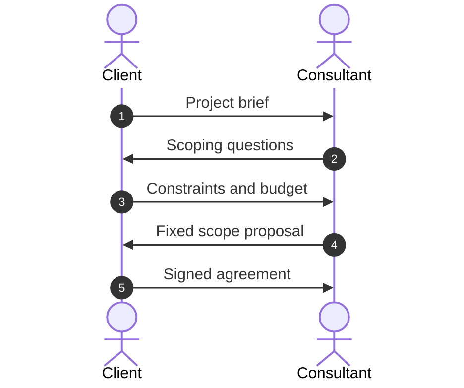
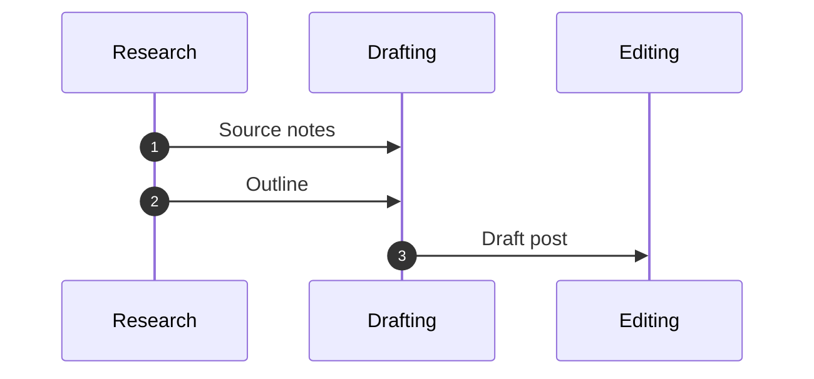
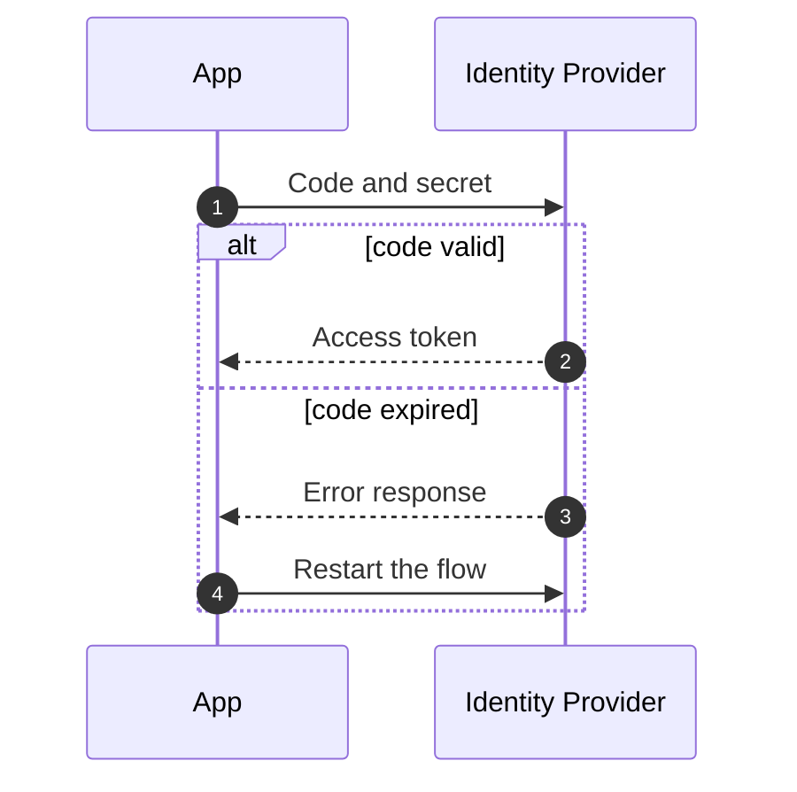
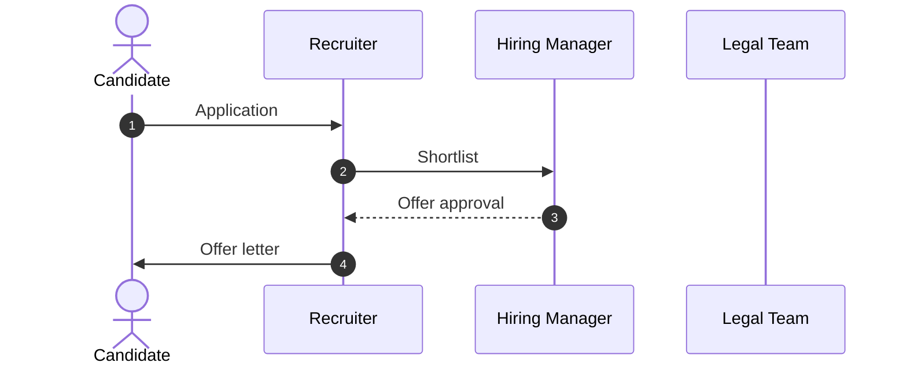

# Exchange

## 1. What It Is

Two to four parties taking turns, drawn as one lane per party with time running down the page. Every numbered line is one message crossing from a sender to a receiver: solid when it opens a request or hands something over, dotted when it closes one by returning what was asked for.

What an exchange argues lives between the lanes rather than on them: what never crosses between two particular parties, who is holding the unanswered request at any given moment, and how many round trips the outcome actually costs. Prose has to assert each of those. The picture shows them as an empty gap, a solid arrow still waiting, a count.

---

## 2. When To Use

The content is two or more parties that each keep their own state, and the story is the turns they take. Three tests, and all three have to pass.

Every line can be said as "X hands Y ___" or "X asks Y for ___", with a real sender and a real receiver. The order is load bearing: swap two messages and the story breaks. And at least one message flows backwards, someone answering, approving, or returning something.

Typical fits are a sign-in flow, a payment authorization, a negotiation, a review loop, and any integration where two systems must agree before work proceeds.

---

## 3. When Not To Use

| The content actually has | Use instead |
| :--- | :--- |
| Stages handing artifacts forward, nothing ever flowing back | `io-pipeline.md` |
| One party's own steps in order | `step-flow.md` |
| Who answers to whom and who works with whom, statically | `role-map.md` |
| Situations routed each to its response | `triage-map.md` |
| Positions something flows through, with nobody taking turns | `niche-map.md` |
| Dated events | `timeline.md` |

The first row is the live boundary, and replies are the test. If no lane ever sends anything back, the lanes are stages wearing costumes, and what they pass forward is the content rather than the turns.

---

## 4. Time and Lanes

Time runs down the page. The diagram type fixes that, so there is no direction to choose.

The choice that remains is lane order. The initiator goes leftmost, so the first message starts at the left edge and the diagram opens the way it reads. Order the remaining lanes so that as many messages as possible run between adjacent lanes: a message may span a lane in the middle, but every span draws over a party it does not concern, and the order with the fewest spans wins.

---

## 5. Parties and Messages

| Part | Syntax | Rule |
| :--- | :--- | :--- |
| Numbering | `autonumber` | Required, first line, always |
| Human party | `actor C as Client` | People and roles held by people |
| System party | `participant A as App` | Systems, services, teams |
| Message | `C->>A: Sign in request` | Solid, opens or hands over |
| Reply | `A-->>C: Session cookie` | Dotted, closes an open request |
| Invariant | `Note over A: Never sees the password` | At most 1 per diagram |

`autonumber` is the pattern's indexing rule: the prose below the diagram refers to messages by number, so nothing on the diagram needs restating to be discussed.

Declare every party up front, humans as `actor`, everything else as `participant`. Display names and message labels are four words or fewer. A message label names what crosses the wire or what is being asked, as `Authorization code` or `Scoping questions`, never a paragraph of what happened.

The note is the one piece of emphasis the pattern owns. It states the invariant the diagram exists to prove, pinned over the lane or lanes it protects, and a diagram whose note merely repeats a message wastes the only highlight it has.

No self messages. Work a party does alone is invisible here on purpose: if it matters, the prose says so, and if it is the story, the content belongs in `step-flow.md`. No emoji anywhere.

This pattern needs no legacy fallback. `sequenceDiagram` predates every renderer this library targets.

---

## 6. Color

None. No `classDef`, no `%%{init}%%` theme variables, no per-message styling.

The sequence type has no portable way to make a color mean something: theme variables parse but render differently across GitHub, Sphinx, and Obsidian, and a color that silently fails is worse than none. Emphasis is carried by the note, by the numbers the prose can point at, and by the takeaway sentence.

---

## 7. Arrows

| Form | Meaning |
| :--- | :--- |
| `->>` | Opens: a request made, or a thing handed over |
| `-->>` | Closes: returns what an earlier solid arrow asked for |

Every dotted arrow answers an earlier solid arrow between the same two lanes, running the other way. A dotted arrow with no request behind it is an unprompted gift the reader cannot place.

The reverse is allowed and is a finding: a solid arrow that no dotted arrow ever answers is a request still open when the diagram ends, and the takeaway sentence should say what that costs.

No blocks: no `alt`, `opt`, `loop`, `par`, or `critical`. The diagram draws one run that succeeded. A branch means the content is a rule, which belongs in `decision-tree.md`; a retry loop is one sentence of prose. No `-x`, `-)`, `<<->>`, bare `->`, or activation bars.

---

## 8. Length

Two to four lanes, and every lane both sends and receives at least once. A lane that only listens, or never speaks at all, fails the delete test: remove it and the story stands, so it was decoration.

Four to ten numbered messages. Below four the exchange is one request and its answer, which is a sentence. Past ten, split where a commitment closes, an agreement signed, a token issued, and let the second diagram open with that in hand. A dance that will not split at any such seam is a protocol spec rather than an explainer, and it belongs in a table.

---

## 9. Canonical Example, Human Scale

> The parties are an independent consultant and a new client, and the exchange settles what will be built and for how much before any work starts.
>
> ```mermaid
> sequenceDiagram
>     autonumber
>     actor C as Client
>     actor F as Consultant
>     C->>F: Project brief
>     F->>C: Scoping questions
>     C-->>F: Constraints and budget
>     F->>C: Fixed scope proposal
>     C-->>F: Signed agreement
>     C->>F: Deposit payment
>     F-->>C: Kickoff schedule
> ```
>
> - **Message 4.** The quote is fixed rather than hourly because messages 2 and 3 already bounded the scope. A proposal sent before the scoping pair would reopen at every change request.
>
> The takeaway from this diagram is that every commitment closes before the next one opens, scope before price, signature before money, money before work, so at no point is either side exposed on two fronts at once.

Two lanes and not a system in sight, which is the point of putting this one first: the pattern is about turns, not about software.

---

## 10. Canonical Example, System Scale

> The parties are a user, the app they are signing into, and the identity provider the app trusts, and the exchange is everything between clicking sign in and holding a session.
>
> ```mermaid
> sequenceDiagram
>     autonumber
>     actor U as User
>     participant A as App
>     participant P as Identity Provider
>     U->>A: Sign in request
>     A-->>U: Redirect to provider
>     U->>P: Credentials
>     P-->>U: Redirect with code
>     U->>A: Authorization code
>     A->>P: Code and secret
>     P-->>A: Access token
>     A-->>U: Signed in session
>     Note over A: Never sees the password
> ```
>
> - **Message 3.** The only line carrying the password, and it lands on the provider. The app's lane is untouched, which is what the note pins down.
> - **Message 6.** The secret proves the app's own identity, so a stolen authorization code alone buys nothing.
>
> The takeaway from this diagram is that the password crosses exactly one pair of lanes, and what the app ends up holding is a token the provider can revoke, so a breach of the app never spends the user's credentials.

The note earns its place here: eight messages of ceremony exist to keep one thing off one lane, and the note is the diagram saying so out loud.

---

## 11. Reach

The examples are a freelance deal and a login flow, and the diagram type looks like it belongs to software, which together undersell the pattern. Anything where parties take turns fits. Read this list before deciding yours does not.

- **A salary negotiation.** Candidate, recruiter, hiring manager. The numbers cross only through the recruiter's lane, and the two people they concern never exchange a message.
- **A code review.** Author, CI, reviewer. The reviewer's lane receives nothing until CI has answered, which is the team's policy made visible.
- **Academic peer review.** Author, editor, referees. Author and referees never see each other's lane, and the editor brokers every crossing.
- **A contract negotiation.** Sales and the customer's counsel. Each redline is a solid arrow, each accepted draft a dotted one, and whoever holds the pen holds the open request.
- **A fundraising round.** Founder and lead investor, term sheet and markup. The number of round trips is the finding.
- **A webhook integration.** Your system and a vendor's. Event, acknowledgment, and the dotted ack is the line the whole retry design hangs on.
- **A support escalation.** Customer, frontline support, engineering. The pair of lanes the customer never sees is where the ticket actually gets solved.
- **A procurement approval.** Requesting team, vendor, security review. The purchase closes only after security's dotted answer arrives.
- **An agent calling a tool.** Agent, tool, human approver. The approval message is the one line the whole design argues about.
- **Anything at all** where parties take turns and at least one line flows back. The section 2 test is the only membership rule.

---

## 12. Bad Examples

Every message solid.



Message 3 answers message 2 and message 5 answers message 4, but nothing on the page says so, so every line reads as a new demand and the reader cannot see which requests are still open, which is the one thing the two arrow weights exist to show.

A pipeline in disguise.



No lane ever replies, so nobody here is taking turns: these are stages handing artifacts forward, and the artifacts are the content rather than the lanes. Draw it as `io-pipeline.md`.

Branching inside the diagram.



Two runs share one picture, so neither can be read straight down, and the vertical axis stops meaning time the moment the reader hits the `else`. Draw the run that succeeds; if the failure handling is itself a standing rule, it belongs in `decision-tree.md`.

A lane that never speaks.



Legal sends nothing and receives nothing, so deleting the lane changes nothing except the width of the diagram. If legal matters, it has a message; if it has no message, it has no lane.

---

## 13. Prose Convention

**Above the diagram, one sentence naming the parties and what the exchange settles.** It is required, and it is doing the title's job, because the sequence type has no portable title and nothing on the diagram says what the dance is for.

**Below, up to three bullets,** each opening with its message number in bold, as `**Message 3.**`, for a line carrying a number, a caveat, or the evidence behind the note. Three is a cap: if most messages need a bullet, the labels are hiding too much.

**Below, last, a takeaway sentence** beginning "The takeaway from this diagram is". It points at an absence, a request left open, or a round-trip count. Walking the reader back down the messages is not a takeaway, because the numbers already do that.

---

## 14. Checklist

- Two to four lanes, initiator leftmost, humans as `actor`, systems and teams as `participant`.
- `autonumber` is the first line.
- Every lane sends at least one message and receives at least one.
- Four to ten messages, each `->>` or `-->>`, and nothing else: no self messages, no `-x`, `-)`, `<<->>`, or activation bars.
- Every dotted arrow answers an earlier solid arrow between the same two lanes.
- Any solid arrow left unanswered is deliberate, and the prose says what it costs.
- No `alt`, `opt`, `loop`, `par`, or `critical`: the diagram is one run that succeeded.
- At most one `Note over`, stating the invariant rather than repeating a message.
- Display names and message labels are four words or fewer, and no emoji appear.
- No color, no `classDef`, no theme variable block.
- The scoping sentence above names the parties and the stake; bullets below are numbered and at most three; the takeaway sentence comes last.
- The diagram parses.
