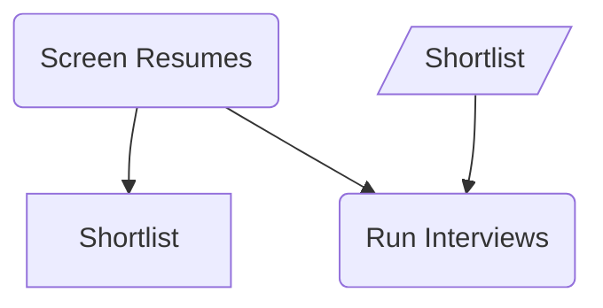
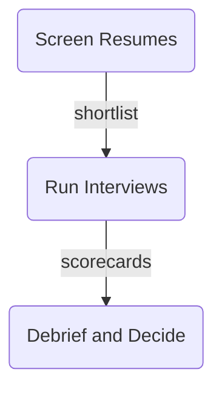
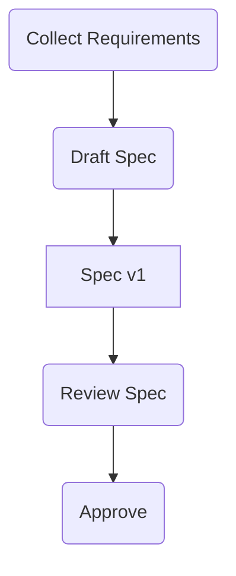

# IO Pipeline

## 1. What It Is

A vertical chain of steps where the thing each step hands to the next is drawn as its own node. The spine alternates actions and documents: a step produces an artifact, and that same artifact node is what the next step consumes. Inputs arriving from outside hang beside the step that uses them, byproducts hang beside the step that makes them, and the solid line down the middle is the pipeline.

---

## 2. When To Use

The content is a sequence of steps and every handover has a noun. A spec, a dataset, a shortlist, a build. The test is whether you can finish the sentence "this step hands over ___" for every step, and whether those nouns are the interesting part: what gets produced, who consumes it, what has to arrive from outside.

Typical fits are a data pipeline, a hiring loop, a content production process, a build and release chain, or any workflow where "where does that file come from" is the question readers actually ask.

---

## 3. When Not To Use

| The content actually has | Use instead |
| :--- | :--- |
| Steps that hand over nothing nameable | `step-flow.md` |
| Branching, where the next step depends on an answer | `decision-tree.md` |
| One question fanning out to responses | `triage-map.md` |
| Static positions something flows through, with no steps | `niche-map.md` |
| A chain derived backwards from a goal | `working-backwards-chain.md` |

The first row is the mirror of Step Flow's routing here. If the answer to "what does this step hand over" is only "it moves to the next step", draw a Step Flow.

---

## 4. Direction

Always `TD`. The spine alternates steps and artifacts, so even three steps put six nodes in a line, which is past what one row holds at readable size.

Never `LR`, `RL`, or `BT`.

---

## 5. Shapes

| Role | Shape | Syntax | Count |
| :--- | :--- | :--- | :--- |
| Step | Rounded rectangle | `@{ shape: rounded }` | 2 to 4 |
| Handover artifact | Document | `@{ shape: doc }` | 1 between each step pair |
| Final deliverable | Document | `@{ shape: doc }` | Exactly 1, last node |
| External input | Lean right | `@{ shape: lean-r }` | 0 to 3, beside its consumer |
| Byproduct | Document | `@{ shape: doc }` | 0 to 2, beside its producer |

Two rules carry the whole pattern.

Every step to step transition passes through a document node. A bare arrow between two steps means the handover has no name, and a handover with no name means the content is a Step Flow.

An artifact is drawn exactly once. If a later step consumes an earlier artifact, draw a second arrow out of the same node, never a copy of the node.

No plain rectangles anywhere, so nothing hanging beside a step can be misread as something the step owns. No diamonds, since a pipeline that branches is a Decision Tree. No stadiums, because the entry points are the external inputs and the lean-right shape already marks them. No double circles, because a pipeline ends in a deliverable and runs again next week, not in a goal reached once. No hexagons, because a pipeline long enough to need milestones is two pipelines, and section 8 says where to cut.

Emoji: 📄 on the final deliverable only, and 🔑 on at most one external input, the one whose absence stalls everything. Every other node stays bare.

Below Mermaid v11.3 the `@{ shape: ... }` form is unavailable. Substitute `S("Step")` and `I[/"Input"/]`, and write artifacts as plain `A["📄 Name"]` rectangles with the emoji in front of every artifact label, since the document shape has no classic form and the emoji must then do its job.

---

## 6. Color

The default is no color at all. The budget is one node: the `accent` class may mark the single artifact the surrounding writing centers on, which is usually the one consumed more than once.

```text
classDef accent fill:#FFF3CD,stroke:#B8860B,color:#3D2E00
```

Copy all three properties or none. Dropping `color` leaves the text color to the theme, so a diagram that reads in GitHub light mode turns pale on pale in dark mode.

Steps are never colored. In this pattern the steps are plumbing and the artifacts are the content, so a highlighted step points the reader at the wrong half of the diagram.

---

## 7. Arrows

Solid `-->` on the spine and nowhere else. Every arrow that touches the spine from the side is dotted: external inputs in, byproducts out, and reuse of an earlier artifact by a later step. One glance separates the pipeline from its traffic.

Everything drawn is required. An optional input does not get a dotted arrow, it gets left out of the diagram and mentioned in the prose.

No labels. An artifact name belongs in a document node, not on an arrow, and a label stating a condition means the content branches, which makes it a Decision Tree. No thick arrows, because an unbranching spine has no other path to be emphasized against.

---

## 8. Length

Two to four steps. One step is a sentence, not a diagram. Four steps already put eight nodes on the spine, and with a normal load of inputs and byproducts the diagram brushes twelve nodes total, which is the ceiling.

Past four steps, split at an artifact rather than at a step: the document that ends the first diagram is the same node that opens the second, so the two read as one pipeline with a page break instead of two unrelated pictures. The fix is never a smaller font.

---

## 9. Canonical Example, Hiring Loop

Three steps, two handovers, a final deliverable, and three external inputs. No color, because the prose this diagram belongs to discusses the whole loop rather than one artifact.

> ```mermaid
> flowchart TD
>     JD@{ shape: lean-r, label: "🔑 Job Description" }
>     R@{ shape: lean-r, label: "Applicant Resumes" }
>     S1@{ shape: rounded, label: "Screen Resumes" }
>     A1@{ shape: doc, label: "Shortlist" }
>     RB@{ shape: lean-r, label: "Interview Rubric" }
>     S2@{ shape: rounded, label: "Run Interviews" }
>     A2@{ shape: doc, label: "Scorecards" }
>     S3@{ shape: rounded, label: "Debrief and Decide" }
>     F@{ shape: doc, label: "📄 Offer Letter" }
>
>     JD -.-> S1
>     R -.-> S1
>     S1 --> A1 --> S2
>     RB -.-> S2
>     S2 --> A2 --> S3
>     S3 --> F
> ```
>
> The takeaway from this diagram is that the offer at the bottom is only as good as the two documents above it, so a weak shortlist cannot be repaired by a strong interview day.

---

## 10. Canonical Example, Data Pipeline

Three steps again, this time with a byproduct hanging off the first step and one artifact reused by a later step. That reuse is the dotted edge from Clean Events down to Publish Dashboard, drawn out of the original node, and it is why Clean Events carries the accent.

> ```mermaid
> flowchart TD
>     L@{ shape: lean-r, label: "🔑 Raw Event Logs" }
>     C@{ shape: lean-r, label: "Schema Config" }
>     S1@{ shape: rounded, label: "Clean and Dedupe" }
>     A1@{ shape: doc, label: "Clean Events" }
>     RJ@{ shape: doc, label: "Rejects Report" }
>     S2@{ shape: rounded, label: "Aggregate Daily" }
>     A2@{ shape: doc, label: "Daily Metrics" }
>     S3@{ shape: rounded, label: "Publish Dashboard" }
>     F@{ shape: doc, label: "📄 Live Dashboard" }
>
>     L -.-> S1
>     C -.-> S1
>     S1 --> A1 --> S2
>     S1 -.-> RJ
>     S2 --> A2 --> S3
>     A1 -.-> S3
>     S3 --> F
>
>     classDef accent fill:#FFF3CD,stroke:#B8860B,color:#3D2E00
>     class A1 accent
> ```
>
> The takeaway from this diagram is that everything downstream is a view over Clean Events, so that one artifact is where data quality is won or lost.

The reuse edge is the only long line this pattern ever produces, and it is long because the content really does skip a step, not because the layout failed.

---

## 11. Bad Examples

One artifact drawn twice.



The shortlist appears as an output box and again as an input box, with nothing connecting them, so the reader has to guess they are the same thing. One document, one node, arrows out to every consumer.

Artifacts demoted to arrow labels.



The handovers are the content of this pattern, and here they are decorations on arrows: they cannot be consumed by a later step, cannot carry the accent, and vanish when the reader skims shapes. Promote them to document nodes.

A spine with bare transitions.



Two transitions pass through a document and two do not, so the reader cannot tell whether the bare arrows lost their artifact or never had one. Name every handover, or drop the one document and draw a Step Flow.

---

## 12. Caption Convention

Follow every IO Pipeline with one sentence in the prose beginning "The takeaway from this diagram is", stating the conclusion rather than describing the boxes. For this pattern the conclusion is usually about an artifact, not a step: which document everything depends on, or which handover is the bottleneck. If the sentence cannot be written, the diagram has no point of view and should be cut.

---

## 13. Checklist

- Every step to step transition passes through a document node.
- Every artifact appears exactly once; reuse is a second dotted arrow out of the same node.
- Direction is `TD`.
- 2 to 4 steps, 12 nodes total at most.
- Spine arrows are bare solid `-->`; every off spine arrow is dotted; no labels, no thick arrows.
- Only rounded rectangles, documents, and lean right inputs. No plain rectangles, diamonds, stadiums, hexagons, or double circles.
- 📄 on the final deliverable only; 🔑 on at most one external input; all other nodes bare.
- At most one `accent`, on an artifact, never on a step, with `fill`, `stroke`, and `color` all set.
- Every input drawn is required; optional inputs live in the prose.
- Every label is four words or fewer.
- The caption sentence is written and states a conclusion about an artifact.
- The diagram parses.
