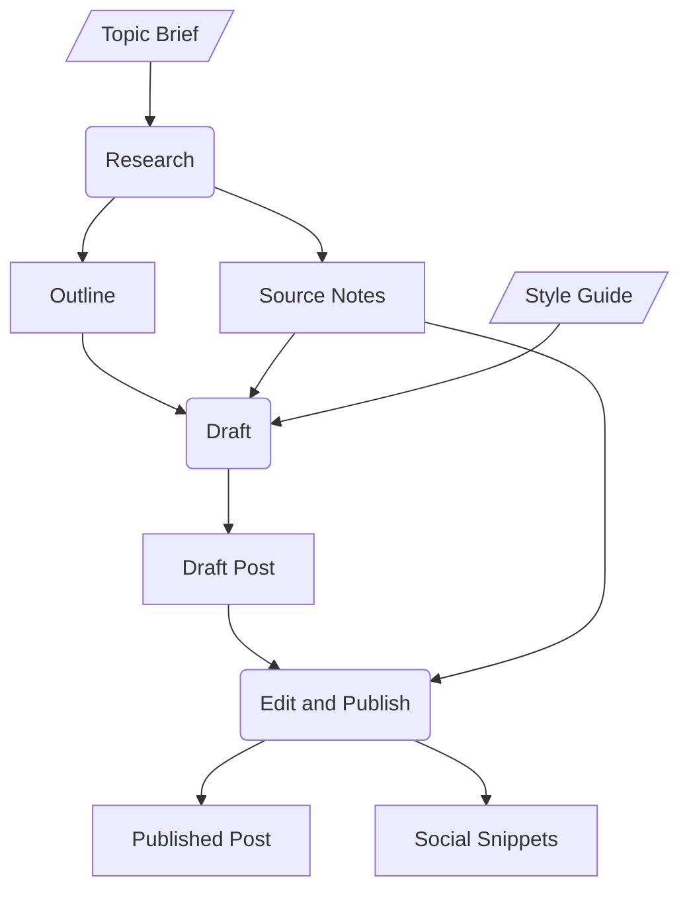
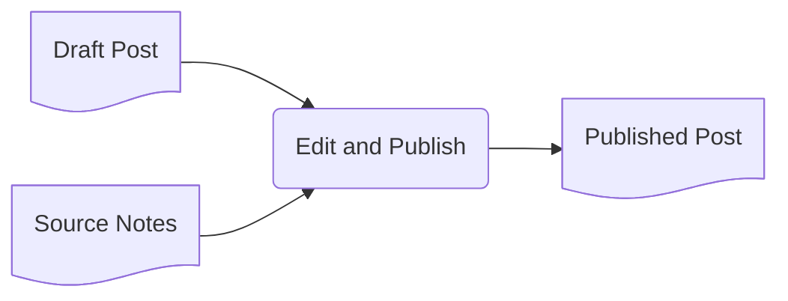
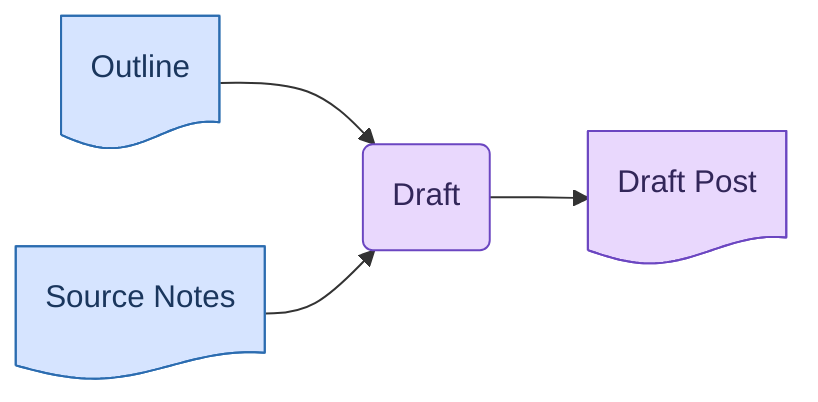

# IO Pipeline

## 1. What It Is

A pipeline drawn one step per diagram. The unit is a set of diagrams: an overview showing the steps in order, then one block per step showing everything that step consumes on the left and everything it produces on the right.

What connects the blocks is not arrows but names. Every step has an ID (`s1`, `s2`, ...), every artifact's label starts with the ID of the step that produced it, and when a later block consumes an earlier artifact it repeats the identical label. The wire that would have crossed the whole picture is replaced by a name the reader can match in one glance.

---

## 2. When To Use

The content is a sequence of steps where every handover has a noun (a dataset, a shortlist, a draft) and the interesting questions are "what does this step need" and "where did that come from". The tell is fan: some step consumes several things, produces several things, or consumes something made two steps ago. One picture holding all of that is wires crossing wires, which is exactly what this pattern exists to avoid.

Typical fits are a data pipeline, a hiring loop, a content production process, a paper from data collection to submission, or a month end close.

---

## 3. When Not To Use

| The content actually has | Use instead |
| :--- | :--- |
| Steps that hand over nothing nameable | `step-flow.md` |
| Branching, where the next step depends on an answer | `decision-tree.md` |
| One question fanning out to responses | `triage-map.md` |
| Parties taking turns, with messages flowing back | `exchange.md` |
| Static positions something flows through, with no steps | `niche-map.md` |
| A chain derived backwards from a goal | `working-backwards-chain.md` |

The first row is the mirror of Step Flow's routing here. If the answer to "what does this step hand over" is only "it moves to the next step", draw a Step Flow.

---

## 4. Direction

Every diagram in the unit is `LR`. The overview reads left to right as time order. Each block reads left to right as flow through the step: inputs, then the step, then outputs.

Never `TD`, `RL`, or `BT`.

---

## 5. Shapes

| Role | Shape | Syntax | Where |
| :--- | :--- | :--- | :--- |
| Step | Rounded rectangle | `@{ shape: rounded }` | Overview, and center of its own block |
| Artifact | Document | `@{ shape: doc }` | Right side of the block that makes it, left side of every block that uses it |
| External input | Lean right | `@{ shape: lean-r }` | Left side of the block that uses it |

The ID convention is the load bearing rule, so here it is in full.

- A step's label is `s<n>: <name>`, as in `s2: Draft`. The same label appears in the overview and in the step's own block.
- An artifact's label is `s<n>: <name>` where `<n>` is the step that produced it, as in `s1: Outline`. The label is written once and repeated character for character everywhere the artifact appears.
- An external input, meaning anything no step in this pipeline produced, has no prefix at all, as in `Style Guide`.

So on the left side of any block, the reader sorts provenance without moving their eyes: a lean right node with a bare label came from outside, and a document carrying `s1:` was made by step 1. Shape and prefix say the same thing twice, which is what makes it one glance.

The `<name>` part obeys the four word limit; the prefix rides on top and does not count.

No diamonds, since a pipeline that branches is a Decision Tree. No stadiums, hexagons, double circles, or plain rectangles.

Emoji: 📄 on the final deliverable only, in the last block. Nothing else carries one.

Below Mermaid v11.3 the `@{ shape: ... }` form is unavailable. Substitute `S("s1: Research")`, `I[/"Style Guide"/]`, and plain `A["s1: Outline"]` rectangles for artifacts, keeping the quotes.

---

## 6. Color

None. This pattern uses no color at all, and that is a rule rather than an omission.

The reason is that color cannot be kept honest here. Any artifact worth emphasizing is one that several blocks consume, so its highlight would repeat across the unit, and a repeated highlight on one step's output is indistinguishable from color marking provenance, which is the exact misreading section 11 bans. A signal that cannot be told apart from a banned signal is not worth its ink.

Everything color could have done already has an owner: provenance is the ID prefix, the final deliverable is 📄, and emphasis is the takeaway sentence, which names the artifact that matters in words.

---

## 7. Arrows

Every arrow in every diagram is a bare solid `-->`. In the overview it means "then". In a block it means "goes in" on the left of the step and "comes out" on the right, and position already says which.

No labels, no dotted arrows, no thick arrows. Everything drawn is required: an optional input does not get a special arrow, it gets left out of the diagram and mentioned in the prose.

---

## 8. Length

Two to six steps. Past six, group the steps into named phases and draw one unit per phase.

Per block: one to four inputs and one to three outputs. A step that wants more than that is two steps wearing one box, and splitting it is the fix. A block therefore never exceeds eight nodes, and the overview never exceeds six.

Every output must be consumed by a later block, be the final deliverable, or earn one clause in the prose saying who outside the pipeline receives it. An output nothing receives is clutter.

---

## 9. Canonical Example

> Publishing a technical blog post, in three steps. First the overview, which is the map the IDs index into.
>
> ```mermaid
> flowchart LR
>     S1@{ shape: rounded, label: "s1: Research" }
>     S2@{ shape: rounded, label: "s2: Draft" }
>     S3@{ shape: rounded, label: "s3: Edit and Publish" }
>
>     S1 --> S2 --> S3
> ```
>
> **s1: Research** turns the topic brief into the two documents everything downstream runs on.
>
> ```mermaid
> flowchart LR
>     T@{ shape: lean-r, label: "Topic Brief" }
>     S1@{ shape: rounded, label: "s1: Research" }
>     N@{ shape: doc, label: "s1: Source Notes" }
>     O@{ shape: doc, label: "s1: Outline" }
>
>     T --> S1
>     S1 --> N
>     S1 --> O
> ```
>
> **s2: Draft** consumes both research artifacts plus one external input. Every node on the left announces its origin: two documents marked `s1:`, one bare lean right from outside.
>
> ```mermaid
> flowchart LR
>     O@{ shape: doc, label: "s1: Outline" }
>     N@{ shape: doc, label: "s1: Source Notes" }
>     G@{ shape: lean-r, label: "Style Guide" }
>     S2@{ shape: rounded, label: "s2: Draft" }
>     D@{ shape: doc, label: "s2: Draft Post" }
>
>     O --> S2
>     N --> S2
>     G --> S2
>     S2 --> D
> ```
>
> **s3: Edit and Publish** reaches back past step 2: the `s1:` prefix on Source Notes says so without a wire. The snippets go to the social queue.
>
> ```mermaid
> flowchart LR
>     D@{ shape: doc, label: "s2: Draft Post" }
>     N@{ shape: doc, label: "s1: Source Notes" }
>     S3@{ shape: rounded, label: "s3: Edit and Publish" }
>     P@{ shape: doc, label: "📄 s3: Published Post" }
>     X@{ shape: doc, label: "s3: Social Snippets" }
>
>     D --> S3
>     N --> S3
>     S3 --> P
>     S3 --> X
> ```
>
> The takeaway from this pipeline is that Source Notes feeds every later step, so the quality of the published post is set in step 1, before a single sentence of it is written.

Source Notes appears in three blocks under one identical label, and the takeaway sentence is what points at it. Nothing in the diagrams needs to.

---

## 10. Reach

The example is one writer and one post, which is the smallest thing this pattern draws. It fits any process whose handovers have nouns, at any scale, and the name should not stop you: "IO" is how engineers say it, but most pipelines in this list contain no code.

- **A hiring loop.** Screen, interview, decide. The scorecards block consumes the shortlist made two steps back, and the offer letter is the final 📄.
- **An ML training run.** Prepare, train, evaluate. The eval block consumes `s1: Eval Set` next to `s2: Checkpoint`, and keeping those prefixes straight is the whole audit.
- **A month end close.** Reconcile, adjust, report. Every input is a statement some earlier step produced, and the auditors read the provenance exactly like the prefixes do.
- **An academic paper.** Collect, analyze, write. The revision consumes figures made in analysis, months later, which no single diagram survives drawing.
- **A data migration.** Snapshot, transform, validate. The validation block consumes both the mapping table and the original snapshot, one step back and two.
- **A grant application.** Gather, budget, write, submit. The submission packet block is nothing but earlier outputs converging.
- **An incident postmortem.** Respond, investigate, review. The review consumes the timeline log written during response, and the action items are the deliverable.
- **B2B customer onboarding.** Contract, configure, train. The training block consumes the config workbook and the signed order form, one internal and one external.
- **A release.** Build, stage, ship. The ship block consumes the build artifact and the release notes, made by different steps.
- **Anything at all** where every handover has a noun and at least one noun is consumed by a step that did not make it. That test, from section 2, is the only membership rule.

---

## 11. Bad Examples

The whole pipeline merged into one diagram.



Twelve nodes at three steps, the ceiling already hit, and the reuse edge from Source Notes down to the third step crosses everything between them. Every step added from here adds crossings, so the merge only ever worked as a toy. Cut one block per step and let the prefixes replace the wires.

An input with no prefix.



The document shape says these were produced earlier, but by which step? The reader has to replay every previous block to find out, which is the exact work the IDs exist to delete.

Provenance by color instead of text.



One color per step means the palette grows with the pipeline: ten steps is ten colors nobody can hold in memory, each needing its own light and dark tuning, and all of it says what a three character prefix says exactly. Strip the classes; this pattern draws no color at all.

---

## 12. Prose Convention

One sentence above the overview naming the process and the step count. One bold lead line before each block, `**s2: Draft**` followed by a sentence saying what the step turns into what. After the last block, one sentence beginning "The takeaway from this pipeline is", stating a conclusion about an artifact rather than describing the boxes: which document everything depends on, or which handover is the bottleneck. If that sentence cannot be written, the pipeline has no point of view and a Step Flow would have done.

---

## 13. Checklist

- The unit is complete: one overview plus one block per step, in step order.
- Every diagram is `LR`.
- Step labels are `s<n>: <name>` and identical between the overview and the block.
- Every artifact label carries the prefix of its producing step, repeated character for character everywhere it appears.
- External inputs are lean right with no prefix; artifacts are documents with one. No other shapes.
- 2 to 6 steps; each block has 1 to 4 inputs, 1 to 3 outputs, 8 nodes at most.
- Every output is consumed later, is the final deliverable, or has a prose clause naming its receiver.
- Every arrow is a bare solid `-->`.
- No color anywhere: no `classDef`, no per step palette, no highlights.
- 📄 on the final deliverable only.
- Every `<name>` is four words or fewer.
- The lead lines and the takeaway sentence are written, and the takeaway is about an artifact.
- Every diagram in the unit parses.
