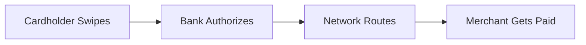
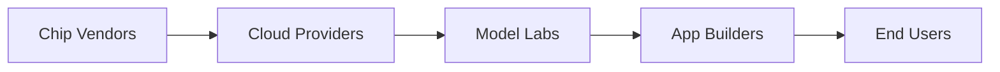
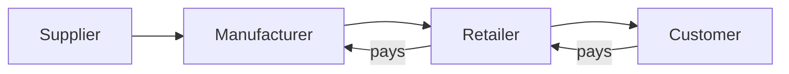
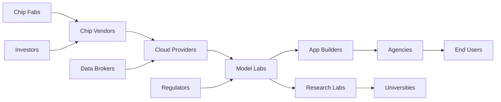

# Niche Map

## 1. What It Is

One subject and the positions around it, with one thing flowing through them in one direction. The subject is green, the positions that matter to it are amber, everything else is grey. The diagram makes one claim: this is where the subject sits, and these are the neighbors worth knowing about.

A straight line and a star are the same diagram at different densities. When each side of the subject holds one position it draws as a chain; when a side holds three it draws as a fan; a subject with fans on both sides is a star. Nothing in the rules changes between them, so never treat the shape as the decision. The decision is who is in and who is amber.

The map does not belong to the subject. The same positions redrawn with the green on a different box is a different diagram making a different argument, and that is the point rather than a loophole. Moving the green is how you show a reader what the same world looks like from someone else's seat.

---

## 2. When To Use

The content is one subject and its surroundings, and the reader's question is where it sits and who around it matters.

Three tests, and all three have to pass.

There is exactly one subject, and you can point at it and say "this is what the surrounding writing is about". Every box is a *who* or a *what*, never a *doing*: `Card Network` passes, `Network Routes Payment` does not. And every solid edge carries the same thing, so `X hands ___ to Y` takes one word in the blank across the whole diagram.

Typical fits are a role among its collaborators, a library in a stack, a team inside a company, a layer of an industry. Section 11 is there because that list is much shorter than the pattern's actual reach.

---

## 3. When Not To Use

| The content actually has | Use instead |
| :--- | :--- |
| Reporting lines, where the parent owns the child | `role-map.md` |
| Actions someone performs in order | `step-flow.md` |
| Named artifacts handed from stage to stage | `io-pipeline.md` |
| Dated events | `timeline.md` |
| Positions placed on two axes rather than around a subject | `quadrant.md` |
| Share of a total rather than a seat in a flow | `proportion-pie.md` |
| A position derived from a goal | `working-backwards-chain.md` |

The first two rows are where the confusion lives, and the third test in section 2 decides both. If one word cannot fill the blank in `X hands ___ to Y` across every edge, the edges mean different things and this is not the pattern. If the boxes are things a person does rather than positions that outlive the doing, it is not the pattern either.

---

## 4. Direction and Layout

Always `LR`. Never `TD`, which claims the box above contains the box below. Never `RL`.

`LR` here is position, not time. Nothing happens first, and the leftmost box is not the earliest, it is the furthest upstream. Pick which end is upstream by asking where the flowing thing originates, then run it to wherever it is consumed.

Do not lay the star out by hand. Write the edges and the renderer puts everything feeding the subject on its left and everything fed by it on its right, which lands the subject in the middle on its own. Trying to place boxes yourself is how a clean fan turns into a knot.

One flow, and only one. A diagram carrying goods rightward and money leftward leaves the reader unable to read either arrow. Pick the flow that makes the argument, name it in the sentence above the diagram, and let every solid edge mean that.

---

## 5. Shapes

| Role | Shape | Syntax | Count |
| :--- | :--- | :--- | :--- |
| Position | Rectangle | `@{ shape: rect }` | Every node |

One shape, no exceptions. Shape variation would claim the positions differ in kind, and the claim here is that they differ only in where they sit and what color they carry.

No diamonds, no double circles, no hexagons, no documents. No emoji: color already says which box is the subject, and a map of positions has no goal, no gate, and no deliverable to mark.

Labels are two or three words, four at most, and every one is a noun phrase naming a position rather than an activity. Job titles, team names, layer names, and company categories all qualify. A verb in a box is the single most common way this pattern collapses into a chain of actions.

**Anchors.** At most two boxes may carry a second line holding one quantitative fact, written as `label: "Card Network<br/>0.24 per 100 dollars"`. Use it only where the number changes how the map reads, which in practice means showing where the value or the volume concentrates. A single citable figure only, never a range, and a map where every box has one is a table.

This pattern needs no legacy fallback. `A["Card Network"]` is the classic form of a rectangle and works in every Mermaid version, and `<br/>` works in both forms.

---

## 6. Color

| Class | Color | Marks | Count |
| :--- | :--- | :--- | :--- |
| `subjectNode` | Green | The one position the diagram is about | Exactly 1 |
| `keyNode` | Amber | Neighbors that matter to the subject | 1 to 3 |
| `contextNode` | Grey | Everything else | The rest |
| `rivalNode` | Red | A position that can replace the subject | 0 or 1 |

```text
classDef subjectNode fill:#D1F0DB,stroke:#1B7F4B,color:#0B3D24
classDef keyNode fill:#FFF3CD,stroke:#B8860B,color:#3D2E00
classDef contextNode fill:#EEF1F5,stroke:#8A94A6,color:#2C3440
classDef rivalNode fill:#FDE2E1,stroke:#C0392B,color:#5A1710
```

Copy all three properties or none. Dropping `color` leaves the text to the theme, so a diagram that reads in GitHub light mode turns pale on pale in dark mode.

Every node is classed and none is left at the theme default. Green against grey reads far louder than green against an unstyled box, and the grey is what states that the rest is context rather than competition.

Exactly one green, always. Zero means the diagram has no point of view and is a map of a field rather than an argument about a seat in it. Two means two arguments, which is two diagrams.

**Amber is not a distance ranking.** Adjacency and importance are different questions, and a Niche Map is worth drawing mainly when they disagree. A position two hops away that can break the subject's week is amber; a direct neighbor that trades with it uneventfully is grey. Pick the amber by asking which boxes, if they changed, would force the subject to change too.

---

## 7. Arrows

Solid `-->` for every edge in the flow, with no labels. The flow is named once in the sentence above the diagram, and repeating that name on six arrows is six copies of one word.

Dotted `-.->` for one thing only: the edge or edges reaching the rival. No `==>` anywhere, since no path here is a happy path.

**The rival.** A position that reaches the subject's downstream without passing through the subject. Draw it with at least one `-.->` landing on a box the subject feeds. It is the most useful thing a niche diagram can show, because a seat with no substitute and a seat with an obvious one look identical until you draw it. At most one, and if the thing routing around is not routing around the subject, it belongs in the diagram where that position is green.

---

## 8. Length

One subject, 2 to 5 direct neighbors, 0 to 3 second hop positions, and 0 or 1 rival. Between 3 and 9 boxes in total.

Below 3 there is no map. A subject and one neighbor is a sentence about a relationship, so write the sentence.

Nothing sits more than two hops from the subject. A third hop is a position whose relationship to the subject the reader can no longer trace, and it belongs in the map where it is closer to the middle.

Above 9 the fans overlap and the subject stops being the visual center, which loses the only thing the diagram was drawing. Merge neighbors that behave the same way toward the subject, since three consumers that all want the same thing are one box named for what they want.

---

## 9. Canonical Example, The Chain

> What flows is one dataset, moving from the systems that emit it to the people who act on it, and the subject is the analytics engineer sitting partway along.
>
> ```mermaid
> flowchart LR
>     A@{ shape: rect, label: "Source System Owners" }
>     B@{ shape: rect, label: "Data Engineers" }
>     C@{ shape: rect, label: "Analytics Engineers" }
>     D@{ shape: rect, label: "Business Analysts" }
>     E@{ shape: rect, label: "Decision Makers" }
>
>     A --> B --> C --> D --> E
>
>     classDef subjectNode fill:#D1F0DB,stroke:#1B7F4B,color:#0B3D24
>     classDef keyNode fill:#FFF3CD,stroke:#B8860B,color:#3D2E00
>     classDef contextNode fill:#EEF1F5,stroke:#8A94A6,color:#2C3440
>
>     class C subjectNode
>     class A,D keyNode
>     class B,E contextNode
> ```
>
> The takeaway from this diagram is that the position is defined by a source system owner two hops upstream who has never heard of it, and by the analyst immediately downstream who has, so the seat is spent absorbing changes from someone it cannot talk to on behalf of someone it talks to daily.

One neighbor per side, so it draws as a straight line, and the rules did not change to allow that.

The amber is the part worth studying. The direct upstream neighbor is grey and a box two hops away is amber, which looks wrong until you ask the question in section 6: a schema change by a source system owner breaks this role's week, while the data engineer next door mostly hands over tables that work. Coloring by distance instead would have produced a diagram that says nothing the arrows had not already said.

---

## 10. Canonical Example, The Star

> What flows is a function call, moving from the layers a library is built on to the systems built on it, and the subject is the library itself.
>
> ```mermaid
> flowchart LR
>     O@{ shape: rect, label: "OS Crypto Library" }
>     H@{ shape: rect, label: "HTTP Client" }
>     S@{ shape: rect, label: "Our Auth Library" }
>     P@{ shape: rect, label: "Payments Service" }
>     C@{ shape: rect, label: "Admin Console" }
>     M@{ shape: rect, label: "Mobile SDK" }
>     V@{ shape: rect, label: "Vendor Auth SaaS" }
>
>     O --> S
>     H --> S
>     S --> P
>     S --> C
>     S --> M
>     V -.-> P
>
>     classDef subjectNode fill:#D1F0DB,stroke:#1B7F4B,color:#0B3D24
>     classDef keyNode fill:#FFF3CD,stroke:#B8860B,color:#3D2E00
>     classDef contextNode fill:#EEF1F5,stroke:#8A94A6,color:#2C3440
>     classDef rivalNode fill:#FDE2E1,stroke:#C0392B,color:#5A1710
>
>     class S subjectNode
>     class O,P keyNode
>     class H,C,M contextNode
>     class V rivalNode
> ```
>
> The takeaway from this diagram is that the library holds three consumers but only one of them could leave, so its position rests on the two boxes it is colored against: the crypto layer it cannot replace, and the payments service a vendor is already able to take.

Two upstream and three downstream, so it draws as a star, and again nothing in the rules changed. Every box is still a rect, every solid edge still means the same thing, and the renderer put the subject in the middle without being asked.

The dotted line does the work here. Without it the picture says the library has three consumers, which reads as strength. With it the picture says the most important consumer has an exit, which is the actual position.

---

## 11. Reach

The two examples above are a person and a library, which is the narrowest possible reading of what can hold the green. The subject is anything a reader will accept as sitting somewhere, at any scale from one person to an entire market layer, and the flow is anything they will accept as moving one way. Read this list before deciding the pattern does not fit.

- **A startup in its market.** The infrastructure it rents upstream, the customers it sells to downstream. What flows is the product, and the rival is the incumbent those customers would otherwise buy.
- **A layer of an industry.** Suppliers, the layer in question, buyers. What flows is money, changing hands at every step, and the subject is a layer rather than any company in it.
- **A marketplace.** Supply side, the marketplace, demand side. What flows is the transaction, and the rival is the two sides finding each other directly.
- **A team inside a company.** Who it takes requests from and who it delivers to, across reporting lines rather than down them. What flows is the request, and the rival is the team that would absorb the work if this one folded.
- **An internal platform.** The teams whose systems it wraps and the teams that ship on top of it. What flows is a deployment, and the rival is a product every one of those teams could buy instead.
- **A dataset.** The teams it passes through between a source system and a decision. What flows is the table, narrowing each time.
- **A model in an application stack.** The data and compute it sits on, the applications built against it. What flows is an inference call, and the rival is whatever a caller would swap in over a weekend.
- **A standard or protocol.** Who writes it, who implements it, who builds on the implementations. What flows is conformance, and the subject is often a committee nobody has heard of.
- **A tutorial or an explainer.** The sources it draws on, the readers it reaches, and the aggregator between them. What flows is attention, and the rival is what those readers read instead.
- **An independent practitioner.** Where the work arrives from and who the deliverable serves. What flows is the referral, and the interesting box is usually the intermediary who does not do the work.

The unifying test is section 2 and nothing else. If one box is the subject, every box is a position, and one word fills the blank in `X hands ___ to Y` throughout, it is this pattern whatever the subject matter and whatever its scale. And if no box deserves the green, it is not this pattern in any subject matter, because a map with no subject is an atlas.

---

## 12. Bad Examples

Verbs in the boxes.



Every box is now something that happens once rather than someone still there tomorrow, so the subject matter is right and the boxes are wrong. Positions are nouns.

No subject.



Five undifferentiated boxes tell the reader the stack has five layers and stop. Nothing says which one the surrounding writing is about, which is the only question the pattern exists to answer.

Two flows in one diagram.



Goods run right and money runs left, so no arrow can be read without first working out which of the two it belongs to. Draw the flow that makes the argument and put the other one in a sentence.

A web instead of a map.



Four hops on one side, three on the other, fans everywhere, and the subject is no longer anywhere near the center. The reader has to search for it, and a box the reader has to search for is not a subject. Cut everything past two hops and merge the neighbors that behave alike.

---

## 13. Prose Convention

**Above the diagram, one sentence naming what flows and who the subject is.** It is required rather than optional, because the edges carry no labels and there is nothing on the diagram that says whether the boxes are passing money, requests, calls, or attention.

**Below, a bullet for each anchored box,** giving the source of the number and any caveat the second line could not hold. Skip it when nothing is anchored.

**Below, last, a takeaway sentence** beginning "The takeaway from this diagram is". It says what the position gets the subject or costs it. Naming the neighbors back to the reader is not a takeaway, because the boxes already did that.

---

## 14. Checklist

- Exactly one green `subjectNode`, and the surrounding writing is about it.
- Every box is a position, a noun phrase, and none is an action.
- One flow only, running one direction, named in the sentence above the diagram.
- `LR`, never `TD` or `RL`, and no box placed by hand.
- Every node is `@{ shape: rect }`. No other shape, no emoji.
- 3 to 9 boxes, nothing more than two hops from the subject.
- 1 to 3 amber `keyNode`, chosen by what would force the subject to change, not by adjacency.
- Every remaining box carries `contextNode`, and no node is left unclassed.
- At most one red `rivalNode`, reached only by `-.->`, landing on a box the subject feeds.
- Every flow edge is a bare `-->` with no label, and there is no `==>`.
- At most two anchored labels, each a single citable figure rather than a range.
- Every `classDef` carries `fill`, `stroke`, and `color`.
- Every label is four words or fewer, not counting an anchor line.
- The scoping sentence above and the takeaway sentence below are both written.
- The diagram parses.
