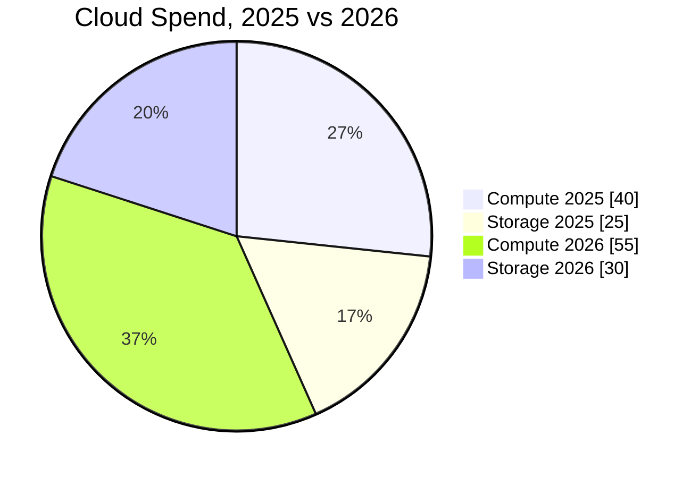
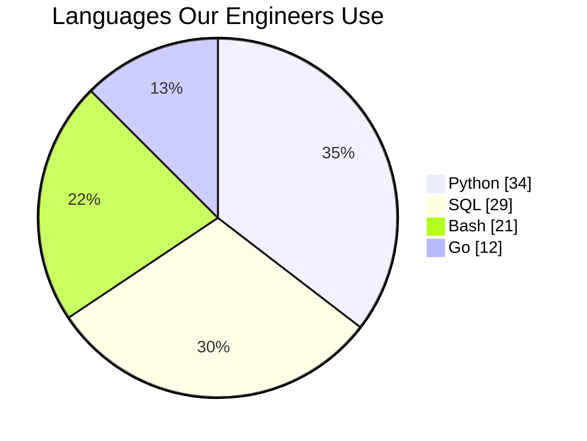
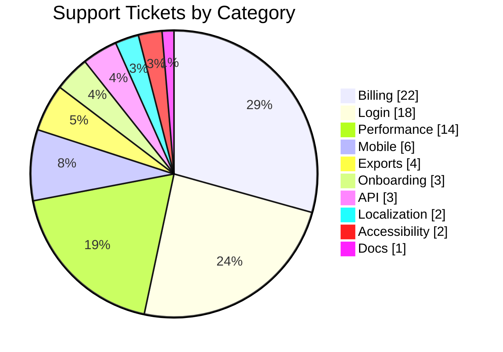
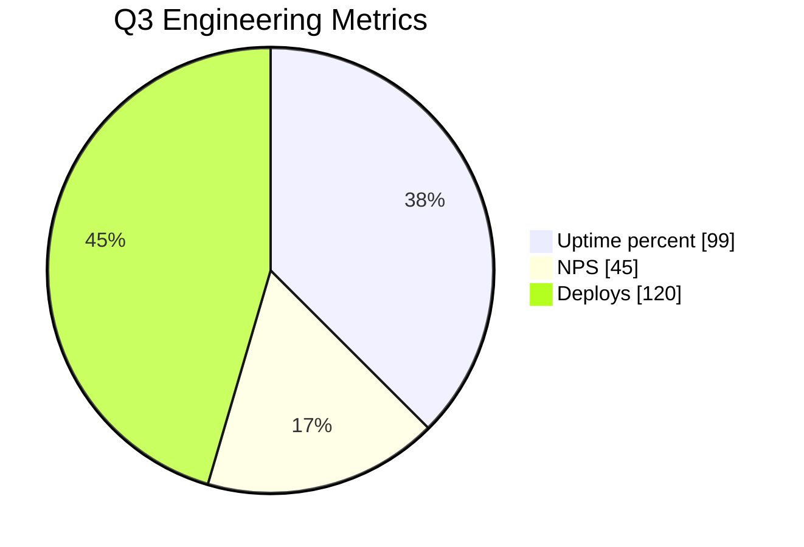

# Proportion Pie

## 1. What It Is

One whole cut into named parts, drawn as a circle so the relative size of each part is visible at a glance. The diagram makes exactly one claim: of this whole, each part takes this much. There is no order, no time, no causality, and no second dimension. Only shares.

What a pie argues is dominance and imbalance. One slice eating two thirds of the circle says something a column of numbers does not, and an even split where the reader expected a dominant slice says it just as fast.

---

## 2. When To Use

The test has two halves, and both must pass.

First, the parts sum to one nameable whole. Every unit of that whole is counted exactly once, in one unit of measure, and the question "percent of what?" has a single answer.

Second, the split is itself the finding. Write the sentence "this part is N percent of the whole". If that sentence is the takeaway you want the reader to leave with, draw the pie. If the numbers are merely context for an argument made elsewhere, write them as a table or a sentence and skip the diagram.

---

## 3. When Not To Use

| The content actually has | Use instead |
| :--- | :--- |
| Two subjects or two moments to compare | One Proportion Pie per subject, each its own diagram with its own takeaway |
| Parts that overlap, or respondents who picked several options | A table in the prose |
| Values in different units | A table in the prose |
| A value changing over time | A table in the prose |
| Items positioned on two continuous dimensions | `quadrant.md` |
| Ordered stages, flows, or anything needing an arrow | `step-flow.md` |

The first row is the one that gets ignored. A before-and-after or an us-versus-them is two wholes, and section 7 says why two wholes never share a circle.

---

## 4. Title and the Whole

The `title` is required, and it does one job: it names the whole and its window, as in `On-call Pages by Root Cause, Q3`. The whole is the denominator of every share on screen, and the title is the only place the diagram can state it. A reader must be able to answer "percent of what, measured when?" from the title alone, because a pie without a stated whole is a circle of shares of nothing.

---

## 5. Slices

| Part | Syntax | Rule |
| :--- | :--- | :--- |
| Header | `pie showData` | `showData` always, so every slice carries its number |
| Title | `title <text>` | Required. Names the whole and its window |
| Slice | `"<label>" : <value>` | 3 to 6, written largest first |
| Residual | `"Other" : <value>` | Written last regardless of size, contents enumerated below the diagram |

Slices render clockwise from twelve o'clock in written order, so largest-first puts the biggest share at the top and the sizes descend around the circle. `Other` goes last so the tail sits at the end of the descent instead of interrupting it.

Labels are noun phrases of four words or fewer. No numbers in a label, because `showData` already prints the value and a percentage written into the label doubles it. No emoji anywhere in the diagram.

Values are raw counts whenever you have them, because a count is citable and the sum of the slices then states the whole. Use percentages only when the source publishes shares and nothing else, and then they must sum to exactly 100, because the renderer normalizes whatever it is given and will happily draw a wrong total as a clean circle.

---

## 6. Color

None. No `classDef`, no `%%{init}%%` theme variables, no per-slice styling.

Mermaid colors slices from its own palette automatically and offers no portable way to make one color mean something. Hardcoded theme variables parse but render differently across GitHub, Sphinx, and Obsidian, and a highlight that silently fails is worse than none. Emphasis is carried by the descending order, which puts the dominant slice at the top, and by the takeaway sentence, which names it.

---

## 7. One Whole Per Diagram

This is the pattern's defining constraint. A pie has exactly one denominator, and every slice is a share of it.

The moment a second subject, a second year, or a second unit enters the slice list, every share on screen becomes a share of a total that means nothing, and the diagram is quietly lying. `Compute 2025` sitting next to `Compute 2026` is the tell: a suffix on a slice label that names a subject or a time is a second dimension trying to get in.

A comparison is drawn as separate pies, one per subject, each with its own title, its own scoping sentence, and its own takeaway. If the comparison itself is the finding rather than either split alone, the pies are the wrong tool entirely, and the numbers belong in a table.

---

## 8. Length

3 to 6 slices.

Below 3, the content is one number and its complement, and a sentence states it better than a circle can. Write the sentence.

Any slice below 5 percent of the whole merges into `Other`. Enumerate what `Other` contains in the prose below the diagram, so the merge hides nothing.

`Other` is never the largest slice. When it is, the categories were cut wrong, and the fix is to recut them rather than to accept a diagram whose biggest finding is unnamed. And if the content genuinely needs seven or more named slices, the finding is a distribution rather than a proportion, and it belongs in a table.

---

## 9. Canonical Example, Counts

> The whole is the 90 pages the on-call rotation answered in Q3, each counted once under the root cause the postmortem assigned it.
>
> ```mermaid
> pie showData
>     title On-call Pages by Root Cause, Q3
>     "Our own deploys" : 38
>     "Config drift" : 21
>     "Upstream API failures" : 17
>     "Capacity limits" : 9
>     "Other" : 5
> ```
>
> Other bundles four causes with one or two pages each: a certificate expiry, two DNS incidents, a disk alert, and a flaky health probe.
>
> The takeaway from this diagram is that 59 of the 90 pages, about two thirds, trace to changes we made ourselves, so the paging problem is a release-discipline problem rather than a dependency problem.

Counts are the preferred form. The slices sum to 90 in plain sight, and every number can be checked against the postmortem log.

---

## 10. Canonical Example, Percentages

> The whole is all visits to the blog over the last 12 months, each attributed to the one channel that delivered it; the analytics platform reports channel mix as shares only.
>
> ```mermaid
> pie showData
>     title Blog Traffic by Channel, Trailing 12 Months
>     "Organic search" : 62
>     "Newsletter" : 17
>     "Social" : 13
>     "Referrals" : 8
> ```
>
> The takeaway from this diagram is that search delivers 62 percent of all traffic, so one ranking change can move more readers than every channel we own combined, and the newsletter at 17 percent is the only piece of that whole under our control.

Percentages are the fallback form, used because the source gives shares and nothing else. They sum to exactly 100, and no slice fell below 5 percent, so there is no `Other` and nothing to enumerate.

---

## 11. Bad Examples

Two wholes in one circle.



Every share here is a share of both years added together, which is a total nobody asked about. The year suffix on each label is the tell. Draw one pie per year, or put the four numbers in a table.

Overlapping parts.



Forty engineers each named every language they use, so the values sum to 96 and the renderer normalizes them into a lie: 34 of 40 engineers use Python, which is 85 percent, but the slice reads 35. Multi-select answers have no whole, so they have no pie.

The long tail.



Ten slices, six of them slivers the labels barely reach. The bottom six merge into `Other` at 15, enumerated below the diagram, and the circle goes back to being readable.

Numbers that are not parts of anything.



An uptime, a score, and a count share no unit and sum to nothing nameable, so the circle asserts a whole that does not exist. This is a table wearing a chart.

---

## 12. Prose Convention

**Above the diagram, one scoping sentence, and nothing else.** It names the whole and how each unit was counted, including the rule used when a unit could have landed in two slices. The title states the whole; this sentence is where the counting method lives.

**Below, first the source**, whenever the numbers are claims about the world rather than your own project's records. A pie of uncited numbers is the roundest-looking unsupported argument there is.

**Below, then the `Other` enumeration**, whenever `Other` appears: one line listing what was merged into it. A residual slice with unlisted contents is a place to hide inconvenient categories, and enumerating it proves nothing was.

**Below, last, a takeaway sentence** beginning "The takeaway from this diagram is". It names the share that matters and says what the split means. Every figure in it must be recomputable from the values `showData` put on screen, so the sentence and the circle can never drift apart.

---

## 13. Checklist

- The header is `pie showData`, and every slice shows its value.
- The title names the whole and its window, and "percent of what, measured when?" is answerable from it alone.
- Every unit of the whole is counted exactly once, in one unit of measure, and the parts sum to the whole.
- 3 to 6 slices, written largest first, `Other` written last.
- Every slice below 5 percent is merged into `Other`, and `Other` is not the largest slice.
- Labels are noun phrases of four words or fewer, with no numbers and no emoji.
- Values are raw counts, or percentages summing to exactly 100 when the source gives shares only.
- One whole per diagram: no second subject, year, or unit hiding in the slice labels.
- No color, no `classDef`, no theme variable block.
- One scoping sentence above the diagram, and nothing else above it.
- Source cited below when the numbers are claims about the world.
- `Other` enumerated below whenever it appears.
- The takeaway sentence comes last, and every figure in it is recomputable from the values on screen.
- The diagram parses.
