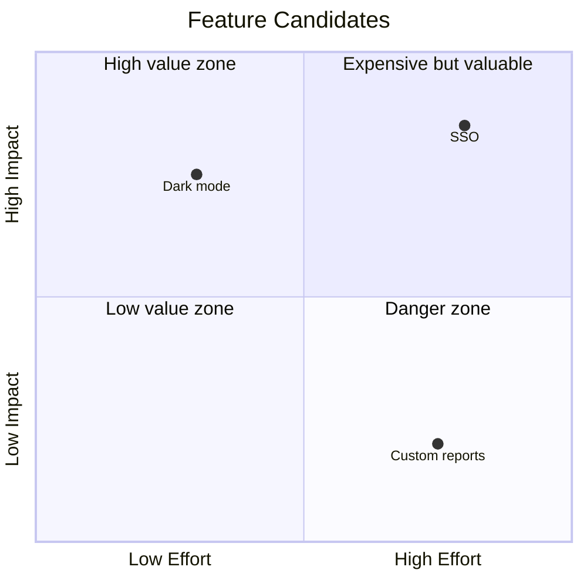
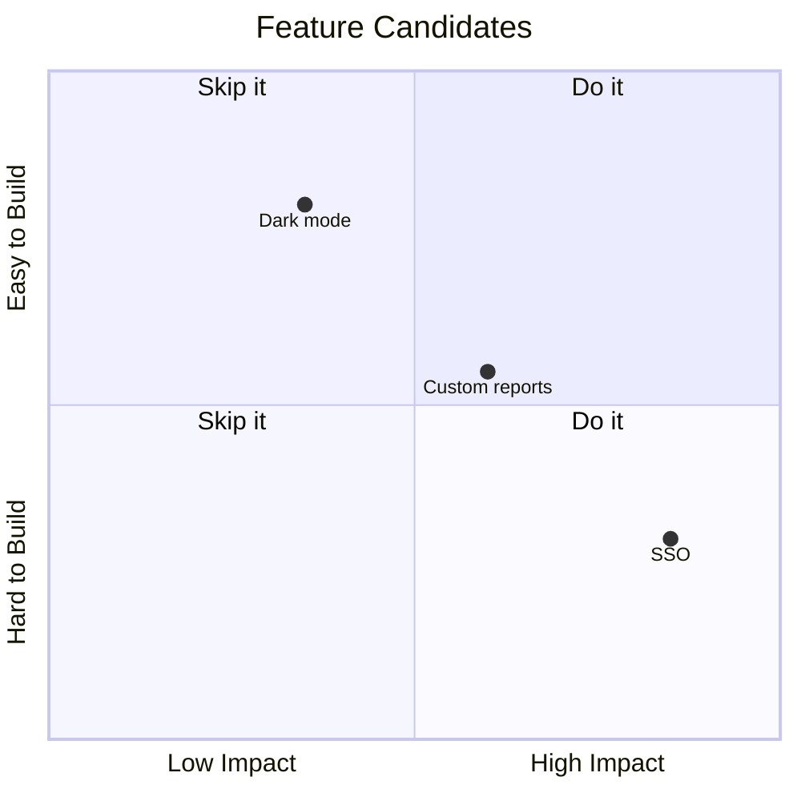
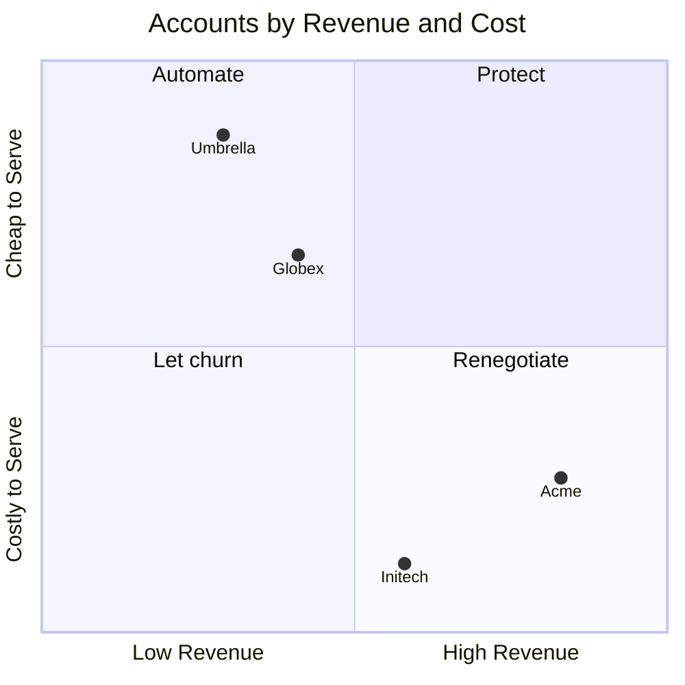

# Quadrant

## 1. What It Is

A set of items placed on a plane by two judgments, so the plane cuts into four zones and each zone carries its own verdict. The diagram makes one claim: these two qualities together sort the set, and where an item lands tells the reader what to do about it.

Drawn once, it is a classification. Drawn with the same items at two dates, it becomes the movement form, and the argument shifts from where things sit to which lines got crossed. The two forms share every rule below except section 7, which only the movement form uses.

---

## 2. When To Use

You hold a set of comparable items and two independent judgments about them, each a matter of degree, and where an item lands changes what you do with it.

Three tests, and all three have to pass. Every point answers the same two questions. Each axis reads as more or less of one named quality, so an item can sit anywhere along it. And the four corners get four different verdicts, which is the test that fails quietly: if two corners would carry the same instruction, one axis is not earning its place.

---

## 3. When Not To Use

| The content actually has | Use instead |
| :--- | :--- |
| A dimension that is a kind rather than a degree | `triage-map.md` |
| A verdict reached through ordered questions | `decision-tree.md` |
| One subject and the positions around it | `niche-map.md` |
| Dated events, or an item placed at three or more moments | `timeline.md` |
| Share of a total | `proportion-pie.md` |
| Actions someone performs in order | `step-flow.md` |

There is one more exit with no pattern behind it. If the verdict follows from one axis alone, the content is a ranking, and a ranked list in prose beats a matrix pretending to need two dimensions.

---

## 4. Axes

Each axis is written `x-axis <low end> --> <high end>`, both ends always present, and the two end labels name the same quality at opposite degrees, as `Lightly Embedded --> Deeply Embedded`. Ends that name two different things are two categories, not one axis.

Right and up always mean more. Never phrase an axis so its high end reads as a negation.

Coordinates run 0 to 1 in steps of 0.05, no finer, because they are judgments rather than measurements, and a judgment axis does not support two decimals of precision.

The midline is a claim. A point placed between 0.45 and 0.55 on an axis says "genuinely middling", which is allowed on at most two points per diagram and must be owned in the prose below, never used to dodge the judgment. If most of the set is middling on one axis, that axis does not separate, so replace it.

---

## 5. Quadrants and Points

Mermaid numbers the quadrants in an order nobody guesses right, so write the labels against this table.

| Slot | Position | Meaning at that corner |
| :--- | :--- | :--- |
| `quadrant-1` | Top right | High on both |
| `quadrant-2` | Top left | High y, low x |
| `quadrant-3` | Bottom left | Low on both |
| `quadrant-4` | Bottom right | High x, low y |

All four labels are required, and each is an imperative verdict of two to four words: `Plan the exit`, `Bet on it`. An adjective label like `High value zone` restates the corner's coordinates, which the reader already has, and withholds the instruction, which is the only thing the corner can add.

`title` is required and names the set of points, plus the two dates in the movement form. The axes name the dimensions and the corners name the verdicts, but nothing else says what population was judged, and an unnamed set reads as a claim about everything.

Point labels are four words or fewer, counting a time suffix. No emoji anywhere: color carries the emphasis here, and a marker glued to a dot's label just crowds the plane.

---

## 6. Color

| Class | Color | Marks | Count |
| :--- | :--- | :--- | :--- |
| `subjectPoint` | Green | The one item the writing is about | 0 or 1 |
| `keyPoint` | Amber | Points the prose stares at | 0 to 3 |
| `riskPoint` | Red | Points in the quadrant being warned about | 0 to 2 |
| `pastPoint` | Grey | A mover's earlier position, or context | Free |

```text
classDef subjectPoint color: #1B7F4B
classDef keyPoint color: #B8860B
classDef riskPoint color: #C0392B
classDef pastPoint color: #8A94A6
```

Apply a class as `XML parser:::riskPoint: [0.8, 0.15]`. Each `classDef` sets `color` and nothing else. Never set `radius`: a bigger dot reads as a third measured dimension, and this chart has no data behind any of its dimensions. Point labels stay theme colored on their own, so they survive GitHub dark mode untouched.

At most three points carry green, amber, or red combined. Grey is free, because it removes attention rather than adding it. Unclassed points keep the theme default, and in a static chart most points should.

Zero green is legitimate here, unlike in the map patterns: a chart can argue about the whole portfolio rather than one member of it. Use the green only when the surrounding writing is about one point in particular.

---

## 7. Movement

This diagram type has no arrows, so movement is drawn as pairs: the same item placed twice, sharing a name with a time suffix, as `SQL 2022` and `SQL 2026`. The earlier point is always grey, and the later point carries whatever emphasis color it has earned. The reader's eye assembles the vector.

Draw a pair only when it crosses at least one quadrant line. A crossing means the verdict changed, which is the only event this form can report. An item that drifted but stayed in its quadrant kept its verdict, so it goes in the prose, not on the chart.

One to three movers, two moments, never a third. An item worth placing at three dates has a history, and a history is a timeline.

---

## 8. Length

3 to 8 points in total, counting both halves of every pair.

Below 3 there is no classification, only a placement, so write the sentence. Above 8 the labels collide and the plane turns into a scatter of text. Cut the context points first, and if the set is genuinely large, chart the few items the writing acts on and put the rest in a table.

---

## 9. Canonical Example, Static

> The coordinates are the platform team's judgment at the January dependency review, not measurements, and the set is every third party library the payments service imports directly.
>
> ```mermaid
> quadrantChart
>     title Dependency Audit, Payments Service
>     x-axis Lightly Embedded --> Deeply Embedded
>     y-axis Failing Upstream --> Healthy Upstream
>     quadrant-1 Bet on it
>     quadrant-2 Use freely
>     quadrant-3 Swap out casually
>     quadrant-4 Plan the exit
>     Postgres driver: [0.85, 0.9]
>     HTTP client: [0.6, 0.8]
>     Retry helper: [0.2, 0.75]
>     Date formatter: [0.15, 0.3]
>     XML parser:::riskPoint: [0.8, 0.15]
>     ORM: [0.7, 0.5]
>     classDef riskPoint color: #C0392B
> ```
>
> - **XML parser.** Last upstream release four years ago, one maintainer, and it sits under every settlement file the service parses. The embeddedness score is the migration estimate from the Q4 spike, which is the only number behind any point here.
> - **ORM.** On the midline deliberately: upstream is maintained but releases have slowed to two a year, and the team could not agree it belonged in either half. If it drops, it lands in the exit quadrant beside the parser.
>
> The takeaway from this diagram is that the exit quadrant holds exactly one point, but that point is among the most deeply embedded things on the chart, so the quadrant with the fewest dots is where the quarter's work is.

No green anywhere, and that is the portfolio mode working as intended: the writing is about the set, so no single point gets the subject color, and the one red is the entire emphasis spend.

---

## 10. Canonical Example, Movement

> The coordinates are my own read of the hiring market, the pairs place the same two skills in 2022 and in 2026, and the subject is prompt evals, because the surrounding piece argues for leading with it.
>
> ```mermaid
> quadrantChart
>     title Two Skills, 2022 against 2026
>     x-axis Rarely Asked For --> Widely Asked For
>     y-axis Common Skill --> Scarce Skill
>     quadrant-1 Lead with it
>     quadrant-2 Keep it warm
>     quadrant-3 Let it fade
>     quadrant-4 Table stakes
>     SQL 2022:::pastPoint: [0.8, 0.6]
>     SQL 2026:::keyPoint: [0.85, 0.2]
>     Prompt evals 2022:::pastPoint: [0.25, 0.8]
>     Prompt evals 2026:::subjectPoint: [0.7, 0.75]
>     classDef pastPoint color: #8A94A6
>     classDef keyPoint color: #B8860B
>     classDef subjectPoint color: #1B7F4B
> ```
>
> The takeaway from this diagram is that both skills crossed a line in four years, in opposite directions: SQL fell out of the lead quadrant into table stakes without losing any demand, and prompt evals earned the seat SQL vacated, so the resume gets reordered even though nothing was unlearned.

Both pairs cross a boundary, which is what qualified them. Had SQL merely drifted rightward inside its quadrant, its pair would be cut and the drift mentioned in prose, leaving a one mover chart.

The grey does the real work. Four points, but the eye lands on the two current ones, and the past positions read as context exactly the way muted context reads everywhere else in this library.

---

## 11. Reach

The examples above are a dependency list and a pair of skills, and the pattern's name evokes a consulting deck, which together undersell where it applies. Any set that survives the section 2 test belongs here. Read this list before deciding it does not.

- **A sprint backlog.** Points are tickets, judged on effort against user impact, and the corners are the four things a planning meeting can decide.
- **Project risks.** Points are the things that could go wrong, judged on likelihood against blast radius, and the corners split mitigate, insure, monitor, accept.
- **Technologies on the radar.** Points are tools or platforms, judged on maturity against fit to the roadmap, and the corners split adopt, trial, assess, hold.
- **Recurring meetings.** Points are the standing entries on a calendar, judged on preparation cost against decision value, and the corners split keep, chair it yourself, delegate, make async.
- **Job offers.** Points are the offers on the table, judged on what each teaches against what each pays, and the corners are four different careers.
- **Customer accounts.** Points are the names on the revenue sheet, judged on revenue against cost to serve, and the corners split protect, automate, renegotiate, let churn.
- **Training datasets.** Points are candidate corpora, judged on signal quality against cost to acquire, and the corners split buy, sample, generate, skip.
- **Content ideas.** Points are pieces you could write, judged on audience demand against your own edge, and the corners split write now, research first, link out, drop.
- **Market segments.** Points are groups of buyers, judged on size against fit to the product, and the corners split pursue, tailor, serve reactively, decline.
- **A team's owned services.** Points are the systems on the on call rota, judged on operational load against business value, and the corners split invest, automate, hand over, sunset.

The test in section 2 is the only membership rule: two judgments of degree, one set of comparable items, four distinct verdicts. And every case above becomes the movement form the moment you can place its points at two dates and at least one crossed a line.

---

## 12. Bad Examples

Categories wearing axes' clothing.


B2B and B2C are kinds, not degrees of one quality, so the API platform at the center claims to be half of each, which means nothing. Two categorical questions is a Triage Map.

Adjectives in the corners.



Every corner restates its own coordinates. The reader already knows SSO is high effort and high impact, because that is where the dot is; the corner's one job was to say what to do about it.

One axis doing all the deciding.



Both right corners say do it and both left corners say skip it, so the vertical axis never changes a verdict. This is a ranking by impact, and a ranked list says it without the ceremony.

Measurement cosplay.



Two decimal coordinates claim these positions were computed. If the revenue really is measured, the content is a scatter plot with real axes, which this library does not draw; if it was judged, the precision is fiction, so round to 0.05 and say whose judgment it is.

---

## 13. Prose Convention

**Above the diagram, one sentence naming whose judgment the coordinates are and as of when,** plus, in the movement form, the two dates. It is required rather than optional, because a quadrant chart is the library's only diagram that looks like measured data, and the sentence is what keeps it honest. Nothing else goes above.

**Below, up to three bullets,** one for each point whose placement needs defending: a number behind a coordinate, a midline claim, a disagreement the team had. Skip points whose position the reader will accept on sight.

**Below, last, a takeaway sentence** beginning "The takeaway from this diagram is". It points at one corner or one crossing. Reciting the whole plane back is not a takeaway, because the plane is already visible.

---

## 14. Checklist

- The title names the set of points, and the two dates in the movement form.
- Both ends of each axis name the same quality at opposite degrees, and both axes are judgments of more or less, never kinds.
- All four quadrant labels are present, imperative, two to four words, and carry four different verdicts.
- No verdict depends on one axis alone.
- 3 to 8 points, labels four words or fewer, no emoji.
- Coordinates in steps of 0.05, no finer.
- At most two points inside a midline band, each owned in a bullet below.
- At most one green `subjectPoint`, and green, amber, and red together mark at most 3 points.
- Every `classDef` sets `color` only, and no point sets `radius`.
- Every mover is a pair sharing a name with time suffixes, its earlier point grey, and every pair crosses at least one quadrant line.
- At most two moments; an item at three dates is a timeline.
- The judgment sentence above and the takeaway sentence below are both written.
- The diagram parses.
