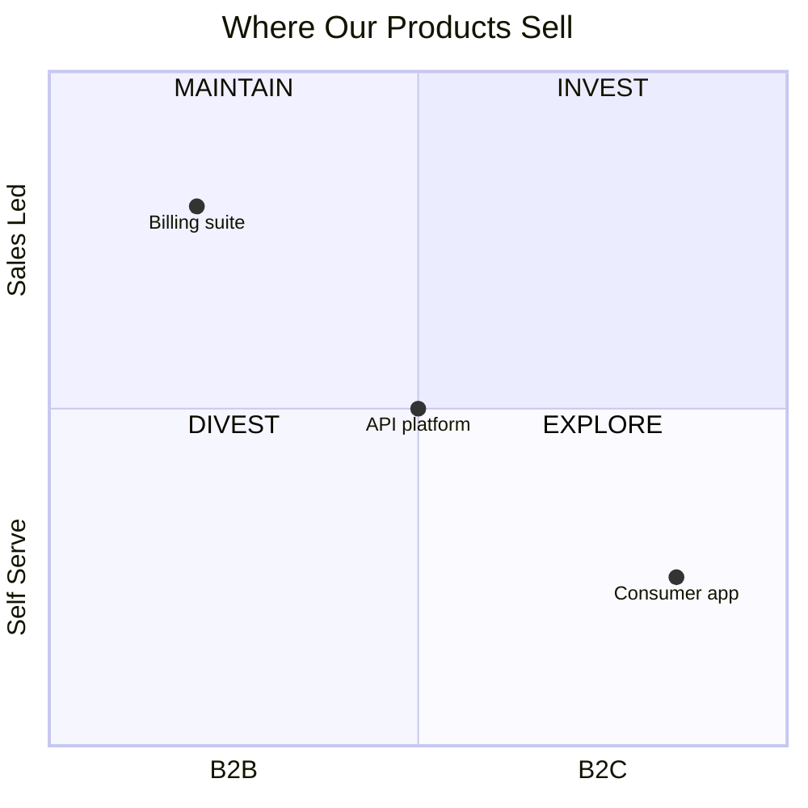
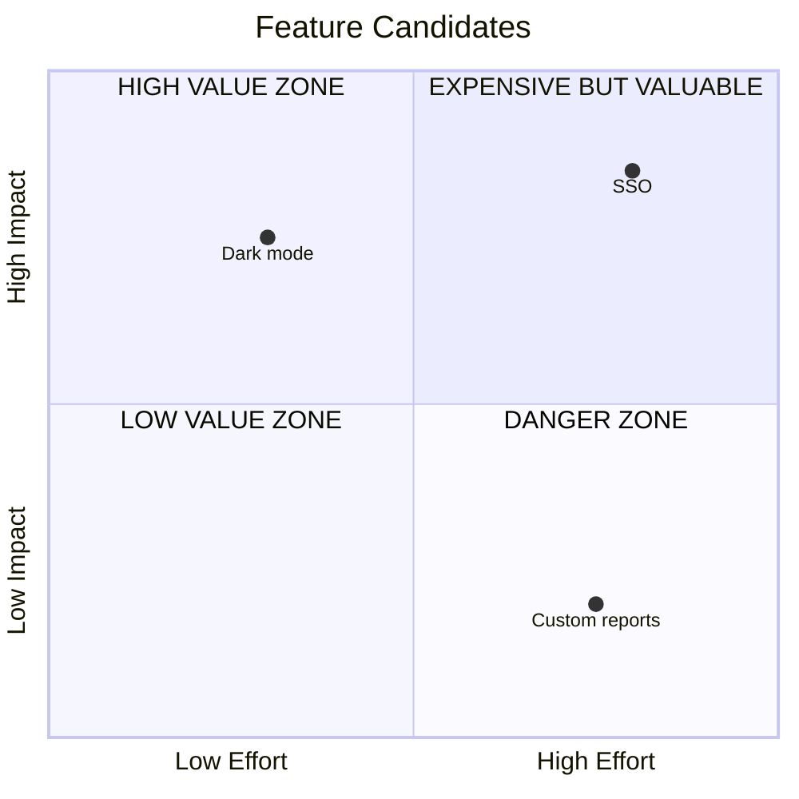
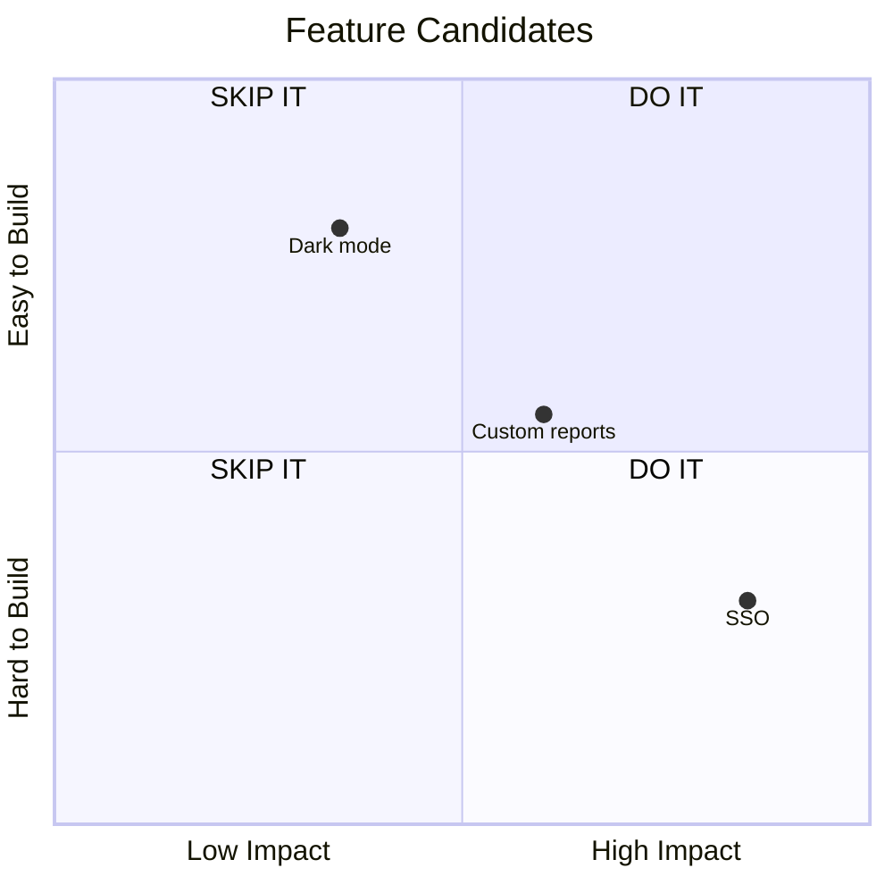
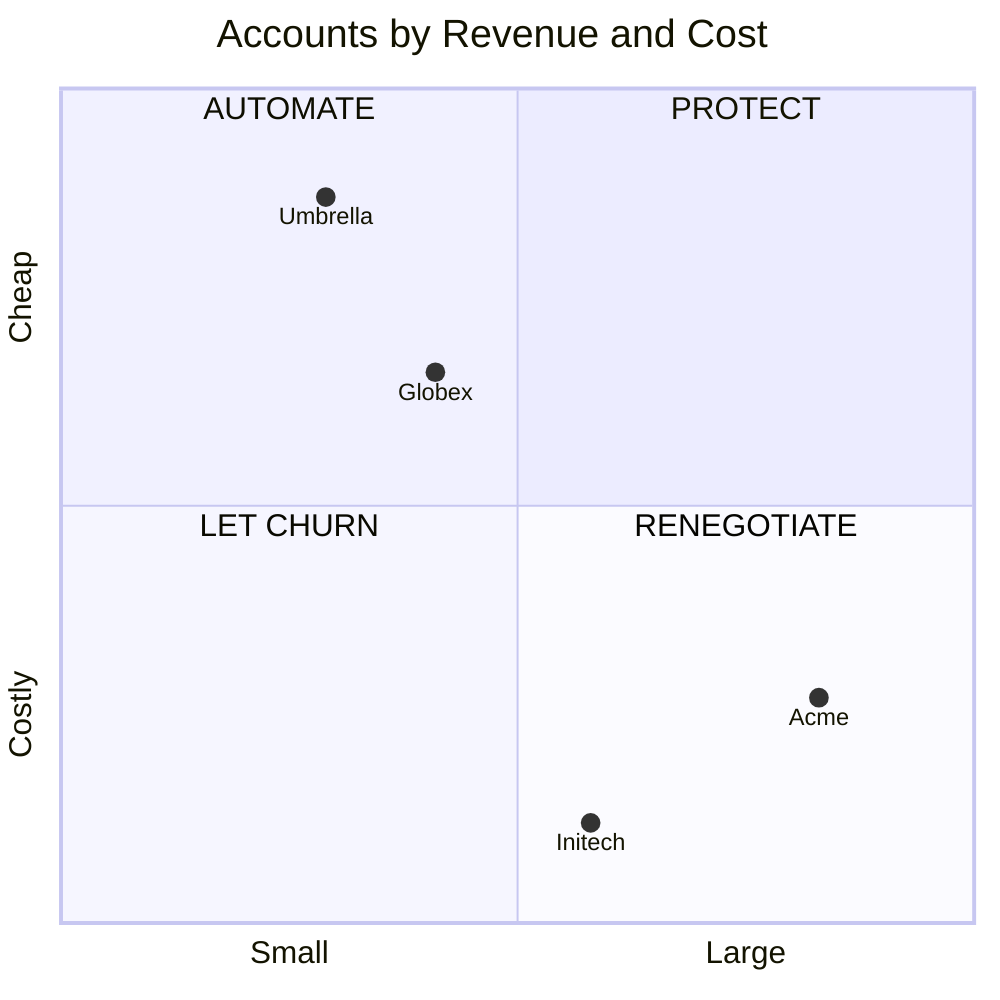

# Quadrant

## 1. What It Is

A set of items placed on a plane by two judgments, so the plane cuts into four zones and each zone carries its own verdict. The underlying move is case analysis: ask two questions of the same set, and the four combinations of high and low are four recognizably different situations, each with its own instruction. The diagram makes one claim: these two qualities together sort the set, and where an item lands tells the reader what to do about it.

Drawn once, it is a classification. Drawn with the same items at two dates, it becomes the movement form, and the argument shifts from where things sit to which lines got crossed. The two forms share every rule below except section 7, which only the movement form uses.

---

## 2. When To Use

You hold a set of comparable items and two independent judgments about them, each a matter of degree, and where an item lands changes what you do with it.

The working test is a sentence filled four times: high on both is one situation, low on both is another, and each mixed case is a situation of its own. When all four read as situations the reader will recognize as genuinely different, each with its own verdict, the plane has earned its place. Two quieter checks follow: every point answers the same two questions, and an item could sit anywhere along each axis. The verdict check is the one that fails silently: if two corners would carry the same instruction, one axis is not earning its place.

---

## 3. When Not To Use

| The content actually has | Use instead |
| :--- | :--- |
| A dimension that is a kind rather than a degree | `triage-map.md` |
| A verdict reached through ordered questions | `decision-tree.md` |
| One subject and the positions around it | `niche-map.md` |
| Dated events, or an item placed at three or more moments | `timeline.md` |
| Share of a total | `proportion-pie.md` |
| Actions someone performs in order | `step-flow.md` |

There is one more exit with no pattern behind it. If the verdict follows from one axis alone, the content is a ranking, and a ranked list in prose beats a matrix pretending to need two dimensions.

---

## 4. Axes

Each axis is written `x-axis <low pole> --> <high pole>`, both ends always present. A pole is one or two words, and the pair are opposite ends of one quality: `Learning --> Skilled`, `Trivial --> Important`. The quality's full name goes in the sentence above the chart, never on the axis.

The first line of every quadrant diagram is this directive, copied exactly:

```text
%%{init: {"quadrantChart": {"xAxisPosition": "bottom"}}}%%
```

It moves the x axis poles below the plane, where axis text belongs. Without it Mermaid stacks the title, the x poles, and the quadrant labels in three same-styled rows across the top, and the reader cannot tell the axis furniture from the verdicts. A renderer too old to know the key ignores it and falls back to the top position, which is a cosmetic regression rather than a broken diagram, so the directive is safe to ship.

The poles stay short because of the y axis. Its labels render rotated 90 degrees along the left edge in every Mermaid version, with no directive to change it, and rotated text gets harder to read with every word, so of the two dimensions the y axis gets the poles you can say in one word.

Right and up always mean more. Never phrase a pole so the high end reads as a negation. And an item must be able to sit anywhere between the poles: ends that name two kinds, as `B2B --> B2C`, are categories wearing an axis's clothing, and a point between them means nothing.

Coordinates run 0 to 1 in steps of 0.05, no finer, because they are judgments rather than measurements, and a judgment axis does not support two decimals of precision.

The midline is a claim. A point placed between 0.45 and 0.55 on an axis says "genuinely middling", which is allowed on at most two points per diagram and must be owned in the prose below, never used to dodge the judgment. If most of the set is middling on one axis, that axis does not separate, so replace it.

---

## 5. Quadrants and Points

Mermaid numbers the quadrants in an order nobody guesses right, so write the labels against this table.

| Slot | Position | Meaning at that corner |
| :--- | :--- | :--- |
| `quadrant-1` | Top right | High on both |
| `quadrant-2` | Top left | High y, low x |
| `quadrant-3` | Bottom left | Low on both |
| `quadrant-4` | Bottom right | High x, low y |

All four labels are required, and each is an imperative verdict of two to four words, written in ALL CAPS: `PLAN THE EXIT`, `BET ON IT`. The caps are load bearing, not decoration: the verdicts render in the same font size as the axis poles, and the caps are what make a verdict read as a stamp on its zone rather than as more axis text, on every renderer. An adjective label like `HIGH VALUE ZONE` restates the corner's coordinates, which the reader already has, and withholds the instruction, which is the only thing the corner can add.

The verdicts center horizontally in their quadrants on their own. Vertically they center only on an empty plane; once points exist, Mermaid pins each verdict to the top edge of its quadrant to stay out of the data's way. Do not fight this placement: keep points at 0.85 or below on the y axis in the top quadrants and the two never collide.

`title` is required and names the set of points, plus the two dates in the movement form. The axes name the dimensions and the corners name the verdicts, but nothing else says what population was judged, and an unnamed set reads as a claim about everything.

Point labels are four words or fewer, counting a time suffix. No emoji anywhere: color carries the emphasis here, and a marker glued to a dot's label just crowds the plane.

---

## 6. Color

| Class | Color | Marks | Count |
| :--- | :--- | :--- | :--- |
| `subjectPoint` | Green | The one item the writing is about | 0 or 1 |
| `keyPoint` | Amber | Points the prose stares at | 0 to 3 |
| `riskPoint` | Red | Points in the quadrant being warned about | 0 to 2 |
| `pastPoint` | Grey | A mover's earlier position, or context | Free |

```text
classDef subjectPoint color: #1B7F4B
classDef keyPoint color: #B8860B
classDef riskPoint color: #C0392B
classDef pastPoint color: #8A94A6
```

Apply a class as `XML parser:::riskPoint: [0.8, 0.15]`. Each `classDef` sets `color` and nothing else. Never set `radius`: a bigger dot reads as a third measured dimension, and this chart has no data behind any of its dimensions. Point labels stay theme colored on their own, so they survive GitHub dark mode untouched.

At most three points carry green, amber, or red combined. Grey is free, because it removes attention rather than adding it. Unclassed points keep the theme default, and in a static chart most points should.

Zero green is legitimate here, unlike in the map patterns: a chart can argue about the whole portfolio rather than one member of it. Use the green only when the surrounding writing is about one point in particular.

One point, one color. When the subject sits in the quadrant being warned about, green wins, because "which one is this about" is the question the reader needs answered before any warning.

---

## 7. Movement

This diagram type has no arrows, so movement is drawn as pairs: the same item placed twice, sharing a name with a time suffix, as `SQL 2022` and `SQL 2026`. The earlier point is always grey, and the later point carries whatever emphasis color it has earned. The reader's eye assembles the vector.

Draw a pair only when it crosses at least one quadrant line. A crossing means the verdict changed, which is the only event this form can report. An item that drifted but stayed in its quadrant kept its verdict, so it goes in the prose, not on the chart.

One to three movers, two moments, never a third. An item worth placing at three dates has a history, and a history is a timeline.

---

## 8. Length

3 to 8 points in total, counting both halves of every pair.

Below 3 there is no classification, only a placement, so write the sentence. Above 8 the labels collide and the plane turns into a scatter of text. Cut the context points first, and if the set is genuinely large, chart the few items the writing acts on and put the rest in a table.

---

## 9. Canonical Example, Static

> The coordinates are my own Monday-planning judgment of one week of incoming work, and the two dimensions are how urgent each item is against how much it actually matters.
>
> ```mermaid
> %%{init: {"quadrantChart": {"xAxisPosition": "bottom"}}}%%
> quadrantChart
>     title One Week of Incoming Work
>     x-axis Can Wait --> Urgent
>     y-axis Trivial --> Important
>     quadrant-1 DO IT NOW
>     quadrant-2 SCHEDULE IT
>     quadrant-3 DROP IT
>     quadrant-4 DELEGATE IT
>     Prod incident: [0.9, 0.85]
>     Quarterly roadmap: [0.2, 0.8]
>     Recruiting pings:::riskPoint: [0.75, 0.2]
>     Legacy status report: [0.15, 0.15]
>     Code review queue: [0.6, 0.5]
>     classDef riskPoint color: #C0392B
> ```
>
> - **Recruiting pings.** Urgent because candidates go cold in days, trivial here because any teammate can run the screen, which is exactly what the corner's verdict arranges.
> - **Code review queue.** On the importance midline deliberately: the queue mixes a risky migration with typo fixes, and if that spread persists the point should split in two.
>
> The takeaway from this diagram is that only one point will not fight for itself: everything urgent rings on its own, so the quarterly roadmap, important and silent, is the item that gets a protected calendar slot.

The four combinations are four situations anyone working recognizes: urgent and important, important but quiet, urgent but trivial, neither. That is the section 2 test passing at full strength, and it is why this chart needs no explaining to a reader who has never seen one.

No green anywhere, and that is the portfolio mode working as intended: the writing is about the week, not one task, so no point gets the subject color, and the one red is the entire emphasis spend.

---

## 10. Canonical Example, Movement

> The coordinates are a manager's own read of two direct reports, placed at the start of 2025 and a year later, and the two dimensions are skill against drive. The subject is the new hire, because the surrounding piece is about how fast delegation was earned.
>
> ```mermaid
> %%{init: {"quadrantChart": {"xAxisPosition": "bottom"}}}%%
> quadrantChart
>     title Two Reports, 2025 against 2026
>     x-axis Learning --> Skilled
>     y-axis Idle --> Driven
>     quadrant-1 DELEGATE
>     quadrant-2 COACH
>     quadrant-3 DIRECT
>     quadrant-4 MOTIVATE
>     New hire 2025:::pastPoint: [0.2, 0.8]
>     New hire 2026:::subjectPoint: [0.65, 0.85]
>     Senior dev 2025:::pastPoint: [0.85, 0.7]
>     Senior dev 2026:::riskPoint: [0.9, 0.3]
>     classDef pastPoint color: #8A94A6
>     classDef subjectPoint color: #1B7F4B
>     classDef riskPoint color: #C0392B
> ```
>
> The takeaway from this diagram is that both reports crossed a line in one year and neither crossing calls for closer supervision: the new hire crossed the skill line and earned delegation, while the senior developer slid down the drive axis with no loss of skill, so the fix is not training but a reason to care again.

Each quadrant is a way of managing someone, so a crossing is not a detail, it is the event: the day a report changes quadrant is the day the old management style stops being right. That is what qualified both pairs. A report who drifted inside their quadrant is managed the same as before, and is not drawn.

What moves a point is prose material, not chart material. Skill moves with teaching and reps, drive moves with meaning and recognition, and the diagram's job is only to show which of the two moved. Note also the poles: `Idle --> Driven` and `Learning --> Skilled` are one word each end, and the dimensions' full names live in the sentence above, which is what keeps the rotated y axis readable.

---

## 11. Reach

The examples above are the two most familiar quadrants in professional life, tasks and people, which risks reading the pattern as a management toy. Any set that survives the section 2 test belongs here, whatever the unit. Read this list before deciding it does not fit.

- **A dependency list.** Points are the libraries a service imports, judged on how deeply embedded against upstream health, and the corners split bet on it, use freely, swap out, plan the exit.
- **Project risks.** Points are the things that could go wrong, judged on likelihood against blast radius, and the corners split mitigate, insure, monitor, accept.
- **Technologies on the radar.** Points are tools or platforms, judged on maturity against fit to the roadmap, and the corners split adopt, trial, assess, hold.
- **Recurring meetings.** Points are the standing entries on a calendar, judged on preparation cost against decision value, and the corners split keep, chair it yourself, delegate, make async.
- **Skills on a resume.** Points are the things you can do, judged on market demand against scarcity, and the corners decide what to lead with, keep warm, let fade, or treat as table stakes.
- **Customer accounts.** Points are the names on the revenue sheet, judged on revenue against cost to serve, and the corners split protect, automate, renegotiate, let churn.
- **Training datasets.** Points are candidate corpora, judged on signal quality against cost to acquire, and the corners split buy, sample, generate, skip.
- **Content ideas.** Points are pieces you could write, judged on audience demand against your own edge, and the corners split write now, research first, link out, drop.
- **Market segments.** Points are groups of buyers, judged on size against fit to the product, and the corners split pursue, tailor, serve reactively, decline.
- **A team's owned services.** Points are the systems on the on call rota, judged on operational load against business value, and the corners split invest, automate, hand over, sunset.

The test in section 2 is the only membership rule: two judgments of degree, one set of comparable items, four distinct verdicts. And every case above becomes the movement form the moment you can place its points at two dates and at least one crossed a line.

---

## 12. Bad Examples

Categories wearing axes' clothing.



B2B and B2C are kinds, not degrees of one quality, so the API platform at the center claims to be half of each, which means nothing. Two categorical questions is a Triage Map.

Adjectives in the corners.



Every corner restates its own coordinates. The reader already knows SSO is high effort and high impact, because that is where the dot is; the corner's one job was to say what to do about it.

One axis doing all the deciding.



Both right corners say do it and both left corners say skip it, so the vertical axis never changes a verdict. This is a ranking by impact, and a ranked list says it without the ceremony.

Measurement cosplay.



Two decimal coordinates claim these positions were computed. If the revenue really is measured, the content is a scatter plot with real axes, which this library does not draw; if it was judged, the precision is fiction, so round to 0.05 and say whose judgment it is.

---

## 13. Prose Convention

**Above the diagram, one sentence naming whose judgment the coordinates are, as of when, and the full names of the two dimensions,** plus, in the movement form, the two dates. It is required rather than optional, twice over: a quadrant chart is the library's only diagram that looks like measured data, and the axis poles are deliberately too short to define their dimensions, so the sentence is where the definitions live. Nothing else goes above.

**Below, up to three bullets,** one for each point whose placement needs defending: a number behind a coordinate, a midline claim, a disagreement the team had. Skip points whose position the reader will accept on sight.

**Below, last, a takeaway sentence** beginning "The takeaway from this diagram is". It points at one corner or one crossing. Reciting the whole plane back is not a takeaway, because the plane is already visible.

---

## 14. Checklist

- The first line is the `xAxisPosition: bottom` init directive, copied exactly.
- The title names the set of points, and the two dates in the movement form.
- Both poles of each axis are present, one or two words each, opposite ends of one quality an item could sit anywhere along, and the y axis got the shortest poles.
- All four quadrant labels are present, imperative, ALL CAPS, two to four words, and carry four different verdicts.
- Points in the top quadrants sit at 0.85 or below on the y axis.
- No verdict depends on one axis alone.
- 3 to 8 points, labels four words or fewer, no emoji.
- Coordinates in steps of 0.05, no finer.
- At most two points inside a midline band, each owned in a bullet below.
- At most one green `subjectPoint`, and green, amber, and red together mark at most 3 points.
- Every `classDef` sets `color` only, and no point sets `radius`.
- Every mover is a pair sharing a name with time suffixes, its earlier point grey, and every pair crosses at least one quadrant line.
- At most two moments; an item at three dates is a timeline.
- The sentence above names the judge, the date, and both dimensions in full; the takeaway sentence below points at one corner or one crossing.
- The diagram parses.
