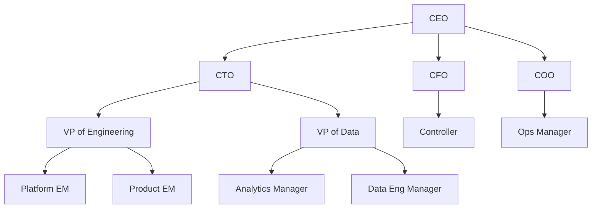
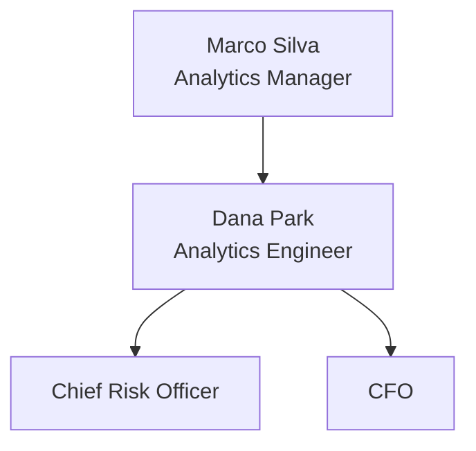
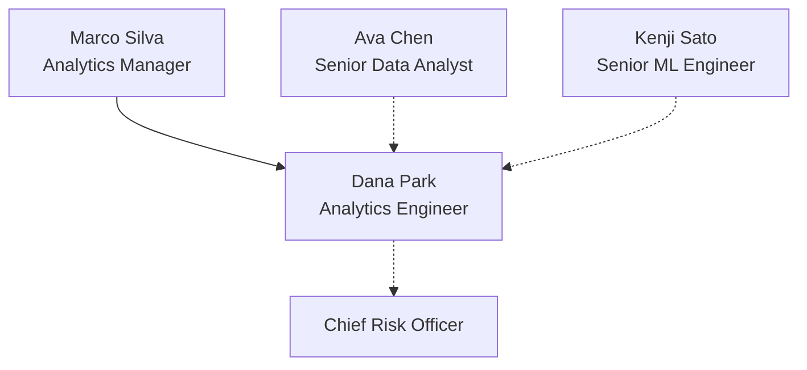

# Role Map

## 1. What It Is

One role and the people around it: the chain it answers to, drawn solid, and the working relationships it actually runs on, drawn dotted and labeled. The subject is green, the one to three people who most shape its week are amber, and everyone else is grey. The diagram makes one claim: this is where the role hangs, and these are the people who decide how it goes.

The solid tree and the amber are two different maps drawn over the same boxes. Rank says who owns whom, dependency says who matters, and the diagram earns its place mainly where the two disagree. A manager who is grey while a peer is amber is a finding, not a mistake.

A role is anything that answers to something and works with something: a named person, a bare seat like Chief Risk Officer, a whole team. Nothing in the rules changes when the boxes change scale. And the diagram is never the company. It is the slice of the company one role can see.

---

## 2. When To Use

The content is one role and its surroundings, and the reader's question is who it answers to and who it works with.

Three tests, and all three have to pass.

Exactly one box is the role the surrounding writing is about. Every box is a *who* — a person, a seat, a team — never a *what* or a *doing*: `Senior Data Analyst` passes, `Metric Sign-off` does not. And at least two boxes sit on an answers-to line, because the solid tree is the spine everything else hangs from. If nobody answers to anybody, this is not the pattern.

---

## 3. When Not To Use

| The content actually has | Use instead |
| :--- | :--- |
| One thing flowing through positions, the same on every edge | `niche-map.md` |
| Actions someone performs in order | `step-flow.md` |
| Dated events, such as how the team grew | `timeline.md` |
| Which person to go to in which situation | `triage-map.md` |
| What the role must become, derived from a goal | `working-backwards-chain.md` |

The first row is where the confusion lives. In a Niche Map one thing flows and every solid edge carries it, so one word fills the blank in `X hands ___ to Y` across the whole diagram and no edge needs a label. Here the solid edges mean answers-to, the dotted edges mean whatever their labels say, and no single word covers them. If you can name the one flowing thing, draw the Niche Map.

---

## 4. Direction and Layout

Always `TD`. The vertical axis is rank: every solid arrow points down, from owner to owned, and the reader finds the subject's chain by walking up. Never `LR`, never `RL`.

Do not lay the boxes out by hand. Write the edges and let the renderer place everything.

A box may have no solid parent at all — an analyst from another chain, an executive stakeholder — and hang by dotted edges alone. The float is information: that box's chain exists, but not in this story.

---

## 5. Shapes

| Role | Shape | Syntax | Count |
| :--- | :--- | :--- | :--- |
| A who | Rectangle | `@{ shape: rect }` | Every node |

One shape, no exceptions. The boxes differ in color and position, never in kind.

Labels come in two forms. A bare seat or a team is one line: `Chief Risk Officer`, `Infrastructure Team`. A named person is two lines, name then role, as `label: "Dana Park<br/>Analytics Engineer"`. Name the person only when the surrounding prose names them; a seat whose holder never appears in the writing stays bare. Each line is four words or fewer.

No emoji, no diamonds, no double circles, no documents. Tenure, background, and personality belong in the prose below the diagram, never in the box.

This pattern needs no legacy fallback. `D["Dana Park<br/>Analytics Engineer"]` is the classic rectangle and works in every Mermaid version.

---

## 6. Color

| Class | Color | Marks | Count |
| :--- | :--- | :--- | :--- |
| `subjectNode` | Green | The one role the writing is about | Exactly 1 |
| `keyNode` | Amber | The people who most shape the subject's week | 1 to 3 |
| `contextNode` | Grey | Everyone else | The rest |

```text
classDef subjectNode fill:#D1F0DB,stroke:#1B7F4B,color:#0B3D24
classDef keyNode fill:#FFF3CD,stroke:#B8860B,color:#3D2E00
classDef contextNode fill:#EEF1F5,stroke:#8A94A6,color:#2C3440
```

Copy all three properties or none. Dropping `color` leaves the text to the theme, and a diagram that reads in GitHub light mode turns pale on pale in dark mode.

Every node is classed and none is left at the theme default. Green against grey reads far louder than green against white, and the grey is what states that the rest is context.

Exactly one green, always. Zero means the diagram has no point of view and is a filing system rather than an argument about a seat. Two means two arguments, which is two diagrams.

**Amber is not rank.** The solid tree already draws rank, so amber repeating it says nothing. Pick the amber by asking whose change of mind would rearrange the subject's month: the analyst who can reject a week of work is amber, the director two boxes up who approves vacations is grey. A grey manager is the pattern working, not a slight.

---

## 7. Arrows

Solid `-->`, unlabeled, only for answers-to. It points down, each box has at most one solid parent, and the solid edges form a tree with no cycles. A box that seems to need two solid parents has a working relationship wearing the wrong line.

Dotted `-.->|label|` for every working relationship, and every dotted edge carries a label. Read the arrow as a sentence, tail through label to head: `Ava -.->|signs off metrics| Dana` reads as Ava signs off metrics for Dana. If the sentence runs backwards, flip the arrow, not the label.

No `==>` anywhere. At most 5 dotted edges; past that the lattice buries the tree. Boxes holding the identical relationship to the subject merge into one box named for what they share: four executives who each receive the same reports are one box, not four.

---

## 8. Length

4 to 10 boxes. Below 4 there is no map, because a role and its manager is a sentence. Above 10 the subject stops being the center of anything.

At most two boxes above the subject on the solid line. The company continues upward; the story does not.

The test for every box is deletion: remove it, and if the prose about the subject does not change, it was decoration. The neighboring team the subject never talks to fails this test even when the official chart shows it.

---

## 9. Canonical Example, The Team

> The subject is a developer productivity team, and the slice is the engineering org as that team sees it.
>
> ```mermaid
> flowchart TD
>     V@{ shape: rect, label: "VP of Engineering" }
>     D@{ shape: rect, label: "Developer Productivity" }
>     I@{ shape: rect, label: "Infrastructure Team" }
>     S@{ shape: rect, label: "Security Team" }
>     P@{ shape: rect, label: "Product Teams" }
>
>     V --> D
>     V --> I
>     D -.->|serves| P
>     D -.->|builds on| I
>     S -.->|reviews releases| D
>
>     classDef subjectNode fill:#D1F0DB,stroke:#1B7F4B,color:#0B3D24
>     classDef keyNode fill:#FFF3CD,stroke:#B8860B,color:#3D2E00
>     classDef contextNode fill:#EEF1F5,stroke:#8A94A6,color:#2C3440
>
>     class D subjectNode
>     class I,P keyNode
>     class V,S contextNode
> ```
>
> The takeaway from this diagram is that the team answers to the VP but is run by its neighbors: the product teams it serves set its roadmap, the infrastructure it builds on sets its ceiling, and the reporting line is the least informative edge in the picture.

Every box is a team and no person is named, because at this scale the individuals are not what the writing is about. Product Teams is one box rather than six, since all six hold the identical relationship to the subject and merge into a box named for what they share.

---

## 10. Canonical Example, The Person

> The subject is an analytics engineer one month into the job, and the slice is the five people who decide whether the first quarter goes well.
>
> ```mermaid
> flowchart TD
>     H@{ shape: rect, label: "Head of Data" }
>     M@{ shape: rect, label: "Marco Silva<br/>Analytics Manager" }
>     D@{ shape: rect, label: "Dana Park<br/>Analytics Engineer" }
>     K@{ shape: rect, label: "Kenji Sato<br/>Senior ML Engineer" }
>     A@{ shape: rect, label: "Ava Chen<br/>Senior Data Analyst" }
>     C@{ shape: rect, label: "Chief Risk Officer" }
>
>     H --> M
>     M --> D
>     M --> K
>     A -.->|signs off metrics| D
>     K -.->|reviews pipelines| D
>     D -.->|serves| C
>
>     classDef subjectNode fill:#D1F0DB,stroke:#1B7F4B,color:#0B3D24
>     classDef keyNode fill:#FFF3CD,stroke:#B8860B,color:#3D2E00
>     classDef contextNode fill:#EEF1F5,stroke:#8A94A6,color:#2C3440
>
>     class D subjectNode
>     class A,K keyNode
>     class H,M,C contextNode
> ```
>
> The takeaway from this diagram is that the reporting line is the quiet part of the job: Marco assigns the work, but Ava can send a week of it back and Kenji decides when it ships, so the two amber boxes own a calendar the grey chain above only reads about.

Head of Data and Chief Risk Officer are bare seats because the prose around the diagram never names their holders. Ava has no solid parent in the picture: that chain exists, but not in this story, and the floating box says exactly that.

---

## 11. Reach

The examples are a team and an employee, which is the narrowest reading of who can hold the green. The solid edge means accountability, not employment, and accountability exists anywhere someone can say no to someone else's work. Read this list before deciding the pattern does not fit.

- **A new hire's first-week doc.** The role they were hired into, its chain, and its reviewers and customers. The dotted labels answer day one's real question, which is who to ask what.
- **An embedded consultant.** The client's tree drawn solid, the consultant hanging from it by dotted edges alone, because nobody in the building owns them.
- **An open-source project.** The lead maintainer owns the maintainers, where solid means merge rights rather than salary, and the sponsoring company hangs dotted with `funds`.
- **A founder and the board.** The one map where the chief executive has a box above them: the board owns the seat, solid, while advisors hang dotted.
- **An academic lab.** The professor owns the students, the collaborator across the hall and the funding agency hang dotted, and the subject is the student deciding whose comments to take.
- **A matrix org.** A designer solid-owned by the design director and dotted-embedded in a product squad. The diagram exists to show those are different edges.
- **A vendor relationship.** The subject is your team, the solid tree stays inside your own chain, and the vendor's account manager and support desk hang dotted with `escalates to` and `bills`.
- **A multi-agent system.** The orchestrator owns the subagents it spawns, solid, and each agent's dotted labels name the tools and services it calls. The subject is the agent being designed.
- **Content production.** An author with an editor who signs off, a publisher that distributes, and a subject-matter reviewer who can block. The green sits on whichever role the piece is advising.
- **The membership rule.** One green who, boxes that are all whos, and a solid tree meaning answers-to. Content passing section 2 is this pattern whatever it is about, and content failing it does not become this pattern by being about an organization.

---

## 12. Bad Examples

The whole company.



No box is green, there is not one working relationship in it, and for any subject you pick, most boxes fail the delete test. This is the company's filing system. Pick the role the writing is about and draw the slice that role can see.

A working relationship drawn solid.



Read as a tree, this claims two chief officers answer to an analytics engineer. Serving an executive is a working relationship: dotted, and labeled `serves`.

Dotted edges with no labels.



Three dotted edges carrying three different relationships, an arbiter, a reviewer, and a customer, and nothing distinguishes them. A bare dotted edge says only that something happens between two people, which the reader already assumed.

---

## 13. Prose Convention

**Above the diagram, one sentence naming the subject and the slice**: which role is green and what corner of the world the boxes cover. The tree cannot say which project or which quarter it was drawn for, so the sentence must.

**Below, the people.** Bios, tenure, and the texture of each relationship go in prose under the diagram, a short paragraph per box that earned one. The box holds a name and a role, and everything else about a person is prose.

**Below, last, a takeaway sentence** beginning "The takeaway from this diagram is". It says what the subject's position costs or gets it. Listing the neighbors back to the reader is not a takeaway, because the boxes already did that.

---

## 14. Checklist

- Exactly one green `subjectNode`, and the surrounding writing is about it.
- Every box is a who: a named person, a bare seat, or a team. No actions, no artifacts.
- `TD`, solid arrows point down, and no box is placed by hand.
- Solid edges are unlabeled, mean answers-to, and form a tree: at most one solid parent per box, no cycles.
- At most two boxes above the subject on the solid line.
- Every dotted edge has a label, and each reads as a sentence from tail through label to head.
- At most 5 dotted edges, and boxes with identical relationships to the subject are merged.
- 1 to 3 amber `keyNode`, chosen by dependency, not rank.
- Every remaining box carries `contextNode`, and no node is left unclassed.
- Every node is `@{ shape: rect }`. No other shape, no emoji.
- A named person's box is name then role, each line four words or fewer, and only people the prose names get names.
- 4 to 10 boxes, and every box survives the delete test.
- Every `classDef` carries `fill`, `stroke`, and `color`.
- The scoping sentence above and the takeaway sentence below are both written.
- The diagram parses.
