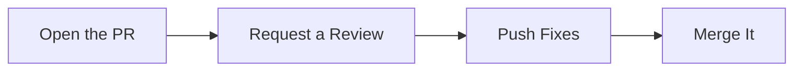
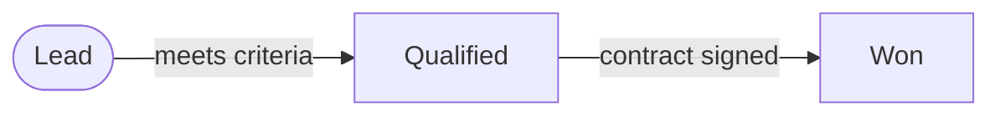
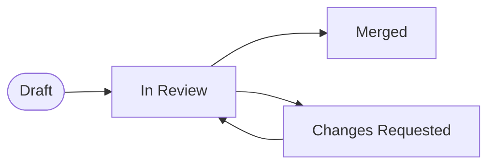
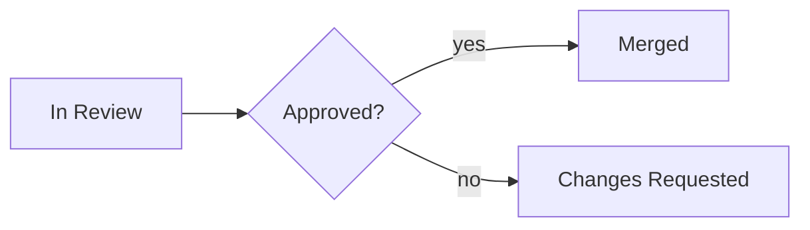

# State Lifecycle

## 1. What It Is

One kind of thing, the named conditions it can be in, and the events that move it between them. Each box is a condition an instance occupies for a while, each arrow is the event that moves it, and at least one arrow points back to an earlier condition. That backwards arrow is what the pattern exists to draw: rework loops, relapses, recoveries, and rollbacks are where lifecycles are actually won and lost.

The diagram is the rulebook every instance follows, never the story of one instance. It claims: these are the only places this thing can be, and these are the only ways it moves.

---

## 2. When To Use

The content is one kind of thing that moves between named conditions over time. Three tests, and all three have to pass.

Every box is a condition the thing can sit in, and its label answers "what is it right now": `In Review` passes, `Review the Code` fails, because the first is a place to wait and the second is something someone does once.

Every arrow has a nameable trigger, an event that happens to the instance rather than a question someone asks about it.

At least one arrow points back to an earlier state. If every instance moves strictly forward, the content is a procedure, not a lifecycle.

---

## 3. When Not To Use

| The content actually has | Use instead |
| :--- | :--- |
| Strictly forward movement, no state ever re-entered | `step-flow.md` |
| A verdict reached by questions asked in order, walked once | `decision-tree.md` |
| One situation fanning out to responses | `triage-map.md` |
| The dated history of one particular instance | `timeline.md` |
| Steps handing named artifacts to later steps | `io-pipeline.md` |

The second row is the boundary that gets confused. A decision tree is walked once by a person holding facts, and it ends. A lifecycle is occupied: events arrive on their own schedule and the same state can host the same instance twice. The tell is that a thing can wait a week inside a state, and nobody waits inside a question.

---

## 4. Direction

Always `LR`, and left to right is progress toward the target state rather than time. An arrow pointing leftward is the instance losing ground, which is exactly the reading intended, and every diagram in this pattern has at least one. Never `TD`, which claims the state above contains the state below. Never `RL`.

Place nothing by hand. Write the entry state first and the renderer lays the forward spine left to right on its own.

---

## 5. Shapes

| Role | Shape | Syntax | Count |
| :--- | :--- | :--- | :--- |
| Entry state | Stadium | `@{ shape: stadium }` | Exactly 1 |
| State | Rectangle | `@{ shape: rect }` | The rest |

The entry state is the condition a new instance is born into. Every other state is a rectangle, including terminal ones: a state with no outgoing arrows is visibly terminal, and color says whether that ending is the good one.

Labels are statuses, four words or fewer: a noun or adjective condition like `Past Due`, `Merged`, `Changes Requested`. An imperative in a box is the tell that the content is a Step Flow.

No diamonds. When two arrows leave a state, their event labels already say what selects between them, and a diamond would invent a questioner standing outside the system. No self loops, because an event that changes nothing is not a transition. No double circles, no hexagons, no documents, no emoji.

Below Mermaid v11.3 the `@{ shape: ... }` form is unavailable. Substitute `T(["Trial"])` and `A["Active"]`, keeping the quotes.

---

## 6. Color

| Class | Color | Marks | Count |
| :--- | :--- | :--- | :--- |
| `targetNode` | Green | The state the lifecycle exists to reach and hold | Exactly 1 |
| `stallNode` | Amber | The state where instances wait, and where the outcome is decided | 0 or 1 |
| `failNode` | Red | The state the lifecycle is built to keep instances out of | 0 or 1 |

```text
classDef targetNode fill:#D1F0DB,stroke:#1B7F4B,color:#0B3D24
classDef stallNode fill:#FFF3CD,stroke:#B8860B,color:#3D2E00
classDef failNode fill:#FDE2E1,stroke:#C0392B,color:#5A1710
```

Copy all three properties or none. Dropping `color` leaves the text to the theme, and a diagram that reads in GitHub light mode turns pale on pale in dark mode.

The green state needs no arrows out of it to qualify, and often has some: a subscription's target is `Active`, which instances leave and re-enter, and holding them there is the point. Red is not every unpleasant state, only the one the whole design routes around, and a lifecycle whose endings are all acceptable carries no red. Every other state stays unclassed.

---

## 7. Arrows

| Form | Meaning |
| :--- | :--- |
| `==>\|event\|` | The happy path |
| `-->\|event\|` | Every other transition |
| `-.->\|event\|` | An override, a transition outside the designed flow |

Every edge carries the event that fires it, one to four words, written as something that happens: `payment fails`, `fixes pushed`, `stale 30 days`. An unlabeled arrow is a movement with no cause, and the causes are the content. When several arrows leave one state, their labels must name events a reader can tell apart.

The happy path is one unbroken thick route from the entry state to the green state, the route a typical instance takes when nothing goes wrong. Exactly one, and it never runs backwards.

Dotted edges mark overrides: the force merge, the manual reactivation, the escape hatch that skips part of the designed flow. Zero to two per diagram, and each one earns a clause in the prose saying who may fire it, because an undocumented override drawn as normal traffic is how rulebooks rot.

---

## 8. Length

Three to seven states, four to ten transitions, and at least one back edge among them.

Below three states, or with no back edge, there is no lifecycle: write the sentence or draw the Step Flow. Past seven states or ten transitions the crossings take over, and the fix is to merge before splitting: two states that share all their outgoing transitions are one state wearing two names. If nothing merges, the content is two lifecycles, usually a coarse one whose states each hide a finer one.

---

## 9. Canonical Example, The Subscription

> The subject is one paid subscription, and every arrow is a billing event arriving from the payment system or the customer.
>
> ```mermaid
> flowchart LR
>     T@{ shape: stadium, label: "Trial" }
>     A@{ shape: rect, label: "Active" }
>     P@{ shape: rect, label: "Past Due" }
>     C@{ shape: rect, label: "Churned" }
>
>     T ==>|card added| A
>     T -->|trial expires| C
>     A -->|payment fails| P
>     P -->|payment recovers| A
>     P -->|unpaid 30 days| C
>     C -.->|win-back accepted| A
>
>     classDef targetNode fill:#D1F0DB,stroke:#1B7F4B,color:#0B3D24
>     classDef stallNode fill:#FFF3CD,stroke:#B8860B,color:#3D2E00
>     classDef failNode fill:#FDE2E1,stroke:#C0392B,color:#5A1710
>
>     class A targetNode
>     class P stallNode
>     class C failNode
> ```
>
> The win-back edge is dotted because it is a campaign someone chooses to run, not a rule the system fires on its own.
>
> The takeaway from this diagram is that a paying customer is never lost directly: every one passes through Past Due first, so the thirty days of dunning inside that amber box own the retention number.

The green state is not terminal, and that is the pattern working: the lifecycle exists to keep instances in `Active`, and the back edge from `Past Due` is the mechanism that does the keeping.

---

## 10. Canonical Example, The Pull Request

> The subject is one pull request, and every arrow is an action by its author, a reviewer, or the bot that closes stale branches.
>
> ```mermaid
> flowchart LR
>     D@{ shape: stadium, label: "Draft" }
>     R@{ shape: rect, label: "In Review" }
>     Q@{ shape: rect, label: "Changes Requested" }
>     M@{ shape: rect, label: "Merged" }
>     X@{ shape: rect, label: "Closed Unmerged" }
>
>     D ==>|marked ready| R
>     R ==>|approved| M
>     R -->|issues found| Q
>     Q -->|fixes pushed| R
>     Q -->|stale 30 days| X
>     D -.->|hotfix override| M
>
>     classDef targetNode fill:#D1F0DB,stroke:#1B7F4B,color:#0B3D24
>     classDef stallNode fill:#FFF3CD,stroke:#B8860B,color:#3D2E00
>     classDef failNode fill:#FDE2E1,stroke:#C0392B,color:#5A1710
>
>     class M targetNode
>     class Q stallNode
>     class X failNode
> ```
>
> The hotfix override may be fired only by the on-call engineer, and every use gets reviewed after the fact.
>
> The takeaway from this diagram is that time to merge is set by how many times the review loop runs, not by any single state, and the dotted override is the only route that never enters the loop, which is exactly why it needs the postmortem it gets.

Here the green state is terminal and the loop between `In Review` and `Changes Requested` is the finding. `Changes Requested` takes the amber because it is where pull requests age, and where the stale bot eventually finds them.

---

## 11. Reach

The examples are a subscription and a pull request, and "state" is how engineers talk, which together read narrower than the pattern is. Anything that occupies conditions and moves on events belongs here. Read this list before deciding it does not fit.

- **A sales deal.** Lead, qualified, negotiating, won or lost, and lost back to re-engaged. Pipeline reviews are arguments about the stall state.
- **A job application.** Applied, screening, onsite, offer, hired or declined, and declined into the talent pool a recruiter later reopens.
- **An incident.** Detected, mitigating, monitoring, resolved. The back edge from monitoring to mitigating is the regression everyone forgets to draw.
- **An invoice.** Sent, overdue, disputed, paid, written off. The dispute edge points backwards, to a revised invoice going out again.
- **A feature flag.** Off, canary, general availability, removed. Canary back to off is the rollback, and it is the edge the diagram exists for.
- **A piece of content.** Idea, drafted, published, outdated, and refreshed back to published. Publishing is a state you leave without touching anything.
- **A cloud resource.** Provisioning, running, degraded, retired. Degraded back to running is what the on-call rotation is for.
- **A habit.** Building, holding, lapsed, rebuilding. The whole diagram argues that lapsed is a state with exits, not an ending.
- **A client relationship.** Prospect, active, dormant, reactivated. The dormant box is where the revenue quietly lives.
- **Anything at all** where the boxes are conditions it can sit in, every arrow has a nameable trigger, and at least one arrow points back. That test, from section 2, is the only membership rule.

---

## 12. Bad Examples

Verbs in the boxes.



Every box is an action performed once, so nothing here can be occupied or re-entered, and the loop the content actually has, pushing fixes again and again, cannot even be drawn. Statuses in the boxes, events on the arrows.

No way back.



Statuses and labeled events, but every arrow points forward and no state is ever re-entered, so this is a Step Flow in borrowed clothes. The back edge is what buys this pattern; without one, draw the chain.

Bare arrows.



Two unlabeled arrows leave `In Review` and nothing says what selects between them, so the reader knows movement is possible but not what causes it. The events are the content, and stripping them leaves furniture.

A questioner standing outside.



The diamond restates what two labeled edges from `In Review` already say, and it plants a box nothing can sit in among boxes whose whole meaning is being sat in. Events decide lifecycles; nobody stands outside asking.

---

## 13. Prose Convention

**Above the diagram, one sentence naming the kind of thing and whose events move it.** The boxes cannot say whether the arrows are fired by a system, a customer, or a bot, and who fires them is half the rulebook.

**Below, one clause per dotted override**, saying who may fire it. An override with no named owner is a hole in the rulebook drawn as a feature.

**Below, last, a takeaway sentence** beginning "The takeaway from this diagram is". It points at the loop, the stall, or the route that skips them, and says what that shape costs or protects. Reciting the states back is not a takeaway, because the boxes already did that.

---

## 14. Checklist

- Every box is a condition that answers "what is it right now", four words or fewer, and none is an imperative.
- Exactly one stadium, the entry state; every other node is `@{ shape: rect }`.
- At least one arrow points back to an earlier state.
- Every edge is labeled with its triggering event, one to four words, and sibling labels are distinguishable.
- One unbroken thick path from the entry state to the green state, never running backwards.
- Exactly one green `targetNode`; at most one amber `stallNode`; at most one red `failNode`.
- Every `classDef` carries `fill`, `stroke`, and `color`.
- No diamonds, no self loops, no double circles, no hexagons, no documents, no emoji.
- Zero to two dotted overrides, each with a prose clause naming who may fire it.
- 3 to 7 states, 4 to 10 transitions.
- Direction is `LR`.
- The scoping sentence above and the takeaway sentence below are both written.
- The diagram parses.
