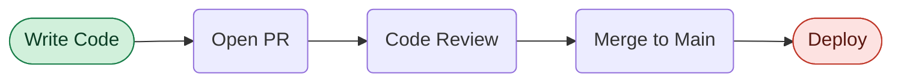
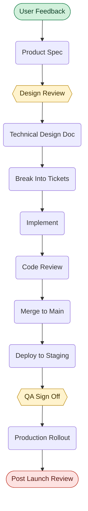
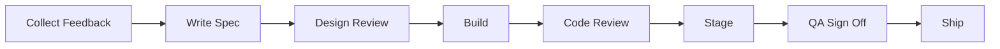
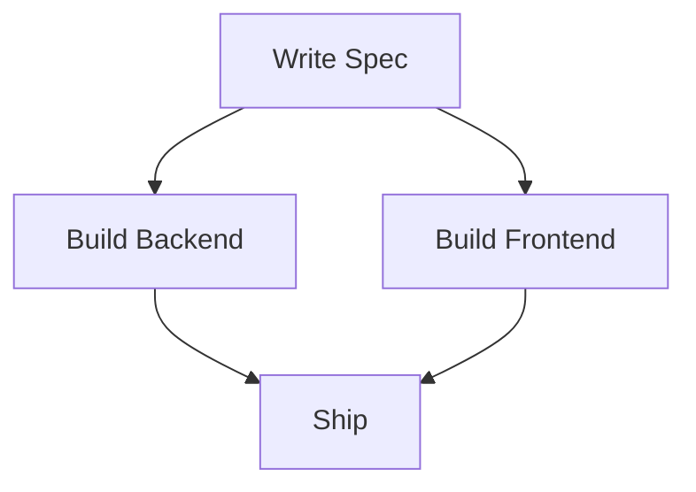
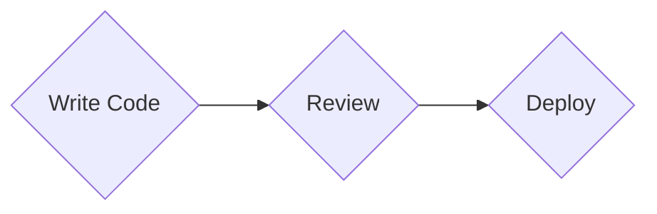
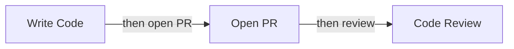
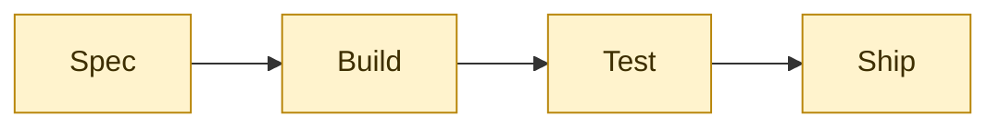

# Step Flow

## 1. Inheritance

Everything in `../visual-grammar.md` applies here by default. This file only records what Step Flow narrows or overrides, and where the two disagree, this file wins. Anything not mentioned below follows the baseline.

Step Flow overrides the baseline in three places, all flagged in the sections that follow. Direction is chosen by layout rather than by meaning (section 5). Green and red are re-bound to the two terminals rather than to goal and risk (section 7). The chain length limit is loosened for the vertical form (section 9).

A few baseline rules are restated here even though nothing about them changes. They are the ones this pattern gets wrong most often, and a rule you have to go and look up is a rule that gets skipped.

---

## 2. One Liner

A Step Flow is a single unbranching chain of steps that shows the reader what happens first, what happens next, and where the whole thing ends. There is exactly one path from start to finish, and the only real decisions are the direction of the chain and which one or two steps deserve a spotlight.

This is the most common and most abused diagram in explainer writing, so the rules below are deliberately narrow. If a chain of boxes and arrows is all the content needs, this is the pattern. If the content needs anything more, it belongs to a different pattern.

---

## 3. When To Use

Use a Step Flow when the material is a procedure, a lifecycle, or a sequence of stages that a reader is expected to follow in order. The test is simple. Can you say the whole thing out loud as "first this, then this, then this", without ever saying "unless" or "it depends"? If yes, this is a Step Flow.

Typical fits are a release process, an onboarding sequence, a request lifecycle, a review workflow, or the stages of a project from kickoff to retrospective.

---

## 4. When Not To Use

Reach for a different pattern in these cases.

| The content actually has | Use instead |
| :--- | :--- |
| Real branching, where the next step depends on an answer | Decision Tree (`decision-tree.md`) |
| A one level fan out, where each situation maps to its own response | Triage Map (`triage-map.md`) |
| Meaningful artifacts handed from each step to the next | IO Pipeline (`io-pipeline.md`) |
| Dated events rather than ordered stages | Timeline (`timeline.md`) |
| A chain derived backwards from a goal | Working Backwards Chain (`working-backwards-chain.md`) |

The distinction against IO Pipeline is the one that gets confused most often. Ask whether you can name the thing each step hands over. If the answer is a concrete artifact (a spec, a dataset, a build), the content is an IO Pipeline and the artifacts must be drawn. If the answer is only "it moves to the next step", it is a Step Flow and there is nothing to draw between the steps.

---

## 5. Direction Rule

This overrides the baseline. In the baseline, direction carries meaning, and `TD` means hierarchy. In a Step Flow there is no hierarchy to express and only one meaning available, which is forward order, so direction is freed up to solve a layout problem instead.

Use `LR` while a single row still reads comfortably at normal font size on a phone. Switch to `TD` the moment it does not. That is the whole rule, and it is a judgment about width rather than a count of boxes.

Calibration rather than a gate: with two word labels a row of six or seven still reads fine, while with four word labels five is already tight and four may be the honest limit. Total label width is what decides it, so when the call is close, count characters rather than nodes. When still in doubt, go vertical. A vertical chain that could have been horizontal costs the reader nothing. A horizontal chain that should have been vertical costs them the entire diagram, because the renderer answers a too wide row by shrinking the text until nobody can read it.

Because `TD` is doing layout duty rather than hierarchy duty here, a vertical Step Flow must stay strictly linear. One arrow in, one arrow out, no node with two children. The moment a node fans out, the reader reads the fan as containment, the override stops being safe, and the content belongs to Decision Tree or Triage Map.

---

## 6. Shapes

Three of the eight shapes, and no others.

| Role | Shape | Count per diagram |
| :--- | :--- | :--- |
| Start | `stadium` | Exactly 1 |
| Ordinary step | `rounded` | The rest |
| Key step | `hex` | 0 to 2 |
| End | `stadium` | Exactly 1 |

Both terminals are stadiums because they play the same structural role. Position and color are what tell them apart, and both signals are present in every diagram. There is no `dbl-circ` in a Step Flow. A Step Flow describes a process that repeats, not a goal that is reached once, and if the last node really is a one time goal then the content is a Working Backwards Chain.

The baseline ban on decorative diamonds is worth restating, because this is the pattern where it gets broken. A diamond promises the reader that two or more arrows leave the node. A Step Flow has no branches, so a Step Flow has no diamonds, however procedural a step feels. The urge to draw one is a signal that the content is a Decision Tree.

Labels are two to four words, in noun phrase or imperative form, and consistent within one diagram. Do not mix "Write the spec" with "Deployment happens" in the same chain. The baseline rule of one meaning per node applies with full force here, and the tell is the word "and". `Build the pipeline and backfill history` is two steps wearing one box, and in a linear chain there is always room to split it.

Emoji are inherited but rarely earn their place. Shape and color already say start, step, gate, and end, so an emoji on top of them is a third signal saying what two signals said. The one that fits is ✅ on a key step that represents a passed gate. Everything else stays bare.

---

## 7. Color

This overrides the baseline color semantics. The baseline binds green to `goal` and red to `risk`. Step Flow re-binds both to the terminals, because a procedure has a beginning and an end rather than a goal, and because a chain with a hazard in it is not a Step Flow in the first place. The hex values are unchanged, so no new color enters the library.

| Class | Color | Meaning | classDef |
| :--- | :--- | :--- | :--- |
| `startNode` | Green | Where the reader enters the process | `fill:#D1F0DB,stroke:#1B7F4B,color:#0B3D24` |
| `keyNode` | Amber | The step that decides whether the rest works | `fill:#FFF3CD,stroke:#B8860B,color:#3D2E00` |
| `finishNode` | Red | Where the process terminates | `fill:#FDE2E1,stroke:#C0392B,color:#5A1710` |

Amber is the highlight color, and it is the baseline `accent` value reused rather than a fourth color. It sits far from both green and red in hue, and it reads as a spotlight rather than as an alarm, which matters because red is carrying terminal duty in this pattern and must not be confusable with anything else.

Red is safe as a terminal marker only because a Step Flow contains no risk node. Within this pattern there is no other red on the page, so the last stadium is unambiguous.

Restating the baseline rule that these three lines exist to satisfy: every `classDef` sets `fill`, `stroke`, and `color` together. Drop `color` and the theme picks the text color, so a diagram that looks right in GitHub light mode turns into pale text on a pale fill the moment someone reads the page in dark mode. Copy all three lines or none of them.

The emphasis budget also overrides the baseline. The baseline allows three colored nodes total. Here the two terminals do not count, because they are structural and appear in every diagram of this pattern rather than pointing at anything. What counts is the key steps, and the ceiling is two. A diagram may therefore carry four colored nodes: two terminals plus at most two amber hexagons.

A key step is optional, and in the horizontal form of five nodes or fewer you should skip it. There is nothing to guide the eye through when the whole chain is visible at a glance, and coloring one of five nodes just adds noise. Introduce key steps in the vertical form, where the reader is scanning a long column and needs to know which stage carries the weight.

Pick the key step by asking where the work can be sent backwards, not where the time goes. The longest stage is rarely the one that decides the outcome.

---

## 8. Arrows

Every arrow is a bare `-->`. No dotted arrows, no thick arrows, no labels, ever.

The baseline says labels are usually unnecessary in an unbranching chain. Here that hardens into a ban, because the chain is unbranching by definition and a label can only restate the node it points at. Numbering the arrows `1`, `2`, `3` is the same mistake in a different costume, since reading order already supplies the numbers. If an arrow genuinely needs a label to state a condition, that condition is a branch and the content is a Decision Tree.

---

## 9. How Long Is Too Long

This loosens the baseline. The baseline caps a linear chain at seven nodes, but that number is a proxy for one specific failure, which is a row running out of page width. Since the failure is about width, it should be measured in width, and a vertical chain never hits it at all. So there is no fixed node count in this pattern, in either direction. Section 5 is the horizontal test, and it asks whether the row still reads.

The floor is the one number worth being firm about. Below three nodes there is no diagram, only a sentence with boxes drawn around it. Write the sentence.

At the top end the constraint stops being width and becomes attention. Somewhere past a dozen steps a vertical chain stops reading as a shape and starts reading as a checklist, which is a list rendered expensively. The baseline puts its diagram ceiling at twelve nodes, and twelve holds up well here, but treat it as the point where you should start looking for the seam rather than as a gate that fails at thirteen. A fourteen step flow with one obvious phase boundary is two good diagrams. A fourteen step flow with no seam anywhere is usually a sign the steps are too fine grained, and merging adjacent steps fixes it better than splitting does.

When a flow is genuinely longer, the fix is never a smaller font. Group the steps into named phases and draw one diagram per phase, ending each phase on the milestone that opens the next. The shared node is what stitches the diagrams into one story rather than two unrelated pictures.

The one hard ceiling that stays is two key steps, and that has nothing to do with length. It is a highlight budget, and section 7 covers it.

---

## 10. Canonical Example, Short Form

Five nodes with short labels, so the row still reads and the chain runs horizontal. Nothing between the terminals is highlighted, because at this length the whole thing is visible at a glance and a spotlight would only add noise.

The takeaway from this diagram is that shipping a change is one straight line with a single human gate in the middle, and nothing on that line is optional.

---

## 11. Canonical Example, Long Form

Twelve steps with labels up to three words. That is far past what a row can hold, so the chain runs vertical, and two stage gates are marked as key steps to give the eye something to land on while it scans the column.

The two amber hexagons are chosen for a reason worth copying. Design Review and QA Sign Off are the only two stages where work can be sent back, so they are the stages that actually decide the timeline. The eight rounded steps between them are work, not decisions. Highlighting Implement instead would have been the wrong call, because Implement is where the time goes but not where the risk sits.

The takeaway from this diagram is that a feature passes through two gates on its way to production, and everything between them is execution.

---

## 12. Bad Examples

Eight steps forced onto a horizontal line.

Eight boxes carrying around a hundred characters of label. The renderer shrinks every label to fit the page width, and on a phone the reader scrolls sideways hunting for the end. Nothing about the content is wrong, only the direction, and turning this into `TD` fixes it without changing a single word.

A vertical chain that fans out.

Under `TD` the reader reads the fan as containment, so this says the spec owns two teams rather than the work splitting and rejoining. Step Flow is strictly linear. Parallel work is either flattened into one ordered chain or drawn as an IO Pipeline.

Diamonds used for steps that do not branch.

Every diamond promises a second outgoing arrow. When none exists, the reader spends attention confirming that nothing was missed.

Arrow labels that restate the node.

Each label repeats the node it points at, doubling the words on screen for nothing. In this pattern the correct number of arrow labels is zero.

Highlights everywhere.

When four out of four nodes are amber, the highlight has stopped pointing at anything. Two is the ceiling, and the terminals are the only other colored nodes.

---

## 13. Classic Syntax

Restated from the baseline because this pattern uses exactly three shapes and the substitution is small enough to keep at hand. The `@{ shape: ... }` form needs Mermaid v11.3 or newer, which GitHub has and some Sphinx and Obsidian builds do not. Swapping the syntax changes nothing about the rules above, and the `classDef` and `class` lines are identical in both forms.

| Role | Modern | Classic |
| :--- | :--- | :--- |
| Start and end | `S@{ shape: stadium, label: "Deploy" }` | `S(["Deploy"])` |
| Ordinary step | `A@{ shape: rounded, label: "Open PR" }` | `A("Open PR")` |
| Key step | `B@{ shape: hex, label: "QA Sign Off" }` | `B{{"QA Sign Off"}}` |

Keep the quotes around every label in the classic form. They are what lets punctuation and emoji survive the parser.

---

## 14. Caption Convention

Every Step Flow is followed in the prose by one sentence starting with "The takeaway from this diagram is". That sentence states the conclusion the reader should carry away, not a description of what the boxes say.

A weak caption reads "the diagram above shows the twelve steps of the release process". The reader can already see that. A strong caption reads "the takeaway from this diagram is that a feature passes through two gates on its way to production, and everything between them is execution". If the caption cannot be written, the diagram has no point of view and should be cut.

---

## 15. Authoring Checklist

On top of the baseline checklist, run this.

- The content has no branches, no conditions, and no handed over artifacts.
- There are at least three nodes, and if there are more than about twelve, you looked for a phase boundary to split on.
- If the chain is `LR`, the row reads at normal font size without shrinking. If you are unsure, it is `TD`.
- The chain is strictly linear. No node has two children.
- Exactly one stadium at the start with `startNode`, exactly one at the end with `finishNode`.
- Zero to two hexagons with `keyNode`, and they mark gates rather than the longest step.
- No diamonds, and no `dbl-circ`.
- Every arrow is a bare `-->` with no label.
- Every `classDef` carries `fill`, `stroke`, and `color`.
- No label contains the word "and" joining two steps.
- The caption sentence is written and states a conclusion.
