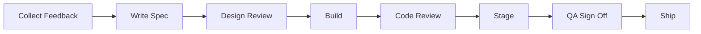
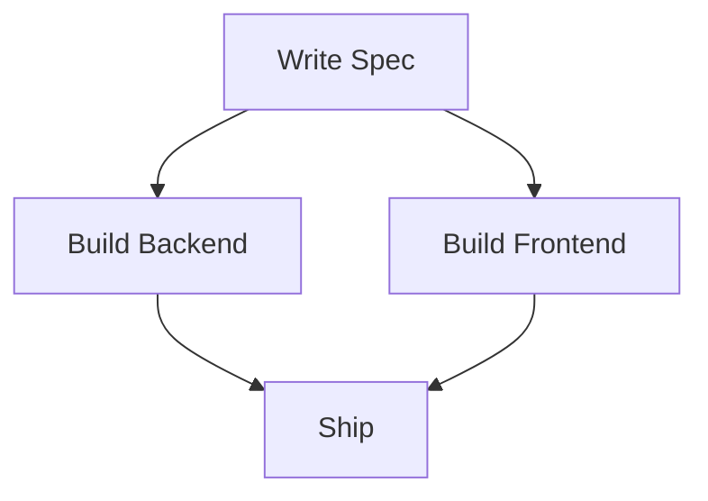
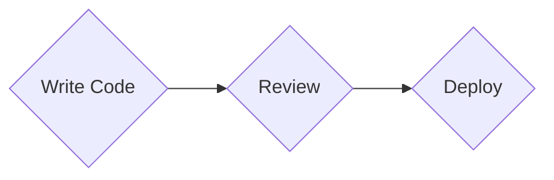

# Step Flow

## 1. What It Is

A single unbranching chain of steps showing what happens first, what happens next, and where it ends. Exactly one path from start to finish. The only decisions are which way the chain runs and which one or two steps get a spotlight.

---

## 2. When To Use

The content is a procedure, a lifecycle, or a sequence of stages the reader follows in order. The test is whether you can say the whole thing out loud as "first this, then this, then this" without ever saying "unless" or "it depends".

Typical fits are a release process, an onboarding sequence, a request lifecycle, a review workflow, or a project from kickoff to retrospective.

---

## 3. When Not To Use

| The content actually has | Use instead |
| :--- | :--- |
| Branching, where the next step depends on an answer | `decision-tree.md` |
| A one level fan out, each situation mapped to its own response | `triage-map.md` |
| Named artifacts handed from each step to the next | `io-pipeline.md` |
| Dated events rather than ordered stages | `timeline.md` |
| A chain derived backwards from a goal | `working-backwards-chain.md` |

The third row is the one that gets confused. If you can name what each step hands over (a spec, a dataset, a build), it is an IO Pipeline and those artifacts must be drawn. If the answer is only "it moves to the next step", it is a Step Flow.

---

## 4. Direction

Use `LR` while a single row still reads at normal font size on a phone. Switch to `TD` the moment it does not. This is a judgment about total label width rather than a count of boxes, so when it is close, count characters. Two word labels survive six or seven in a row, four word labels are tight at five.

When unsure, go vertical. A vertical chain that could have been horizontal costs the reader nothing, and a horizontal one that should have been vertical costs them the entire diagram.

A vertical chain must be strictly linear: one arrow in, one arrow out, no node with two children. Under `TD` a fan out reads as containment, which is a claim the diagram is not making.

Never `RL` or `BT`.

---

## 5. Shapes

| Role | Shape | Syntax | Count |
| :--- | :--- | :--- | :--- |
| Start | Stadium | `@{ shape: stadium }` | Exactly 1 |
| Ordinary step | Rounded rectangle | `@{ shape: rounded }` | The rest |
| Key step | Hexagon | `@{ shape: hex }` | 0 to 2 |
| End | Stadium | `@{ shape: stadium }` | Exactly 1 |

Both terminals are stadiums, and position plus color is what tells them apart.

No diamonds. A diamond promises a second outgoing arrow, and this pattern has no branches however procedural a step feels. Wanting one means the content is a Decision Tree.

No double circles. A Step Flow describes a process that runs again next week, not a goal reached once.

No emoji. Shape and color already say start, step, gate, and end.

Labels are four words at most, noun phrase or imperative, consistent within one diagram. One step per box, and the tell is the word "and": `Build the pipeline and backfill history` is two boxes wearing one.

Below Mermaid v11.3 the `@{ shape: ... }` form is unavailable. Substitute `S(["Start"])`, `A("Step")`, and `B{{"Gate"}}`, keeping the quotes so punctuation survives the parser.

---

## 6. Color

| Class | Color | Marks |
| :--- | :--- | :--- |
| `startNode` | Green | Where the reader enters |
| `keyNode` | Amber | The step that decides whether the rest works |
| `finishNode` | Red | Where the process terminates |

```text
classDef startNode fill:#D1F0DB,stroke:#1B7F4B,color:#0B3D24
classDef keyNode fill:#FFF3CD,stroke:#B8860B,color:#3D2E00
classDef finishNode fill:#FDE2E1,stroke:#C0392B,color:#5A1710
```

Copy all three properties or none. Dropping `color` leaves the text color to the theme, so a diagram that reads in GitHub light mode turns pale on pale in dark mode.

Terminals are always colored. Key steps are capped at two, because three highlights means nothing is highlighted. Skip them entirely on a short horizontal chain, where the whole thing is visible at once and a spotlight is only noise. Use them on a long vertical chain, where the reader is scanning a column and needs somewhere to land.

Pick the key step by asking where work can be sent backwards, not where the time goes.

---

## 7. Arrows

Every arrow is a bare `-->`. No dotted arrows, no thick arrows, no labels, no step numbers. In an unbranching chain a label can only repeat the node it points at, and reading order already supplies the numbering. An arrow that needs a label to state a condition is a branch, so the content is a Decision Tree.

---

## 8. Length

Below three nodes there is no diagram, only a sentence with boxes drawn around it. Write the sentence.

There is no hard ceiling, but past about a dozen steps a vertical chain stops reading as a shape and starts reading as a checklist. Treat twelve as the point to start looking for a seam. If there is an obvious phase boundary, split into two diagrams and let the last node of the first be the first node of the second, so the shared node stitches them into one story. If there is no seam anywhere, the steps are too fine grained and merging adjacent ones fixes it better than splitting. The fix is never a smaller font.

---

## 9. Canonical Example, Short Form

Five short labels, so the row still reads and the chain runs horizontal. No key step, because nothing needs pointing at when the whole thing is visible at once.

> ```mermaid
> flowchart LR
>     S@{ shape: stadium, label: "Write Code" }
>     A@{ shape: rounded, label: "Open PR" }
>     B@{ shape: rounded, label: "Code Review" }
>     C@{ shape: rounded, label: "Merge to Main" }
>     D@{ shape: stadium, label: "Deploy" }
>
>     S --> A --> B --> C --> D
>
>     classDef startNode fill:#D1F0DB,stroke:#1B7F4B,color:#0B3D24
>     classDef finishNode fill:#FDE2E1,stroke:#C0392B,color:#5A1710
>
>     class S startNode
>     class D finishNode
> ```
>
> The takeaway from this diagram is that shipping a change is one straight line with a single human gate in the middle, and nothing on that line is optional.

---

## 10. Canonical Example, Long Form

Twelve steps, far past what a row can hold, so the chain runs vertical and two gates are marked.

> ```mermaid
> flowchart TD
>     S@{ shape: stadium, label: "User Feedback" }
>     A@{ shape: rounded, label: "Product Spec" }
>     B@{ shape: hex, label: "Design Review" }
>     C@{ shape: rounded, label: "Technical Design Doc" }
>     D@{ shape: rounded, label: "Break Into Tickets" }
>     E@{ shape: rounded, label: "Implement" }
>     F@{ shape: rounded, label: "Code Review" }
>     G@{ shape: rounded, label: "Merge to Main" }
>     H@{ shape: rounded, label: "Deploy to Staging" }
>     I@{ shape: hex, label: "QA Sign Off" }
>     J@{ shape: rounded, label: "Production Rollout" }
>     K@{ shape: stadium, label: "Post Launch Review" }
>
>     S --> A --> B --> C --> D --> E --> F --> G --> H --> I --> J --> K
>
>     classDef startNode fill:#D1F0DB,stroke:#1B7F4B,color:#0B3D24
>     classDef keyNode fill:#FFF3CD,stroke:#B8860B,color:#3D2E00
>     classDef finishNode fill:#FDE2E1,stroke:#C0392B,color:#5A1710
>
>     class S startNode
>     class B,I keyNode
>     class K finishNode
> ```
>
> The takeaway from this diagram is that a feature passes through two gates on its way to production, and everything between them is execution.

Design Review and QA Sign Off are the only two stages where work can be sent back, which is why they carry the hexagons. Implement would have been the wrong pick: it is where the time goes, not where the risk sits.

---

## 11. Bad Examples

Eight steps forced onto one row.



A hundred characters of label in one row. The renderer shrinks all of it to fit the page, and on a phone the reader scrolls sideways hunting for the end. The content is fine, only the direction is wrong.

A vertical chain that fans out.



This reads as the spec owning two teams rather than work splitting and rejoining. Flatten parallel work into one ordered chain, or draw it as an IO Pipeline.

Diamonds on steps that do not branch.



Each diamond promises a second outgoing arrow, and when none exists the reader spends attention confirming nothing was missed.

---

## 12. Caption Convention

Follow every Step Flow with one sentence in the prose beginning "The takeaway from this diagram is", stating the conclusion rather than describing the boxes. "The diagram above shows the twelve steps of the release process" is weak, because the reader can already see that. If the sentence cannot be written, the diagram has no point of view and should be cut.

---

## 13. Checklist

- No branches, no conditions, no named artifacts handed between steps.
- At least three nodes, and if more than about twelve, you looked for a seam to split on.
- If `LR`, the row reads without shrinking. If unsure, it is `TD`.
- Strictly linear. No node has two children.
- One stadium at the start with `startNode`, one at the end with `finishNode`.
- Zero to two hexagons with `keyNode`, marking gates rather than the longest step.
- No diamonds, no double circles, no emoji.
- Every arrow is a bare `-->` with no label.
- Every `classDef` carries `fill`, `stroke`, and `color`.
- Every label is four words or fewer, and none joins two steps with "and".
- The caption sentence is written and states a conclusion.
- The diagram parses.
