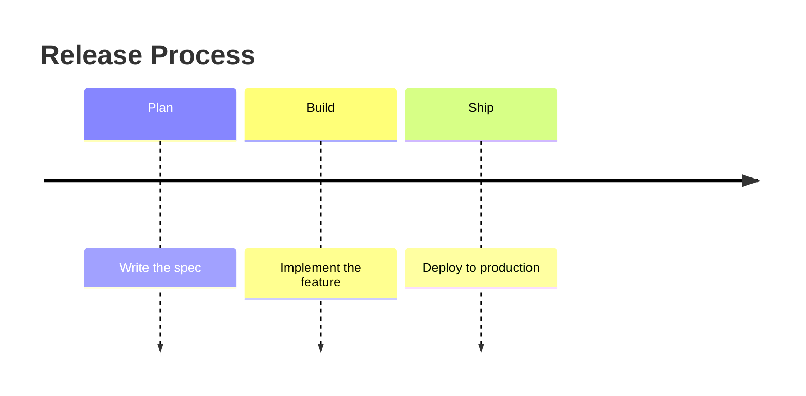
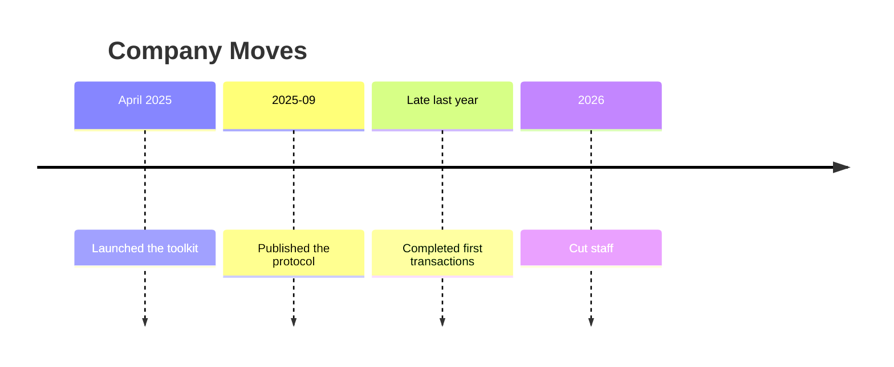
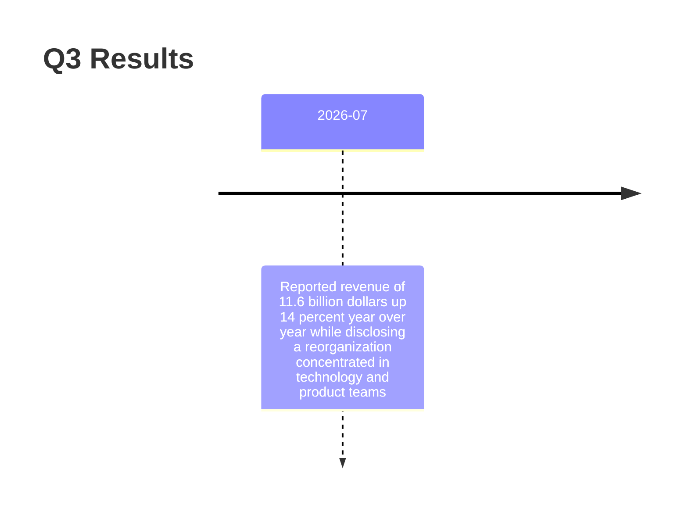
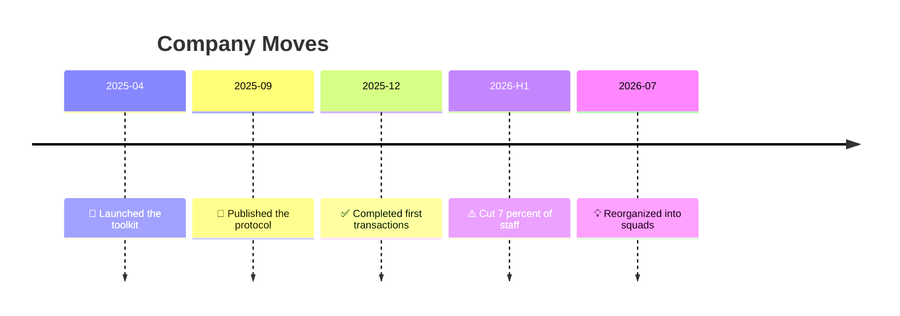

# Timeline

## 1. What It Is

Dated events on one axis, time running left to right. Each tick is a point in time and carries one to three things that happened at it. There are no arrows and no shapes, so the diagram makes exactly one kind of claim: this happened, then this, at this spacing.

What a timeline argues is density and direction of travel. Six moves in sixteen months says something a list of six bullets does not, and one bad event sitting among five good ones says it faster than a paragraph can.

---

## 2. When To Use

Every item has a date you could cite. That is the whole test. If you find yourself wanting to write "then" between two items instead of a date, the content is a sequence rather than a history.

Typical fits are a company's recent moves, a product's release history, an incident reconstruction, a policy's history of amendment, a project's phases after the fact.

---

## 3. When Not To Use

| The content actually has | Use instead |
| :--- | :--- |
| Ordered stages with no dates | `step-flow.md` |
| A plan derived from a goal | `working-backwards-chain.md` |
| Branching on conditions | `decision-tree.md` |
| Artifacts handed from stage to stage | `io-pipeline.md` |
| One event causing the next | `step-flow.md` |

The last row is the one that gets ignored. A causal link needs an arrow to carry it, and section 7 says why a timeline can never supply one.

---

## 4. Axis and Window

There is no direction to choose. Time runs left to right, and the decisions are the window and the granularity.

The window is an argument. The same company drawn from 2024 and drawn from 1958 supports different conclusions, so the window belongs in the title.

Every tick label starts with a four digit year and uses ASCII, so the column sorts and reads as one series. Pick one granularity, either `2026`, `2026-07`, or `2026-Q3`, and hold it. Where a source is vaguer than the granularity you picked, widen that one label in the same shape, as `2026-H1`, and never invent precision the source does not support. Free text like `April 2025` or `late last year` is out: the first breaks the column, the second rots.

---

## 5. Ticks and Events

| Part | Syntax | Rule |
| :--- | :--- | :--- |
| Title | `title <text>` | Required. Names the subject and the window |
| Tick | `2026-07 : <event>` | 4 to 8 per diagram |
| Extra event on a tick | `2026-07 : <event> : <event>` | 1 to 3 events per tick |
| Section | `section <name>` | Optional. Only when eras are the point |

A tick is one moment and its events are simultaneous. Their left to right order inside the tick means nothing, so never split one story across a tick to imply sequence.

Events are one clause each, eight words at most, in a consistent grammatical form. Past tense verb phrases read best, as `Cut 7 percent of staff`. An event that will not fit is a fact plus its explanation, and section 12 says where the explanation goes.

Sections group ticks into named eras. Use them only when the boundary between eras is itself the finding, because on a short timeline they are a row of chrome that says nothing. Two or three sections, never one.

| Emoji | Marks |
| :--- | :--- |
| ⚠️ | A setback, the event that went the wrong way |
| ✅ | A stated goal actually reached |

Those two and no others, on at most two events in the whole diagram. Everything unmarked is neutral fact. This is the only typographic signal the diagram type has, so spending it on more than two events spends it on nothing.

---

## 6. Color

None. No `classDef`, no `%%{init}%%` theme variables, no per event styling.

Mermaid colors a timeline by section automatically and offers no equivalent of a color that means something. Hardcoded theme variables do parse, but they render differently across GitHub, Sphinx, and Obsidian, and a color that silently fails in one of them is worse than a diagram that never claimed to have one. The emoji are the entire emphasis budget.

---

## 7. Arrows

There are none, and this is the pattern's defining constraint rather than a limitation to work around.

Adjacency is not causality. Two events sitting next to each other are two things that happened, and readers will infer a cause anyway. If the prose underneath claims one produced the other, the prose carries the evidence, because the diagram cannot.

---

## 8. Length

4 to 8 ticks, 1 to 3 events each, so 6 to 14 events in total.

Below 4 ticks there is no density to see and the content is a list of dates. Write the list.

Above 8 the axis runs off the page and the labels shrink, and the fix is the window rather than the font. Narrow it until 8 ticks fit, or cut at an era boundary and draw one timeline per era. Thirty years at eight ticks is a coarse claim made honestly; the same thirty years at twenty ticks is no claim at all.

---

## 9. Canonical Example, Plain

> The window is the sixteen months from the first public AI move to the most recent acquisition, and everything before it is left out because this diagram is about the current turn rather than the company's history.
>
> ```mermaid
> timeline
>     title Visa AI Moves, 2025-04 to 2026-08
>     2025-04 : Launched Intelligent Commerce
>     2025-09 : Published Trusted Agent Protocol
>     2025-12 : Completed first AI agent transactions
>     2026-H1 : ⚠️ Cut 7 percent of staff
>     2026-07 : Reorganized into small squads
>     2026-08 : Acquired BioCatch for 2.4B
> ```
>
> Sources in order: the product launch and the protocol from the company newsroom, the December agent transactions from its investor relations announcement, the layoff figure from Yahoo Finance, the reorganization from the Q3 2026 earnings call, and the acquisition from CNBC.
>
> - **Cut 7 percent of staff.** About 2,600 people, concentrated in technology and product, with 563 million dollars of severance booked in the quarter. The tick carries the ratio because that is what makes it comparable to other companies, and the headcount and the cost do not fit on an axis.
> - **Reorganized into small squads.** The company's own framing, teams of ten or more going down to two to four. The productivity gains quoted alongside it are unverified by anyone outside the company, which is why they are not on the diagram at all.
> - **Acquired BioCatch for 2.4B.** Announced, not closed: completion is expected in fiscal 2027 and it is still subject to regulatory approval. An axis has no way to show a pending state, so every tick reads as a completed fact whether or not it is one, and catching that is what the bullets are for.
>
> The takeaway from this diagram is that five of the six moves are investment and one is a cut, all inside sixteen months, so this is a company changing shape rather than one contracting.

One detail worth copying: the scoping sentence is the only prose above the diagram, and everything else waited until the reader had seen it.

---

## 10. Canonical Example, Sectioned

> The window is the platform's whole life, from the first scheduled job to the point where analysts stopped filing tickets, so nothing is left out.
>
> ```mermaid
> timeline
>     title How the Data Platform Got Here
>     section Hand Rolled
>         2023-Q1 : First cron job ships
>         2023-Q4 : ⚠️ Nightly job misses SLA
>     section Managed
>         2024-Q2 : Moved onto a scheduler
>         2024-Q4 : ✅ SLA held two quarters
>     section Self Serve
>         2025-Q3 : Analysts write their own pipelines
> ```
>
> The takeaway from this diagram is that each era began where the last one failed, and the gap between the miss and the fix was three quarters both times.

Sections earn their place because the point is not the five events, it is that the platform passed through three regimes. Drawn flat it is five dates and the reader has to find that themselves.

No sources and no bullets here, and that is correct rather than lazy. These are your own team's events, so there is nothing to cite, and none of them carries a number, a caveat, or someone else's framing, so a bullet could only repeat its tick. The apparatus in section 9 is a response to what those events were, not a form to fill in.

---

## 11. Bad Examples

Stages wearing dates' clothing.



No tick is a date, so the axis measures nothing and the spacing is fiction. These are ordered stages, and they belong in `step-flow.md`.

Four date formats in one column.



The column no longer sorts or aligns, and `Late last year` means something different every year the page is read.

A paragraph on a tick.



Thirty words in one event. The renderer wraps it into a wall and the tick stops being scannable. One clause on the tick, the number and the caveat in a bullet below.

Emoji soup.



Five marks, five meanings, nothing standing out. 🎯 and 💡 have no role in a history, and with every event marked the ⚠️ that matters is invisible.

---

## 12. Prose Convention

A timeline argues by what it leaves out, so it never ships bare. Above the diagram goes only what the reader needs in order to read it. Everything concluded from it goes below, because a timeline is scannable in two seconds and prose stacked on top only delays the scan.

**Above, one scoping sentence, and nothing else.** It states the window, and where events were deliberately excluded it says so. A reader who does not know the axis starts in 2025 will read the empty space before it as nothing having happened.

**Below, first the sources**, whenever the events are claims about the world rather than your own project's history. A timeline of facts with no citations is the most confident looking unsupported argument in the library.

**Below, then up to three bullets.** Eight words on an axis cannot hold a number, a caveat, or whose framing an event is written in, and those three are exactly what a reader needs in order to check a fact. Write a bullet only for an event carrying one of them, name the event in bold, and give what the tick had to drop.

Three is a cap, not a target. If most events need a bullet, the timeline is not the deliverable and the list is, so write the list and drop the diagram. If none does, write none.

**Below, last, a takeaway sentence** beginning "The takeaway from this diagram is". It says what the density or the shape means, and it is the only place a causal claim may appear, carrying its own evidence.

---

## 13. Checklist

- Every tick is a real date, not a stage name, and the title names the subject and the window.
- Every tick label starts with a four digit year, in ASCII, at one granularity, with no invented precision.
- 4 to 8 ticks, 1 to 3 events each.
- Every event is one clause of eight words or fewer, in a consistent grammatical form.
- No sequence is implied by the order of events within a single tick.
- Sections only if the era boundary is the finding, and then 2 or 3 of them.
- At most two marked events, using only ⚠️ and ✅.
- No color, no `classDef`, no theme variable block.
- One scoping sentence above the diagram, stating the window and any deliberate omission, and nothing else above it.
- Sources cited below, if the events are claims about the world.
- At most three bullets, each for an event carrying a number, a caveat, or someone else's framing, and none that only repeats its tick.
- The takeaway sentence comes last, and is the only place a causal claim appears.
- The diagram parses.
