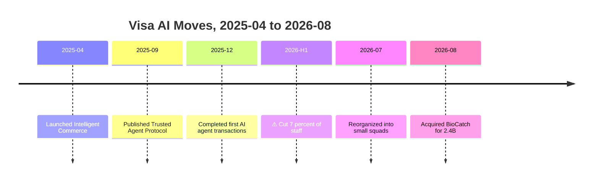
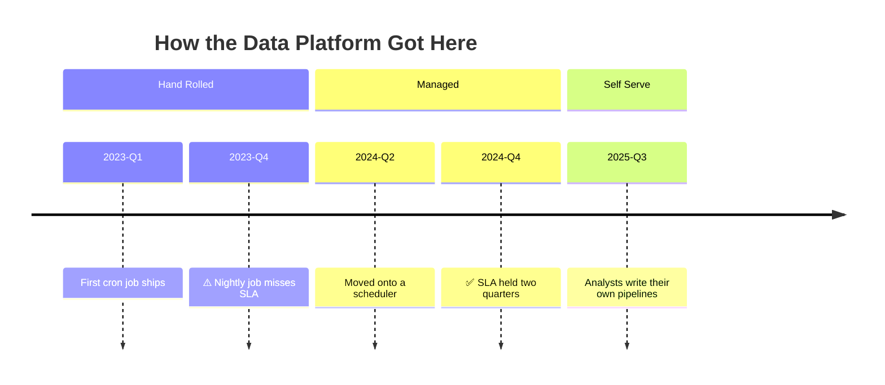
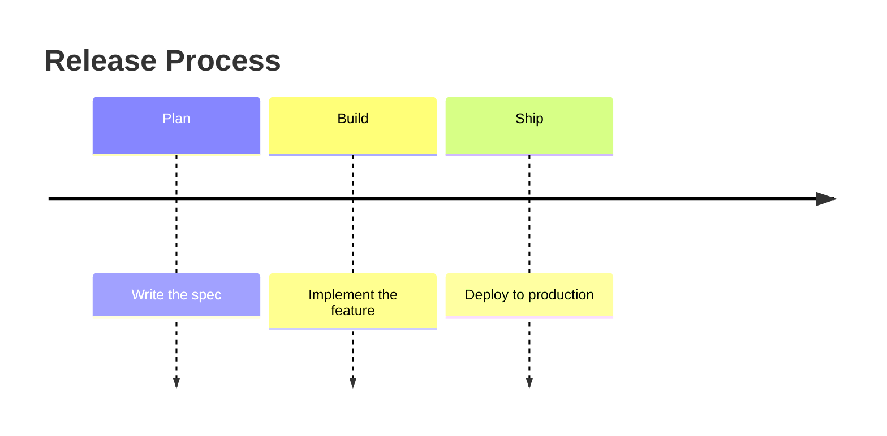
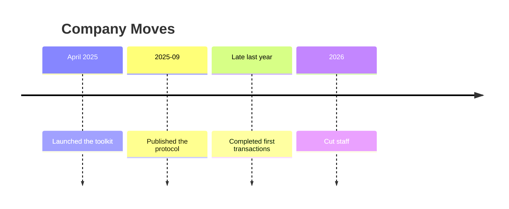
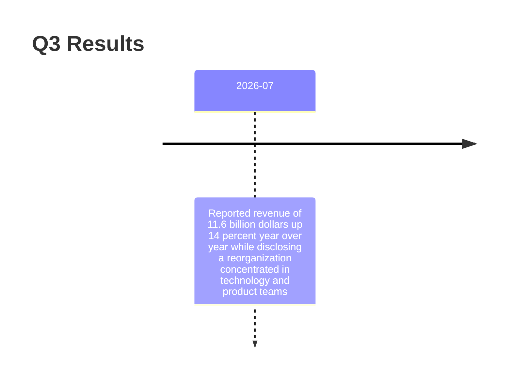
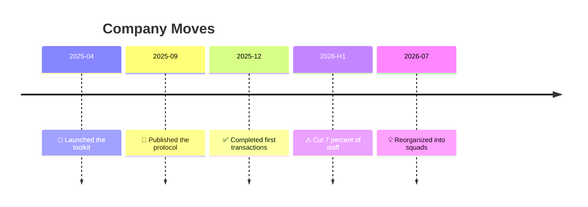

# Timeline

## 1. What It Is

Dated events on one axis, time running left to right. Each tick is a point in time and carries one to three things that happened at it. There are no arrows and no shapes, so the diagram makes exactly one kind of claim: this happened, then this, at this spacing.

The argument a timeline makes is density and direction of travel. Six moves in sixteen months says something a list of six bullets does not, and one bad event sitting among five good ones says it faster than a paragraph can.

---

## 2. When To Use

Every item has a date you could cite. That is the whole test. If you find yourself wanting to write "then" between two items instead of a date, the content is a sequence rather than a history.

Typical fits are a company's recent moves, a product's release history, an incident reconstruction, a policy's history of amendment, a project's phases after the fact.

The reader should finish it able to say "the pace picked up" or "it changed shape here", not "A caused B".

---

## 3. When Not To Use

| The content actually has | Use instead |
| :--- | :--- |
| Ordered stages with no dates | `step-flow.md` |
| A plan derived from a goal | `working-backwards-chain.md` |
| Branching on conditions | `decision-tree.md` |
| Artifacts handed from stage to stage | `io-pipeline.md` |

The one that matters is causality. A timeline puts events next to each other and cannot say one produced the other, and readers will infer it anyway. If the causal link is the point, draw a flowchart where an arrow can carry it, and keep the timeline for the record of what happened.

---

## 4. Axis and Window

There is no direction to choose. Time runs left to right, and the decisions are the window and the granularity.

The window is an argument. A timeline that starts in 2024 and one that starts in 1958 support different conclusions from the same company, so the window goes in the title and the reason for it goes in the prose.

Every tick label starts with a four digit year and uses ASCII, so the column sorts and reads as one series. Pick one granularity, either `2026`, `2026-07`, or `2026-Q3`, and hold it. Where a source is vaguer than the granularity you picked, widen that one label in the same shape, as `2026-H1`, and never invent precision that the source does not support. Free text like `April 2025` or `late last year` is out: the first breaks the column, the second rots.

---

## 5. Ticks and Events

| Part | Syntax | Rule |
| :--- | :--- | :--- |
| Title | `title <text>` | Required. Names the subject and the window |
| Tick | `2026-07 : <event>` | 4 to 8 per diagram |
| Extra event on a tick | `2026-07 : <event> : <event>` | 1 to 3 events per tick |
| Section | `section <name>` | Optional. Only when eras are the point |

A tick is one moment and its events are simultaneous. Their left to right order inside the tick means nothing, so never split one story across a tick to imply sequence.

Events are one clause each, eight words at most, and the same grammatical form throughout. Past tense verb phrases read best, as `Cut 7 percent of staff`. An event that will not fit in eight words is a fact plus its explanation, and the explanation belongs in the prose.

Sections group ticks into named eras. Use them only when the boundary between eras is itself the finding, because on a short timeline they add a row of chrome and say nothing. Two or three sections, never one.

Two emoji only, and at most two marked events in the whole diagram.

| Emoji | Marks |
| :--- | :--- |
| ⚠️ | A setback, the event that went the wrong way |
| ✅ | A stated goal actually reached |

Everything unmarked is neutral fact. This is the only typographic signal a timeline has, so spending it on more than two events spends it on nothing.

---

## 6. Color

None. No `classDef`, no `%%{init}%%` theme variables, no per event styling.

Mermaid colors a timeline by section automatically and offers no equivalent of a color that means something. Hardcoded theme variables do parse, but they render differently across GitHub, Sphinx, and Obsidian, and a color that silently fails in one of them is worse than a diagram that never claimed to have one.

If an event needs to stand out, it gets the ⚠️ or the ✅, and that is the entire emphasis budget.

---

## 7. Arrows

There are none, and this is the pattern's defining constraint rather than a limitation to work around.

Adjacency is not causality. Two events sitting next to each other on the axis are two things that happened, and if the prose underneath says one caused the other, the prose has to carry the evidence, because the diagram cannot.

---

## 8. Length

4 to 8 ticks, 1 to 3 events each, so 6 to 14 events in total.

Below 4 ticks there is no density to see and the content is a list of dates. Write the list.

Above 8 the axis runs off the page and the labels shrink, and the fix is the window rather than the font. Narrow it until 8 ticks fit, or cut at the era boundary and draw one timeline per era. A timeline covering thirty years at eight ticks is making a coarse claim honestly; the same thirty years at twenty ticks is making no claim at all.

---

## 9. Canonical Example, Plain

The common form. No sections, one marked event, six ticks across sixteen months.

The window is sixteen months and it is stated in the title, because the same company drawn from 1958 would be a different argument. Earlier events are left out deliberately, and the prose has to say so rather than let the reader assume nothing happened before 2025.

`2026-H1` is wider than the other five labels because the source only supports a half year. Widening the one label is right; guessing at `2026-02` to make the column tidy is not.

The takeaway from this diagram is that five of the six moves are investment and one is a cut, all inside sixteen months, so this is a company changing shape rather than one contracting.

---

## 10. Canonical Example, Sectioned

Three named eras, where the boundary between them is the finding. Both emoji appear, which is the maximum.

Sections earn their place here because the point is not the five events, it is that the platform passed through three regimes and each was entered because the previous one broke. Drawn without sections it is five dates and the reader has to find the pattern.

The takeaway from this diagram is that each era began where the last one failed, and the gap between the miss and the fix was three quarters both times.

---

## 11. Bad Examples

Stages wearing dates' clothing.

None of the ticks is a date, so the axis measures nothing and the spacing is fiction. This is a Step Flow.

Four date formats in one column.

The column no longer sorts or aligns, the reader cannot compare intervals, and `Late last year` means something different every year the page is read.

A paragraph on a tick.

Thirty words in one event. The renderer wraps it into a wall and the tick stops being scannable. One clause on the tick, the number and the caveat in the prose.

Emoji soup.

Five marks, five meanings, and nothing stands out from anything. 🎯 and 💡 have no role in a history at all, and with every event marked the ⚠️ that actually matters is invisible.

---

## 12. Prose Convention

A timeline argues by what it leaves out, so it never ships bare. Three pieces of prose.

**A scoping sentence above the diagram.** It states the window and why that window, and where events were deliberately excluded it says so. A reader who does not know the timeline starts in 2025 will read the empty space before it as nothing having happened.

**Sources under the diagram**, whenever the events are claims about the world rather than your own project's history. Every event has to be traceable to something, and a timeline of facts with no citations is the most confident looking unsupported argument in the library.

**A takeaway sentence** beginning "The takeaway from this diagram is". It says what the density or the shape means, and it is the only place a causal claim may appear, carrying its own evidence. Describing the events again is wasted, since the reader just read them.

---

## 13. Checklist

- Every tick is a real date, not a stage name.
- The title is present and names both the subject and the window.
- Every tick label starts with a four digit year, in ASCII, at one granularity.
- No invented precision. A vague source gets a wider label, not a guessed one.
- 4 to 8 ticks, 1 to 3 events each.
- Every event is one clause of eight words or fewer, in a consistent grammatical form.
- No sequence is implied by the order of events within a single tick.
- Sections only if the era boundary is the finding, and then 2 or 3 of them.
- At most two marked events, using only ⚠️ and ✅.
- No color, no `classDef`, no theme variable block.
- No causal claim anywhere except the takeaway sentence, and there it carries evidence.
- The scoping sentence states the window and any deliberate omission.
- Sources are cited if the events are claims about the world.
- The diagram parses.
