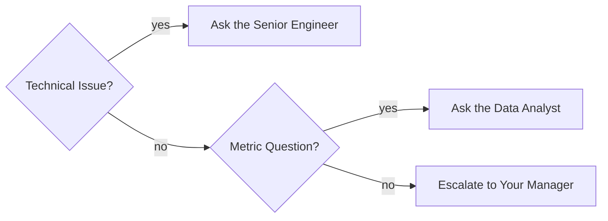
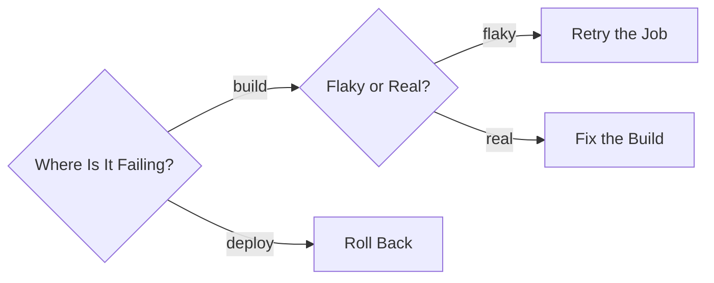
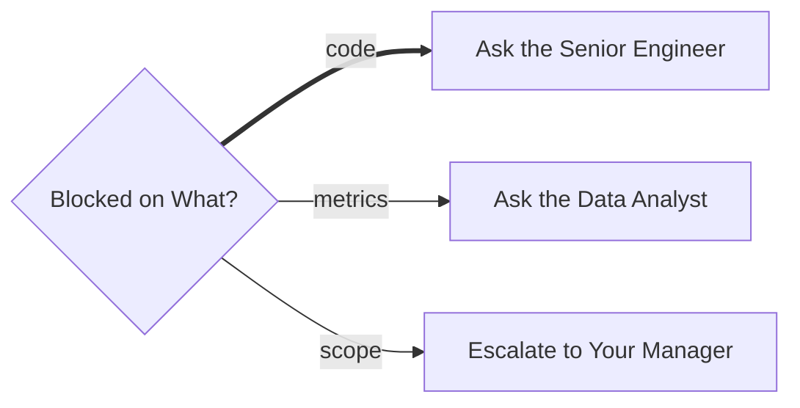

# Triage Map

## 1. What It Is

One question, asked once, fanning out to the response each answer gets. A Triage Map is a routing table drawn as a diagram: the reader arrives already in some situation, finds the edge that names it, and walks out through exactly one response. There is one diamond, it is the entry point, and any depth beyond the fan out is escalation, never a second question.

---

## 2. When To Use

The content is a standing rule of the form "in this situation, do this" or "with this kind of problem, go to this person". The test has two parts. Say each case out loud as its own sentence: when X, do A; when Y, do B. If the sentences can be spoken in any order without changing what any of them means, and none of them ends in another question, the content is a Triage Map.

Typical fits are who to interrupt when blocked on what, how each class of error gets handled, where each kind of incoming request is routed, and which channel each kind of announcement goes to.

---

## 3. When Not To Use

| The content actually has | Use instead |
| :--- | :--- |
| Questions with an order, where X is checked before Y matters | `decision-tree.md` |
| A case that needs a second question before it reaches a response | `decision-tree.md` |
| No branching at all, just steps in sequence | `step-flow.md` |
| One role, who it answers to, and who it works with | `role-map.md` |
| Boxes that are positions something flows through | `niche-map.md` |

The first two rows are the ones that get confused, and depth is the wrong way to tell them apart. "Ask the senior engineer, and if that fails, escalate" looks like a second layer but is not a second question, it is a fallback, and a fallback is drawn as a dotted edge inside this pattern. The moment a branch needs a genuine follow up question, with its own answers and its own responses, the content is a Decision Tree.

---

## 4. Direction

Always `LR`. The question sits at the left, the responses line up at the right, and the reader scans in the same direction the situation resolves. Never `TD`: a fan out drawn top down reads as the question owning the responses, which is a hierarchy claim the map is not making. Never `RL`.

---

## 5. Shapes

| Role | Shape | Syntax | Count |
| :--- | :--- | :--- | :--- |
| Classifier question | Diamond | `@{ shape: diam }` | Exactly 1, the entry |
| Response | Rounded rectangle | `@{ shape: rounded }` | One per case |
| Fallback response | Rounded rectangle | `@{ shape: rounded }` | 0 or 1 |

Exactly one diamond is this pattern's defining rule. A second diamond means one of the cases needs a follow up question, and the content is a Decision Tree.

Responses are written as imperative actions: `Ask the Data Analyst`, `Retry with Backoff`. Never the bare name of a person or a team, because a box that only says who leaves the reader to guess what doing anything about it looks like.

No stadiums, no double circles, no hexagons, no documents, no emoji. The question label ends in a question mark and, like every label here, stays within four words.

Below Mermaid v11.3 the `@{ shape: ... }` form is unavailable. Substitute `Q{"Blocked on What?"}` and `A("Ask the Data Analyst")`, keeping the quotes so punctuation survives the parser.

---

## 6. Color

| Class | Color | Marks |
| :--- | :--- | :--- |
| `accent` | Amber | The fallback response |

```text
classDef accent fill:#FFF3CD,stroke:#B8860B,color:#3D2E00
```

One class, at most one node. Amber marks the fallback, the node the escalation edges converge on, because it is the one exit the reader must remember when no case matches or a handler fails. Every other node stays unclassed, and a map with no fallback carries no color at all. Copy all three properties or none: dropping `color` leaves the text to the theme, and a diagram that reads in GitHub light mode turns pale on pale in dark mode.

---

## 7. Arrows

| Form | Meaning |
| :--- | :--- |
| `-->\|label\|` | A case. The label names the situation |
| `-.->\|label\|` | Escalation, from a response to the fallback |

Every solid arrow leaves the diamond and carries a label, because the labels are the content: they are the situations being routed. A solid arrow with no label routes nothing.

Case labels must be mutually exclusive. A reader whose situation matches two labels is standing in two lines at once, and the map has failed. A reader whose situation matches none gets silence, so either the labels cover everything or the last edge is an explicit `anything else`.

Escalation arrows are dotted, run from a response to the fallback, and are labeled with what triggers them: `unresolved`, `still failing`. At most one hop, meaning escalation reaches the fallback and stops. A fallback that itself escalates is a chain of questions in disguise.

No thick arrows. A thick arrow claims one case is the main case, and triage cases are peers.

---

## 8. Length

Two to five cases. One case is a sentence, not a diagram, so write the sentence. Past five, the cases are usually at mixed granularity, meaning two of them are really one, or the question is really two questions and the content should split into two maps. With five responses and a fallback the whole diagram is seven nodes, comfortably inside a phone screen.

---

## 9. Canonical Example, System Scale

Four error classes, one escalation, and a fallback that is also a direct case.

> A failed API call is handled by whichever line matches its status code.
>
> ```mermaid
> flowchart LR
>     Q@{ shape: diam, label: "API Error Type?" }
>     R@{ shape: rounded, label: "Retry with Backoff" }
>     T@{ shape: rounded, label: "Refresh the Token" }
>     F@{ shape: rounded, label: "Fix the Request" }
>     P@{ shape: rounded, label: "Page the On Call" }
>
>     Q -->|429 or 503| R
>     Q -->|401| T
>     Q -->|other 4xx| F
>     Q -->|persistent 5xx| P
>     R -.->|still failing| P
>
>     classDef accent fill:#FFF3CD,stroke:#B8860B,color:#3D2E00
>     class P accent
> ```
>
> The takeaway from this diagram is that only persistent server errors reach a human, and every other failure has a self service fix.

`Page the On Call` is both a direct case and the escalation target, which is common and fine. A fallback often earns its amber precisely by being reachable from more than one direction.

---

## 10. Canonical Example, Team Scale

Three kinds of blocker, two first doors, one escalation point.

> A new engineer's standing rule for who to interrupt when stuck.
>
> ```mermaid
> flowchart LR
>     Q@{ shape: diam, label: "Blocked on What?" }
>     K@{ shape: rounded, label: "Ask the Senior Engineer" }
>     H@{ shape: rounded, label: "Ask the Data Analyst" }
>     P@{ shape: rounded, label: "Escalate to Your Manager" }
>
>     Q -->|code or architecture| K
>     Q -->|metric definitions| H
>     Q -->|scope change| P
>     K -.->|unresolved| P
>     H -.->|unresolved| P
>
>     classDef accent fill:#FFF3CD,stroke:#B8860B,color:#3D2E00
>     class P accent
> ```
>
> The takeaway from this diagram is that every blocker has exactly one first door to knock on, and the manager is the escalation point rather than the first stop.

---

## 11. Bad Examples

A ladder of binary checks that is really one question.



Three peer situations stretched into a sequence, inventing an evaluation order the content does not have. Collapse the ladder into one diamond with three labeled edges. If the order were real, meaning the second question only makes sense after the first answer, the content is a Decision Tree.

A branch that asks a genuine second question.



The second diamond is not a fallback, it is a real judgment with its own answers, so this content is a Decision Tree and belongs in `decision-tree.md`.

A thick arrow electing a main case.



The thick arrow tells the reader most blockers are code blockers, which is a frequency claim the map has no evidence for. Triage cases are peers, and every solid edge carries the same weight.

---

## 12. Caption Convention

Follow every Triage Map with one sentence in the prose beginning "The takeaway from this diagram is", stating the routing rule's point rather than reciting the cases. "The diagram above shows who to ask for each kind of problem" is weak, because the reader can already see that. The strong version says what the rule buys: who is protected, what never escalates, which door is busiest. If the sentence cannot be written, the diagram has no point of view and should be cut.

---

## 13. Checklist

- Exactly one diamond, and it is the entry point.
- Two to five cases, each leaving the diamond as a solid labeled arrow.
- Case labels are mutually exclusive, and they cover everything or end in an explicit catch all.
- The cases could be reordered without changing the meaning. If not, this is a Decision Tree.
- Every response is an imperative action, four words or fewer.
- Escalation edges are dotted, labeled with their trigger, one hop, converging on the fallback.
- No thick arrows, no stadiums, no double circles, no hexagons, no emoji.
- At most one colored node, the fallback in amber, with `fill`, `stroke`, and `color` all set.
- Direction is `LR`.
- The caption sentence is written and states a conclusion.
- The diagram parses.
