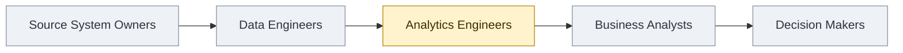
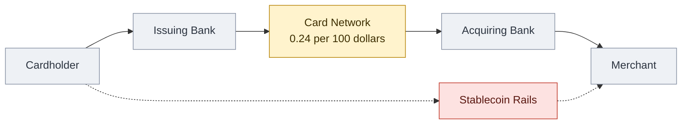
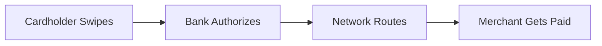
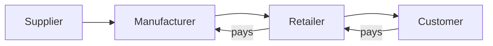
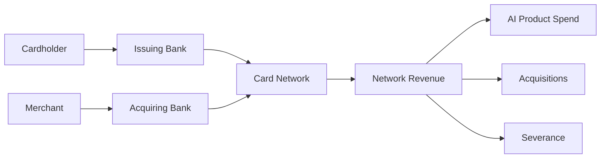
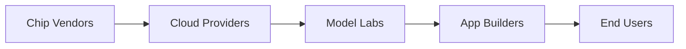

# Value Chain

## 1. What It Is

A row of positions with one thing flowing through them in one direction, and exactly one position marked as the subject. Everything else is drawn grey on purpose, so the diagram makes a single claim: this is where the subject sits, this is who is upstream, this is who is downstream.

The chain does not belong to the subject. The same positions redrawn with the mark on a different box is a different diagram making a different argument, and that is the point rather than a loophole. Moving the mark is how you show a reader what the same world looks like from someone else's seat.

---

## 2. When To Use

The content is a set of positions in a one-way flow, and the reader's question is where something sits in it and what that seat gets it.

Two tests, and both have to pass. Every box is a *who* or a *what*, never a *doing*: `Card Network` passes, `Network Routes Payment` does not. And you can say `X hands ___ to Y` for every link with the same word in the blank all the way down.

Typical fits are an industry's layers, a role's collaborators, a library's place in a stack, a dataset's path across teams. Section 11 is there because that list is much shorter than the pattern's actual reach.

---

## 3. When Not To Use

| The content actually has | Use instead |
| :--- | :--- |
| Reporting lines inside one organization | `org-chart.md` |
| Actions someone performs in order | `step-flow.md` |
| Named artifacts handed from stage to stage | `io-pipeline.md` |
| Dated events | `timeline.md` |
| Positions placed on two axes rather than in a line | `quadrant.md` |
| Share of a total rather than seat in a flow | `proportion-pie.md` |
| A position derived from a goal | `working-backwards-chain.md` |

The second and third rows are where the confusion lives. If the boxes are things a person does, it is a Step Flow. If the boxes are stages and the interesting content is what each one hands over, it is an IO Pipeline. Here the boxes outlive the flow: the positions are still there tomorrow whether or not anything moves through them.

---

## 4. Direction

Always `LR`. Never `TD`, which claims the box above contains the box below and is an Org Chart's claim. Never `RL`.

`LR` here is position, not time. Nothing in this chain happens first, and the leftmost box is not the earliest, it is the furthest upstream. Pick which end is upstream by asking where the thing being passed originates, then run it to wherever it is consumed.

One flow, and only one. A chain carrying goods rightward and money leftward leaves the reader unable to read either arrow. Pick the flow that makes the argument, name it in the sentence above the diagram, and let every arrow mean that.

---

## 5. Shapes

| Role | Shape | Syntax | Count |
| :--- | :--- | :--- | :--- |
| Position | Rectangle | `@{ shape: rect }` | Every node |

One shape, no exceptions. Shape variation would claim the positions differ in kind, and the pattern's claim is that they differ only in where they sit and what color they carry.

No diamonds, no double circles, no hexagons, no documents. No emoji: color already says which box is the subject, and a chain of positions has no goal, no gate, and no deliverable to mark.

Labels are two or three words, four at most, and every one is a noun phrase naming a position rather than an activity. Job titles, company categories, layer names, and team names all qualify. A verb in a box is the single most common way this pattern collapses into a Step Flow.

**Anchors.** At most two boxes may carry a second line holding one quantitative fact, written as `label: "Card Network<br/>0.24 per 100 dollars"`. Use it only where the number changes how the chain reads, which in practice means showing where the value concentrates or fails to. Anchors are the one place a number belongs on the diagram rather than in the prose, and a chain where every box has one is a table.

This pattern needs no legacy fallback. `A["Card Network"]` is the classic form of a rectangle and works in every Mermaid version, and `<br/>` works in both forms.

---

## 6. Color

| Class | Color | Marks |
| :--- | :--- | :--- |
| `hereNode` | Amber | The one position the diagram is about |
| `contextNode` | Grey | Every other position |
| `bypassNode` | Red | A route that skips the subject |

```text
classDef hereNode fill:#FFF3CD,stroke:#B8860B,color:#3D2E00
classDef contextNode fill:#EEF1F5,stroke:#8A94A6,color:#2C3440
classDef bypassNode fill:#FDE2E1,stroke:#C0392B,color:#5A1710
```

Copy all three properties or none. Dropping `color` leaves the text to the theme, so a diagram that reads in GitHub light mode turns pale on pale in dark mode.

Every node is classed and none is left at the theme default. One amber box against a row of grey reads far louder than the same box against a row of white, and the grey is what states that the rest is context rather than competition.

Exactly one amber, always. Zero means the diagram has no point of view and is a map of an industry rather than an argument about a seat in it. Two means two arguments, which is two diagrams.

---

## 7. Arrows

Spine arrows are bare `-->`, with no labels. The flow is named once in the sentence above the diagram, and repeating that name on four arrows is four copies of one word.

The bypass, if there is one, is `-.->` on both sides. No `==>` anywhere, since no path here is a happy path.

**The bypass.** One dotted edge in, one dotted edge out, both landing on spine nodes, with the subject strictly between them. It is the route that reaches downstream without passing through the amber box, which is the most useful thing a niche diagram can show and the reason to draw one at all. At most one, and if the thing routing around is not routing around the subject, it belongs in the diagram where that position is amber.

---

## 8. Length

3 to 6 positions in the spine, plus 0 or 1 bypass. The bypass hangs below the row and costs it no width.

Below 3 there is no chain. Two positions and an arrow is a sentence about a relationship, so write the sentence.

Above 6 the row runs off the page, and there is no vertical escape hatch here because `TD` would claim a hierarchy. Merge adjacent positions until it fits. Chains merge more easily than steps do, since two positions that only ever trade with each other can honestly be named as one.

If the subject lands on either end of the chain, check whether the chain was cut short. Most chains continue past where the author stopped looking, and an end position is usually a sign that the upstream or the downstream was never investigated rather than that it does not exist.

---

## 9. Canonical Example, The Plain Chain

What flows is one dataset, moving from the systems that emit it to the people who act on it, getting narrower and closer to a decision at every hand-off.



No company appears anywhere in it. The positions are job families, the flow is a table rather than money, and the pattern does not notice the difference.

The takeaway from this diagram is that the analytics engineer sits on the one seam where raw tables become named business metrics, so the value of the seat is measured by the rework it saves the two positions on either side rather than by anything it produces on its own.

---

## 10. Canonical Example, With A Bypass

What flows is the money for one purchase, moving from the person who spends it to the business that receives it. Every position in between takes a cut for carrying it one hop further.



- **0.24 per 100 dollars.** Network revenue divided by the volume that crossed it in the same year, so it is a derived figure rather than a published rate, and the bullet is where that gets said.

Only one box is anchored, and that is a decision rather than an oversight. The obvious second anchor is what the issuing bank keeps, but interchange varies by card type and country, and a fact that needs a range is not an anchor. It goes in a bullet or it goes nowhere.

The takeaway from this diagram is that the network occupies the exact middle of the chain and takes a quarter of one percent of everything crossing it, so the seat is only worth holding at volume, and the dotted line is the shape of what happens if that volume ever finds another way across.

---

## 11. What Counts As A Chain

Both examples above involve commerce, and that is the pattern's most reliable misreading. What makes a Value Chain is not money and not companies. It is a one-way flow through positions where the subject holds one of them, and the flow can be anything a reader will accept as moving in one direction. Read this list before deciding the pattern does not fit.

- **An industry.** Suppliers, manufacturers, distributors, retailers, buyers. What flows is money, changing hands at every step.
- **A job family.** Who hands work to a role and who consumes what it produces. What flows is a work item, and the subject is a title rather than an employer.
- **An open source library.** What it is built on and what is built on it. What flows is a function call, and the seat worth marking is the layer everything has to cross.
- **A request in a running system.** Client, gateway, service, cache, store. What flows is one request, and the subject is the hop your team is paged for.
- **A dataset inside a company.** The teams it passes through between a source system and a decision. What flows is the table, narrowing each time.
- **A grant dollar.** Funder, intermediary, grantee, beneficiary. What flows is the money, and the position worth marking is usually the one taking overhead.
- **A piece of writing.** Author, editor, platform, aggregator, reader. What flows is attention, and any of the five can be the subject.
- **A physical good.** Farm, processor, shipper, shelf, table. What flows is the good itself, which makes this the one case where the arrow direction argues with nobody.
- **A method in a field.** The disciplines a technique was borrowed from and the fields now applying it. What flows is the technique, and upstream is where it was invented rather than where it is popular.
- **A standard or protocol.** Who writes it, who implements it, who builds on the implementations. What flows is conformance, and the subject is often a committee nobody has heard of.

The unifying test is section 2 and nothing else. If every box is a position and one word fills the blank in `X hands ___ to Y` the whole way down, it is this pattern, whatever the subject matter. And if no box deserves the amber, it is not this pattern in any subject matter, because a chain with no subject is a map.

---

## 12. Bad Examples

Verbs in the boxes.



Every box is now something happening once rather than someone who is still there tomorrow, so this is a Step Flow wearing a value chain's subject matter. Positions are nouns.

Two flows in one diagram.



Goods run right and money runs left, so no arrow can be read without first working out which of the two it belongs to. Draw the flow that makes the argument and put the other one in a sentence.

A chain that turns into an allocation.



Halfway across, the boxes stop being positions and become one position's money, then that money's budget lines. Two diagrams were merged: a chain, and a breakdown of what one node in it does with its takings. Cut it at `Card Network` and let the spending be prose or a pie.

No subject.



Five undifferentiated boxes tell the reader the stack has five layers and stop. Nothing here says which one the surrounding article is about, which is the only question the pattern exists to answer. One amber box fixes it and costs nothing.

---

## 13. Prose Convention

**Above the diagram, one sentence naming what flows and which way.** It is required rather than optional, because the arrows carry no labels and there is nothing else on the diagram that says whether the boxes are passing money, requests, work, or attention.

**Below, a bullet for each anchored box.** It gives the source of the number and any caveat the second line could not hold. Skip the section entirely when nothing is anchored.

**Below, last, a takeaway sentence** beginning "The takeaway from this diagram is". It says what the position gets the subject or costs it. Naming the layers back to the reader is not a takeaway, because the boxes already did that.

---

## 14. Checklist

- Every box is a position, a noun phrase, and none is an action.
- One flow only, running one direction, named in the sentence above the diagram.
- `LR`, never `TD` or `RL`.
- Every node is `@{ shape: rect }`. No other shape, no emoji.
- 3 to 6 spine positions, strictly linear, plus at most one bypass.
- Exactly one `hereNode`, and it is not sitting at an end unless the chain genuinely stops there.
- Every other spine node carries `contextNode`, and no node is left unclassed.
- At most one bypass, dotted on both sides, landing on spine nodes with the subject strictly between them, carrying `bypassNode`.
- Spine arrows are bare `-->` with no labels, and there is no `==>`.
- At most two anchored labels, each a single citable figure rather than a range.
- Every `classDef` carries `fill`, `stroke`, and `color`.
- Every label is four words or fewer, not counting an anchor line.
- The scoping sentence above and the takeaway sentence below are both written.
- The diagram parses.
