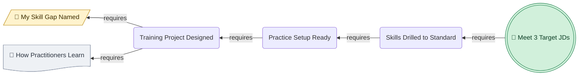
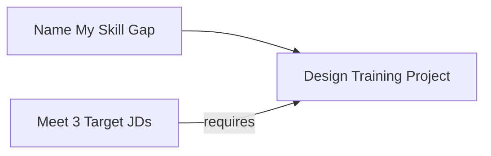
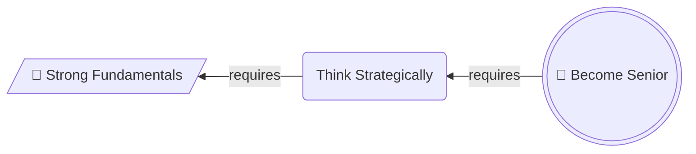
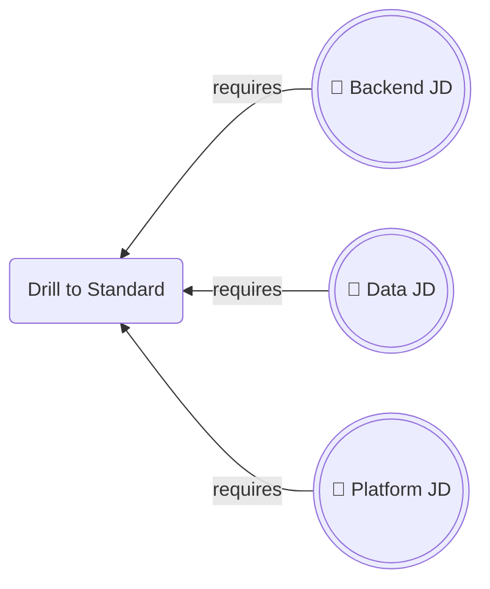

# Working Backwards Chain

## 1. What It Is

A pair of diagrams over the same nodes. The first runs right to left from a goal, and every arrow means `requires`, so the chain is derived rather than invented. The second runs left to right over the identical nodes, every arrow means `then`, and that is the plan you execute.

The pair is the unit. One diagram alone is half the argument: the derivation with no plan tells the reader nothing to do on Monday, and the plan with no derivation looks like five steps someone made up.

---

## 2. When To Use

The content is a plan whose credibility rests on where it came from. The reader's objection is "why these steps and not five others", not "what order do they go in".

The test is that you can say `X requires Y` out loud for every link and have it stay true when you also say it the other way as `Y then X`. If a link only survives in one direction, it is not a requirement, it is a habit.

Typical fits are a career or skill plan derived from a target role, a launch derived from a launch date, a system design derived from a service level objective, a curriculum derived from an exam.

---

## 3. When Not To Use

| The content actually has | Use instead |
| :--- | :--- |
| Steps already known in order, with nothing to justify | `step-flow.md` |
| Branching, where the next step depends on an answer | `decision-tree.md` |
| Named artifacts handed from each step to the next | `io-pipeline.md` |
| Dated events rather than derived stages | `timeline.md` |

A goal that decomposes into several independent lines of work is not one chain. Pick the line that actually binds and draw that, or draw one pair per line. Merging them produces a graph where no path is readable.

---

## 4. Direction

The derivation is `RL`. The execution is `LR`. Nothing else, and never `TD`, which would claim the goal contains its requirements rather than depends on them.

Never put both meanings in one graph. A diagram holding some arrows that mean `requires` and some that mean `then` gives the reader no way to read any arrow, and splitting it into this pair is the fix.

Both diagrams are one horizontal row, so the spine has to stay short. Section 8 sets the count.

---

## 5. Shapes

| Role | Shape | Syntax | Count |
| :--- | :--- | :--- | :--- |
| Goal | Double circle | `@{ shape: dbl-circ }` | Exactly 1, in both diagrams |
| Ground, in the derivation | Lean right | `@{ shape: lean-r }` | Exactly 1 |
| Ground, in the execution | Stadium | `@{ shape: stadium }` | The same node, redrawn |
| Derived stage | Rounded rectangle | `@{ shape: rounded }` | The rest of the spine |
| Material already in hand | Document | `@{ shape: doc }` | 0 to 2 |

The goal carries 🎯, the ground carries 🔑 in the derivation only, materials carry 📄. No other emoji.

The ground is where the derivation stops, and it stops when the answer to `requires what` is something you already have or can start this week. A chain that bottoms out on something you cannot start is not finished, and that is the most useful thing this pattern tells you.

Materials hang off the spine rather than sitting in it. They are things you possess or can fetch, not stages you pass through, and they are what keeps a five node spine from swelling to eight.

No diamonds. A requirement is not a question. No hexagons, because a derivation has no gates.

Labels change form between the two diagrams and this is deliberate. The derivation names states, so `Training Project Designed`. The execution names actions, so `Design Training Project`. Same node, and the grammatical flip is what stops a reader from mistaking one diagram for the other.

Below Mermaid v11.3 substitute `G((("🎯 Goal")))`, `B[/"🔑 Ground"/]`, `S(["Ground"])`, `A("Stage")`, and a plain `P["📄 Material"]`, keeping the quotes.

---

## 6. Color

| Class | Color | Marks |
| :--- | :--- | :--- |
| `goalNode` | Green | The goal, in both diagrams |
| `groundNode` | Amber | The ground, in both diagrams |
| `materialNode` | Grey | What you already have |

```text
classDef goalNode fill:#D1F0DB,stroke:#1B7F4B,color:#0B3D24
classDef groundNode fill:#FFF3CD,stroke:#B8860B,color:#3D2E00
classDef materialNode fill:#EEF1F5,stroke:#8A94A6,color:#2C3440
```

Copy all three properties or none. Dropping `color` leaves the text to the theme, so a diagram that reads in GitHub light mode turns pale on pale in dark mode.

Two colored nodes only, and they are the two ends. Nothing in the middle of the spine ever gets a color, because the middle is derived and no stage in it is more important than the link that produced it.

The amber ground is the hinge. It is the same node in both diagrams, it is the last node of the derivation and the first node of the plan, and the repeated color is what tells the reader the two pictures are one story. Grey materials are background and cost no budget.

---

## 7. Arrows

In the derivation every arrow is `-->|requires|`, with no exceptions and no other label. The right to left direction alone does not tell a reader the arrow means requires, and without the label the pair reads as two diagrams that contradict each other.

In the execution every arrow is a bare `-->` with no label. Order is already carried by the direction.

No dotted arrows and no thick arrows in either diagram.

---

## 8. Length

The spine is 4 to 6 nodes counting the goal, plus 0 to 2 hanging materials.

Below 4 the derivation is a single hop, which is a sentence rather than a diagram. Write the sentence.

Above 6 the row stops reading, and there is no vertical escape hatch here because direction is carrying the meaning. Merge adjacent stages until it fits. If nothing merges, the goal is too far away, so cut a milestone out of the middle, make it the goal of a first pair, and make it the ground of a second.

---

## 9. Canonical Example, The Derivation

Read right to left, and check every arrow by asking whether the thing on the left is genuinely required rather than merely helpful.



The chain stops at the amber node because naming the gap needs only the job descriptions and the record of your own experience, both of which are already on your disk. The grey document hangs off the project stage rather than sitting in the spine, because how real practitioners built the skill is something you go and read, not a stage you pass through.

---

## 10. Canonical Example, The Execution

The same six nodes, reversed. The ground has become a stadium and the states have become imperatives.


The takeaway from this pair is that reaching the target roles is four moves from where you already stand, and the reason there are four rather than fourteen is that each one was forced by the goal instead of chosen from a list of good habits.

---

## 11. Bad Examples

Both meanings in one graph.



Two arrows land on the same node and they mean opposite things, one saying work flows in and the other saying it is a precondition. Relabelling the arrows does not fix it. Splitting into the pair does.

A goal nobody can check, on a chain that never lands.



Nobody can say when the goal is met, so no arrow can be tested, and the chain terminates on something the reader cannot start on Monday either. A ground node has to be a possession or a first move, not one more thing to acquire.

Three goals.



Three targets means no target, and the derivation cannot be checked because each arrow is true of a different job. Collapse them into one node naming what all three share, or draw one pair per target.

---

## 12. Caption Convention

The pair takes one sentence, placed under the execution diagram, beginning "The takeaway from this pair is". It has to say why the plan is short, or why it is longer than expected, rather than describing the boxes. If that sentence cannot be written, the derivation did not actually constrain anything and the diagram is decoration.

---

## 13. Checklist

- Both diagrams are present, over the identical node set.
- The derivation is `RL`, the execution is `LR`, and neither mixes the two meanings.
- Exactly one `dbl-circ` carrying 🎯, and someone other than you could tell whether it has been met.
- Exactly one ground node, `lean-r` with 🔑 in the derivation and `stadium` in the execution.
- The ground is something you already have or can start this week.
- The spine is 4 to 6 nodes, plus at most 2 hanging `doc` materials.
- Derivation labels are states, execution labels are actions.
- Every derivation arrow is `-->|requires|`, every execution arrow is a bare `-->`.
- Only the goal and the ground are colored, and the same two colors appear in both diagrams.
- Every `classDef` carries `fill`, `stroke`, and `color`.
- No diamonds, no hexagons, no dotted or thick arrows.
- Every label is four words or fewer.
- The caption sentence is written and states a conclusion.
- Both diagrams parse.
