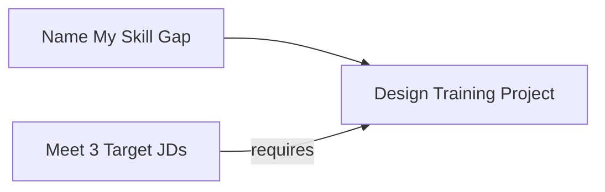
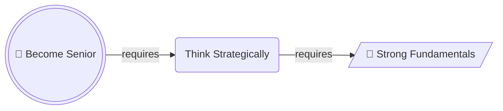
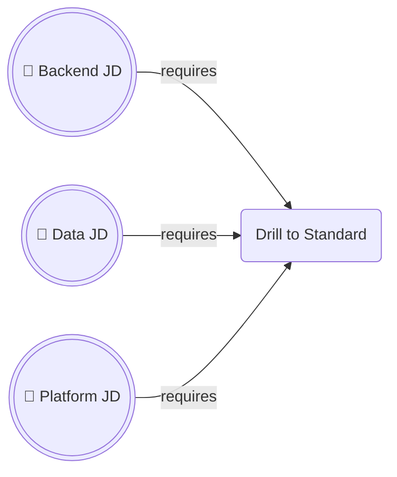
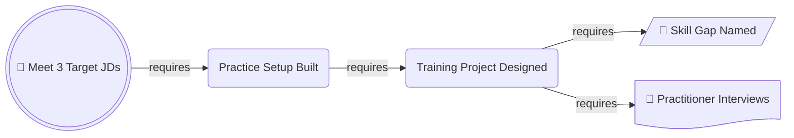

# Working Backwards Chain

## 1. What It Is

A pair of diagrams over the same nodes. The first opens on the goal and walks outward, every arrow meaning `requires`, until it lands on what you already hold. The second runs over the identical nodes in the opposite order, every arrow meaning `then`, and that is the plan you execute.

They are mirror images, and that is the point. The goal sits at the left end of the derivation, because it is where the thinking starts, and at the right end of the plan, because it is where the doing ends. Watching it change ends is what the reader takes away.

The pair is also the unit. One diagram alone is half the argument: the derivation with no plan tells the reader nothing to do on Monday, and the plan with no derivation looks like five steps someone made up.

---

## 2. When To Use

The content is a plan whose credibility rests on where it came from. The reader's objection is "why these steps and not five others", not "what order do they go in".

The test is that you can say `X requires Y` out loud for every link and have it stay true said the other way as `Y then X`. A link that survives in only one direction is not a requirement, it is a habit.

Typical fits are a skill plan derived from a target role, a launch derived from a date, a design derived from a service level objective, a curriculum derived from an exam. Section 11 is there because the pair is the unit, so both examples below are locked to one subject however much room the file has.

---

## 3. When Not To Use

| The content actually has | Use instead |
| :--- | :--- |
| Steps already known in order, with nothing to justify | `step-flow.md` |
| Branching, where the next step depends on an answer | `decision-tree.md` |
| Named artifacts handed from each step to the next | `io-pipeline.md` |
| Dated events rather than derived stages | `timeline.md` |
| A record of what already happened | `timeline.md` |

A goal that decomposes into several independent lines of work is not one chain. Pick the line that actually binds and draw that, or draw one pair per line. Merging them produces a graph where no path is readable.

---

## 4. Direction

Both diagrams are `LR`. Never `TD`, which would claim the goal contains its requirements rather than depends on them.

What separates them is which end the goal sits at. In the derivation the goal is the leftmost node and the arrows walk away from it, so the reader meets the goal first and every arrow after it answers "requires what". In the execution the goal is the rightmost node and the arrows walk toward it. Nothing else changes position, so the two diagrams read as one picture reflected.

Never put both meanings in one graph. A diagram holding some arrows that mean `requires` and some that mean `then` gives the reader no way to read any arrow, and splitting it into this pair is the fix. Since both diagrams face the same way, the `requires` label on every derivation arrow is what keeps them apart, and it is not optional.

Both diagrams are one horizontal row, so the spine has to stay short. Section 8 sets the count.

---

## 5. Shapes

| Role | Shape | Syntax | Count |
| :--- | :--- | :--- | :--- |
| Goal | Double circle | `@{ shape: dbl-circ }` | Exactly 1, in both diagrams |
| Ground, in the derivation | Lean right | `@{ shape: lean-r }` | Exactly 1 |
| Ground, in the execution | Stadium | `@{ shape: stadium }` | The same node, redrawn |
| Derived stage | Rounded rectangle | `@{ shape: rounded }` | The rest of the spine |
| Material already in hand | Document | `@{ shape: doc }` | 0 to 3, only at the ground |

The goal carries 🎯, the ground carries 🔑 in the derivation only, materials carry 📄. No other emoji.

The derivation stops at the ground, which is the first answer to `requires what` that you already have or can start this week. A chain bottoming out on something you cannot start is not finished, and saying so is the most useful thing this pattern does.

Materials are the documents, data, and access already in your possession, and they attach to the ground node and nowhere else, where they cluster into a picture of your starting position. If a stage needs something you do not yet hold, obtaining it is a stage of its own, because drawing it as a material quietly claims you already have it.

No diamonds. A requirement is not a question. No hexagons, because a derivation has no gates.

Labels change form between the two diagrams. The derivation names states, so `Training Project Designed`. The execution names actions, so `Design Training Project`. The grammatical flip is what stops a reader mistaking one diagram for the other.

Below Mermaid v11.3 substitute `G((("🎯 Goal")))`, `B[/"🔑 Ground"/]`, `S(["Ground"])`, `A("Stage")`, and a plain `P["📄 Material"]`, keeping the quotes.

---

## 6. Color

| Class | Color | Marks |
| :--- | :--- | :--- |
| `goalNode` | Green | The goal, in both diagrams |
| `groundNode` | Amber | The ground, in both diagrams |
| `materialNode` | Grey | What you already have |

```text
classDef goalNode fill:#D1F0DB,stroke:#1B7F4B,color:#0B3D24
classDef groundNode fill:#FFF3CD,stroke:#B8860B,color:#3D2E00
classDef materialNode fill:#EEF1F5,stroke:#8A94A6,color:#2C3440
```

Copy all three properties or none. Dropping `color` leaves the text to the theme, so a diagram that reads in GitHub light mode turns pale on pale in dark mode.

Two colored nodes only, and they are the two ends. The middle of the spine is never colored, because it is derived and no stage in it outranks the link that produced it. Grey materials are background and cost no budget.

The amber ground is the hinge: last node of the derivation, first node of the plan, and the repeated color is what tells the reader the two pictures are one story. Amber and grey always travel together, since the ground is where you start and the materials are what you start with, and a reader who finds one has found the other.

---

## 7. Arrows

In the derivation every arrow is `-->|requires|`, with no exceptions and no other label. Both diagrams face the same way, so the label is the only thing separating them, and without it the pair reads as two diagrams that contradict each other.

In the execution every arrow is a bare `-->` with no label. Order is already carried by reading order.

No dotted arrows and no thick arrows in either diagram.

---

## 8. Length

The spine is 4 to 6 nodes counting the goal, plus 0 to 3 materials at the ground. The materials stack vertically and cost the row no width.

Below 4 the derivation is a single hop, which is a sentence rather than a diagram. Write the sentence.

At 6 the row is full. What fills it is total label width rather than the node count, so keep the spine under about twenty words in all, and count them when it is close. Above 6 it stops reading, and there is no vertical escape hatch here because `TD` would claim a hierarchy the chain does not have. Merge adjacent stages until it fits. If nothing merges, the goal is too far away, so cut a milestone out of the middle, make it the goal of a first pair, and make it the ground of a second.

---

## 9. Canonical Example, The Derivation

> Someone holds a resume, a write up of each past role, and a private note on what they want and what they will not do. They are aiming at three job descriptions whose bar they do not currently clear, and they want to know what actually stands between the two.
>
> ```mermaid
> flowchart LR
>     G@{ shape: dbl-circ, label: "🎯 Meet 3 Target JDs" }
>     E@{ shape: rounded, label: "Skills at JD Standard" }
>     D@{ shape: rounded, label: "Practice Setup Built" }
>     C@{ shape: rounded, label: "Training Project Designed" }
>     B@{ shape: rounded, label: "Practitioner Paths Read" }
>     A@{ shape: lean-r, label: "🔑 Skill Gap Named" }
>     R1@{ shape: doc, label: "📄 Three Target JDs" }
>     R2@{ shape: doc, label: "📄 My Career Dossier" }
>
>     G -->|requires| E -->|requires| D -->|requires| C -->|requires| B -->|requires| A
>     A -->|requires| R1
>     A -->|requires| R2
>
>     classDef goalNode fill:#D1F0DB,stroke:#1B7F4B,color:#0B3D24
>     classDef groundNode fill:#FFF3CD,stroke:#B8860B,color:#3D2E00
>     classDef materialNode fill:#EEF1F5,stroke:#8A94A6,color:#2C3440
>
>     class G goalNode
>     class A groundNode
>     class R1,R2 materialNode
> ```
>
> Read it in the order it is drawn, one arrow at a time. Each line below asserts the requirement and says why the thing on the right is genuinely required rather than merely helpful.
>
> - **Meeting the three JDs requires the skills at the standard the JDs set.** An interviewer checks performance against a bar, so having read about a skill scores zero.
> - **Reaching that standard requires a practice setup that already exists.** Reps need a tutorial, source material, and an environment that runs, and without them the drilling stalls in the first week.
> - **Building that setup requires a project to build it around.** Materials gathered with no target are a reading list, and a reading list produces no reps.
> - **Designing that project requires having read how practitioners actually got the skill.** Designed from imagination it trains the wrong thing convincingly, which is worse than not training at all.
> - **Reading those paths requires knowing which skills are missing.** Otherwise you are researching every skill in the field rather than the four you lack.
> - **Naming the gap requires only what is already on the disk.** The three job descriptions on one side and your own resume, role write ups, and career note on the other.

The chain ends in two grey documents, and that cluster is the answer to "where do I actually stand today". Everything to the left of the amber node has to be built. Everything at it and beyond is already yours.

---

## 10. Canonical Example, The Execution

The same eight nodes, reflected. Nothing new is introduced and nothing is dropped, which is the whole claim: this plan was not chosen, it was forced. The documents you hold have moved to the left edge, the ground has become a stadium, the states have become imperatives, and the goal has crossed to the far side.

> ```mermaid
> flowchart LR
>     R1@{ shape: doc, label: "📄 Three Target JDs" }
>     R2@{ shape: doc, label: "📄 My Career Dossier" }
>     A@{ shape: stadium, label: "Name My Skill Gap" }
>     B@{ shape: rounded, label: "Read Practitioner Paths" }
>     C@{ shape: rounded, label: "Design Training Project" }
>     D@{ shape: rounded, label: "Build Practice Setup" }
>     E@{ shape: rounded, label: "Drill to JD Standard" }
>     G@{ shape: dbl-circ, label: "🎯 Meet 3 Target JDs" }
>
>     R1 --> A
>     R2 --> A
>     A --> B --> C --> D --> E --> G
>
>     classDef goalNode fill:#D1F0DB,stroke:#1B7F4B,color:#0B3D24
>     classDef groundNode fill:#FFF3CD,stroke:#B8860B,color:#3D2E00
>     classDef materialNode fill:#EEF1F5,stroke:#8A94A6,color:#2C3440
>
>     class G goalNode
>     class A groundNode
>     class R1,R2 materialNode
> ```
>
> Each step, and what finishing it looks like.
>
> - **Name my skill gap.** Read the three JDs against your own documents and produce one list of what is required and not yet held, split into skills that can be demonstrated and judgement that has to be shown.
> - **Read practitioner paths.** For each gap item, find how people who have it actually got it, and keep the account rather than the conclusion.
> - **Design the training project.** One project, scoped to the top few gap items, shaped like the accounts you just read.
> - **Build the practice setup.** Tutorial, source material, and a running environment, assembled until nothing stands between you and the first rep.
> - **Drill to JD standard.** Reps against the bar from the JDs, until the gap list is empty.
>
> The takeaway from this pair is that reaching the target roles is five moves from documents already sitting on your disk, and the reason there are five rather than fifty is that every one of them was forced by the goal rather than picked off a list of good habits.

---

## 11. Reach

The pair above is one person aiming at a job, which is the smallest thing this pattern draws. It fits anything with a goal somebody else could check and a starting position already occupied, at any scale, and the one who holds the ground can be a person, a team, or a company. Both examples run on a single subject because the pair is the unit and the budget is spent there, so read this list before deciding the shape does not fit yours.

- **A funding round.** The goal is a signed term sheet by the month the runway ends, and the ground is the metrics and the deck already in hand. Investors reject on the derivation far more often than on the goal.
- **A launch date.** The goal is general availability on a date already announced, and the ground is what is merged into the branch today. The chain is what turns an announced date from a wish into a claim.
- **A market entry.** The goal is the first paying customers in a segment the company has never sold to, and the ground is the product and the reputation it already has. Most of these fail on a link nobody could argue for out loud.
- **A decommission.** The goal is the old system switched off with nothing broken, and the ground is the inventory of what still calls it. Every consumer migrated is required by the shutdown, and nothing that is not required belongs on the chain.
- **A service level objective.** The goal is a number the on call rotation can be held to by the end of a quarter, and the ground is the current error budget and the traces already collected. The derivation is what separates the work that moves the number from the work that feels responsible.
- **A certification audit.** The goal is an auditor's opinion by a renewal date, and the ground is the policies already written down. The chain is short and the temptation to pad it with good practices is enormous.
- **A promotion case.** The goal is a committee saying yes at the next cycle, and the ground is the work already shipped. A committee judges the derivation by construction, so drawing it is close to drawing the packet.
- **A hiring plan.** The goal is a team of a stated size shipping by a date, and the ground is the headcount and the open requisitions already approved. Every link is a lead time, which is why this one is usually longer than anyone expects.
- **A conference talk.** The goal is a delivered talk on a schedule someone else publishes, and the ground is the work you have already done and can speak to. The submission deadline sits mid chain rather than at the end, and forgetting that is the usual way these fail.
- **Going independent.** The goal is a stated number of retained clients by a date you set yourself, and the ground is the network and the portfolio you already have. The goal is checkable only if you name the number, which is the entire discipline this pattern imposes.

The unifying test is section 2 and nothing else. If `X requires Y` and `Y then X` both stay true down the whole spine, if someone other than you can tell when the goal has been met, and if the chain lands on something already in your possession, it is this pattern at any scale and in any of these.

What it is not is a Step Flow in different colors. This pattern answers "why these steps and not five others", so if nobody would have asked that, the derivation is a diagram nobody needed. Draw the plan alone and let it be a Step Flow.

---

## 12. Bad Examples

Both meanings in one graph.



Two arrows land on the same node and they mean opposite things, one saying work flows in and the other saying it is a precondition. Relabelling the arrows does not fix it. Splitting into the pair does. This is the easiest mistake in the pattern to make.

A goal nobody can check, on a chain that never lands.



Nobody can say when the goal is met, so no arrow can be tested, and the chain terminates on something the reader cannot start on Monday either. A ground node has to be a possession or a first move, not one more thing to acquire, and the giveaway is that no document could be drawn hanging off it.

Three goals.



Three targets means no target, and the derivation cannot be checked because each arrow is true of a different job. Collapse them into one node naming what all three share, or draw one pair per target.

A material attached mid spine.



The interviews have not happened yet, so drawing them as a document claims a possession the reader does not have, and it scatters the starting position across the picture instead of collecting it at one end. Conducting them is a stage, and it belongs in the spine.

---

## 13. Prose Convention

The pair never ships bare. Four word labels cannot hold a reason, and a derivation whose reasons are invisible is just a chain of boxes the reader has to take on faith. Three pieces of prose, always in this order.

**A scenario sentence above the derivation.** It names where the reader stands and what they are aiming at, in that order, in one or two sentences. The diagram assumes a starting position, and stating it is what stops the goal from reading as a fantasy.

**A bullet under the derivation, one per spine arrow.** Each begins by asserting the requirement in the form `A requires B`, then gives the reason B is genuinely required and not merely helpful. The arrows into the materials share a single closing bullet, since they make one claim between them: that the chain has landed on things already in hand. That closing bullet is the one that earns the diagram. Writing these is also how the derivation gets checked, and an arrow whose bullet will not write is an arrow that was wishful.

**A takeaway sentence under the execution diagram**, beginning "The takeaway from this pair is". It says why the plan is as short as it is, or as long, rather than describing the boxes.

A bullet per step under the execution diagram is optional. Add it when finishing a step is ambiguous, and say what done looks like rather than restating the label.

---

## 14. Checklist

- Both diagrams are present, over the identical node set.
- Both are `LR`, the goal is leftmost in the derivation and rightmost in the execution, and neither mixes the two meanings.
- Exactly one `dbl-circ` carrying 🎯, and someone other than you could tell whether it has been met.
- Exactly one ground node, `lean-r` with 🔑 in the derivation and `stadium` in the execution.
- The ground is something you already have or can start this week.
- The spine is 4 to 6 nodes, and under about twenty words of label in total.
- Materials are 0 to 3 `doc` nodes, all attached to the ground, none mid spine, and every one is genuinely already in hand.
- Derivation labels are states, execution labels are actions.
- Every derivation arrow is `-->|requires|`, every execution arrow is a bare `-->`.
- Only the goal and the ground are colored, and the same two colors appear in both diagrams.
- Every `classDef` carries `fill`, `stroke`, and `color`.
- No diamonds, no hexagons, no dotted or thick arrows.
- Every label is four words or fewer.
- A scenario sentence sits above the derivation, naming the starting position and the goal.
- Every spine arrow has its own bullet asserting the requirement and giving the reason, and the materials share a closing one.
- The takeaway sentence is written and states a conclusion.
- Both diagrams parse.
