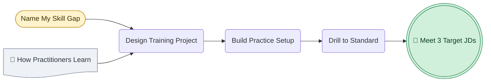
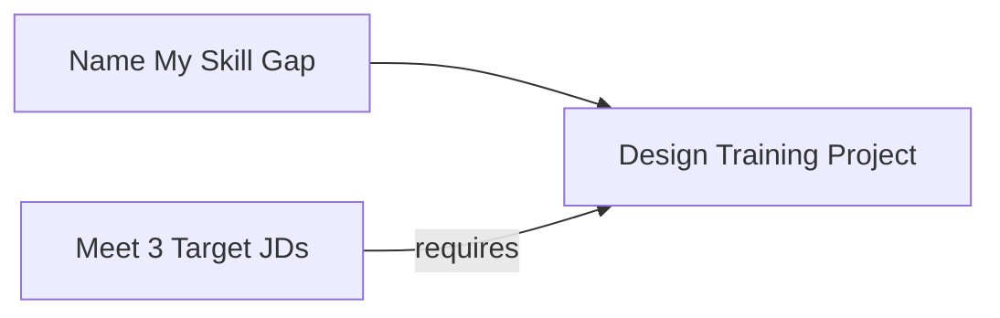
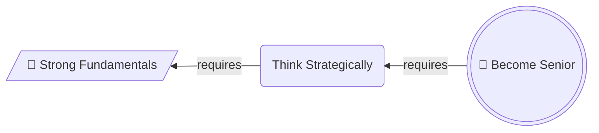
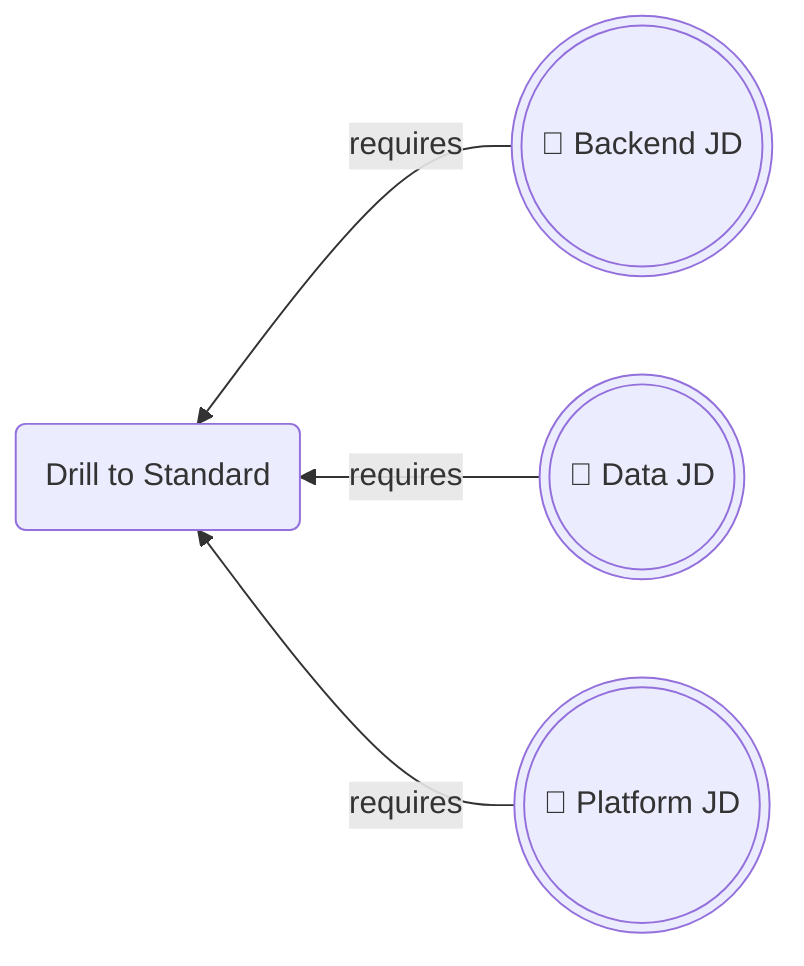

# Working Backwards Chain

## 1. What It Is

A pair of diagrams over the same nodes. The first runs right to left from a goal, and every arrow means `requires`, so the chain is derived rather than invented. The second runs left to right over the identical nodes, every arrow means `then`, and that is the plan you execute.

The pair is the unit. One diagram alone is half the argument: the derivation with no plan tells the reader nothing to do on Monday, and the plan with no derivation looks like five steps someone made up.

---

## 2. When To Use

The content is a plan whose credibility rests on where it came from. The reader's objection is "why these steps and not five others", not "what order do they go in".

The test is that you can say `X requires Y` out loud for every link and have it stay true said the other way as `Y then X`. A link that survives in only one direction is not a requirement, it is a habit.

Typical fits are a skill plan derived from a target role, a launch derived from a date, a design derived from a service level objective, a curriculum derived from an exam.

---

## 3. When Not To Use

| The content actually has | Use instead |
| :--- | :--- |
| Steps already known in order, with nothing to justify | `step-flow.md` |
| Branching, where the next step depends on an answer | `decision-tree.md` |
| Named artifacts handed from each step to the next | `io-pipeline.md` |
| Dated events rather than derived stages | `timeline.md` |

A goal that decomposes into several independent lines of work is not one chain. Pick the line that actually binds and draw that, or draw one pair per line. Merging them produces a graph where no path is readable.

---

## 4. Direction

The derivation is `RL`. The execution is `LR`. Nothing else, and never `TD`, which would claim the goal contains its requirements rather than depends on them.

Never put both meanings in one graph. A diagram holding some arrows that mean `requires` and some that mean `then` gives the reader no way to read any arrow, and splitting it into this pair is the fix.

Both diagrams are one horizontal row, so the spine has to stay short. Section 8 sets the count.

---

## 5. Shapes

| Role | Shape | Syntax | Count |
| :--- | :--- | :--- | :--- |
| Goal | Double circle | `@{ shape: dbl-circ }` | Exactly 1, in both diagrams |
| Ground, in the derivation | Lean right | `@{ shape: lean-r }` | Exactly 1 |
| Ground, in the execution | Stadium | `@{ shape: stadium }` | The same node, redrawn |
| Derived stage | Rounded rectangle | `@{ shape: rounded }` | The rest of the spine |
| Material already in hand | Document | `@{ shape: doc }` | 0 to 2 |

The goal carries 🎯, the ground carries 🔑 in the derivation only, materials carry 📄. No other emoji.

The derivation stops at the ground, which is the first answer to `requires what` that you already have or can start this week. A chain bottoming out on something you cannot start is not finished, and saying so is the most useful thing this pattern does.

Materials hang off the spine instead of sitting in it. They are things you possess or can fetch rather than stages you pass through, and keeping them off the spine is what stops five nodes becoming eight.

No diamonds. A requirement is not a question. No hexagons, because a derivation has no gates.

Labels change form between the two diagrams. The derivation names states, so `Training Project Designed`. The execution names actions, so `Design Training Project`. The grammatical flip is what stops a reader mistaking one diagram for the other.

Below Mermaid v11.3 substitute `G((("🎯 Goal")))`, `B[/"🔑 Ground"/]`, `S(["Ground"])`, `A("Stage")`, and a plain `P["📄 Material"]`, keeping the quotes.

---

## 6. Color

| Class | Color | Marks |
| :--- | :--- | :--- |
| `goalNode` | Green | The goal, in both diagrams |
| `groundNode` | Amber | The ground, in both diagrams |
| `materialNode` | Grey | What you already have |

```text
classDef goalNode fill:#D1F0DB,stroke:#1B7F4B,color:#0B3D24
classDef groundNode fill:#FFF3CD,stroke:#B8860B,color:#3D2E00
classDef materialNode fill:#EEF1F5,stroke:#8A94A6,color:#2C3440
```

Copy all three properties or none. Dropping `color` leaves the text to the theme, so a diagram that reads in GitHub light mode turns pale on pale in dark mode.

Two colored nodes only, and they are the two ends. The middle of the spine is never colored, because it is derived and no stage in it outranks the link that produced it. Grey materials are background and cost no budget.

The amber ground is the hinge: last node of the derivation, first node of the plan, and the repeated color is what tells the reader the two pictures are one story.

---

## 7. Arrows

In the derivation every arrow is `-->|requires|`, with no exceptions and no other label. The right to left direction alone does not tell a reader the arrow means requires, and without the label the pair reads as two diagrams that contradict each other.

In the execution every arrow is a bare `-->` with no label. Order is already carried by the direction.

No dotted arrows and no thick arrows in either diagram.

---

## 8. Length

The spine is 4 to 6 nodes counting the goal, plus 0 to 2 hanging materials.

Below 4 the derivation is a single hop, which is a sentence rather than a diagram. Write the sentence.

Above 6 the row stops reading, and there is no vertical escape hatch here because direction is carrying the meaning. Merge adjacent stages until it fits. If nothing merges, the goal is too far away, so cut a milestone out of the middle, make it the goal of a first pair, and make it the ground of a second.

---

## 9. Canonical Example, The Derivation

Someone holds a resume, a write up of each past role, and a private note on what they want and what they will not do. They are aiming at three job descriptions whose bar they do not currently clear, and they want to know what actually stands between the two.


Read right to left, one arrow at a time. Each line below asserts the requirement and says why the thing on the left is genuinely required rather than merely helpful.

- **Meeting the three JDs requires the missing skills drilled to standard.** An interviewer checks performance against a bar, so having read about a skill scores zero.
- **Drilling to standard requires the practice setup to exist first.** Reps need a tutorial, source material, and an environment that runs, and without them the drilling stalls in the first week.
- **The practice setup requires a project to be built around.** Materials gathered with no target are a reading list, and a reading list produces no reps.
- **Designing that project requires knowing how practitioners actually got the skill.** Designed from imagination it trains the wrong thing convincingly, which is worse than not training at all.
- **Designing that project also requires knowing which skills are missing.** A project aimed at everything in the JD is a career, not a project.
- **Naming the gap requires nothing that is not already on hand.** The three JDs on one side, the resume and role write ups and career note on the other, so the chain stops here and this is where the work starts.

The grey document hangs off the project stage rather than sitting in the spine, because how practitioners learned is something to go and read, not a stage to pass through.

---

## 10. Canonical Example, The Execution

The same six nodes, reversed. Nothing new is introduced here and nothing is dropped, which is the whole claim: this plan was not chosen, it was forced. The ground has become a stadium and the states have become imperatives.



Each step, and what finishing it looks like.

- **Name my skill gap.** Read the three JDs against your own documents and produce one list of what is required and not yet held, split into skills that can be demonstrated and judgement that has to be shown.
- **Read how practitioners learned.** For each gap item, find how people who have it actually got it, and keep the account rather than the conclusion.
- **Design the training project.** One project, scoped to the top few gap items, shaped like the accounts you just read.
- **Build the practice setup.** Tutorial, source material, and a running environment, assembled until nothing stands between you and the first rep.
- **Drill to standard.** Reps against the bar from the JDs, until the gap list is empty.

The takeaway from this pair is that reaching the target roles is five moves from where you already stand, and the reason there are five rather than fifty is that every one of them was forced by the goal rather than picked off a list of good habits.

---

## 11. Bad Examples

Both meanings in one graph.



Two arrows land on the same node and they mean opposite things, one saying work flows in and the other saying it is a precondition. Relabelling the arrows does not fix it. Splitting into the pair does.

A goal nobody can check, on a chain that never lands.



Nobody can say when the goal is met, so no arrow can be tested, and the chain terminates on something the reader cannot start on Monday either. A ground node has to be a possession or a first move, not one more thing to acquire.

Three goals.



Three targets means no target, and the derivation cannot be checked because each arrow is true of a different job. Collapse them into one node naming what all three share, or draw one pair per target.

---

## 12. Prose Convention

The pair never ships bare. Four word labels cannot hold a reason, and a derivation whose reasons are invisible is just a chain of boxes the reader has to take on faith. Three pieces of prose, always in this order.

**A scenario sentence above the derivation.** It names where the reader stands and what they are aiming at, in that order, in one or two sentences. The diagram assumes a starting position, and stating it is what stops the goal from reading as a fantasy.

**A bullet under the derivation, one per arrow.** Each begins by asserting the requirement in the form `A requires B`, then gives the reason B is genuinely required and not merely helpful. The last bullet is the one that earns the diagram: it says what the ground node consists of and why nothing further is needed. Writing these is also how the derivation gets checked, and an arrow whose bullet will not write is an arrow that was wishful.

**A takeaway sentence under the execution diagram**, beginning "The takeaway from this pair is". It says why the plan is as short as it is, or as long, rather than describing the boxes.

A bullet per step under the execution diagram is optional. Add it when finishing a step is ambiguous, and say what done looks like rather than restating the label.

---

## 13. Checklist

- Both diagrams are present, over the identical node set.
- The derivation is `RL`, the execution is `LR`, and neither mixes the two meanings.
- Exactly one `dbl-circ` carrying 🎯, and someone other than you could tell whether it has been met.
- Exactly one ground node, `lean-r` with 🔑 in the derivation and `stadium` in the execution.
- The ground is something you already have or can start this week.
- The spine is 4 to 6 nodes, plus at most 2 hanging `doc` materials.
- Derivation labels are states, execution labels are actions.
- Every derivation arrow is `-->|requires|`, every execution arrow is a bare `-->`.
- Only the goal and the ground are colored, and the same two colors appear in both diagrams.
- Every `classDef` carries `fill`, `stroke`, and `color`.
- No diamonds, no hexagons, no dotted or thick arrows.
- Every label is four words or fewer.
- A scenario sentence sits above the derivation, naming the starting position and the goal.
- Every derivation arrow has its own bullet asserting the requirement and giving the reason.
- The takeaway sentence is written and states a conclusion.
- Both diagrams parse.
